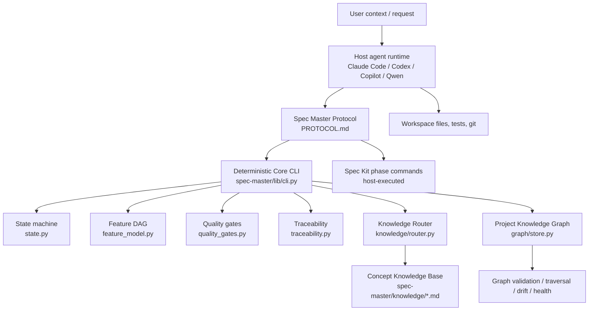

# Spec Master — Agent Harness Revalidation v2

> Auditor: Codex, acting as Agent Harness Auditor  
> Repository: `/Users/mrlopito/Documents/desenv/ai-projects/skills/spec-master`  
> Date: 2026-08-31  
> Scope: revalidate Agent Harness adherence after Knowledge-Enriched Agents + Graph-Augmented Context / Knowledge Graph implementation  
> Constraint: no implementation code changes; inspection and safe validations only

## Executive Verdict

Spec Master has moved materially beyond the prior diagnosis.

- Previous diagnostic: **38/75**, **50.7%**, **Agent Orchestrator L4**
- Current score v2: **73/100**
- Current readiness: **73%**
- Harness Characterization: **YES, with hosted-runtime boundaries**
- Harness Type: **HOSTED**
- Current level: **L5-H — Hosted Agent Harness**
- Not yet: **L5-S Self-Hosted Agent Harness** or **L6 Engineering Agent Platform**

Spec Master now satisfies the defining requirements for a hosted harness: it has a deterministic orchestration core, explicit agent/team architecture, persistent workflow state, phase gates, repair-loop caps, quality-gate discovery, traceability, knowledge routing, graph-backed context selection, file-first graph persistence, provenance validation, temporal freshness detection, and graph traversal/blast-radius primitives.

The important distinction is that Spec Master does not own the model runtime or tool execution substrate. It governs agent work from inside Claude Code / Codex / Copilot / Qwen-style hosts. That is still a valid **Hosted Agent Harness**, but it is not a self-hosted runtime harness.

## Taxonomy Placement

| Level | Meaning | Current Fit |
|---|---|---|
| L0 | Prompt collection | Surpassed |
| L1 | Reusable skills/workflows | Surpassed |
| L2 | Single autonomous agent workflow | Surpassed |
| L3 | Multi-agent system | Mostly met structurally; runtime concurrency remains host/manual |
| L4 | Agent orchestrator | Fully met |
| L4.5 | Orchestrator with persistent knowledge/context governance | Fully met |
| L5-H | Hosted Agent Harness | Current classification |
| L5-S | Self-hosted Agent Harness | Not met |
| L6 | Engineering Agent Platform | Not met |

## Evidence Summary

| Area | Status | Evidence |
|---|---:|---|
| Agent architecture | Strong | `team_model.py` defines Team Mode roles, workstream ownership and reviewer assignment; `PROTOCOL.md` defines Spec Master as orchestrator plus role-specific delivery. |
| Orchestration | Strong | `state.py` enforces workflow and phase order; `feature_model.py` performs dependency ordering with cycle detection; `PROTOCOL.md` preserves the `constitution -> specify -> clarify -> plan -> tasks -> analyze -> implement -> validate` spine. |
| State | Strong | `.spec-master/state.json` state model, atomic save via temp file + replace, forward-only workflow transitions, phase prerequisites, analyze cycle cap. |
| Context engineering | Strong | Normalized WHAT/WHY/HOW context layer, fingerprinting, staleness propagation, graph + knowledge bundle builder in `graph/context.py`. |
| Knowledge architecture | Strong | 76 validated concept modules across agile, anti-patterns, architecture, design, distributed-systems, foundations, security. |
| Knowledge routing | Strong | `KnowledgeRouter` ranks by role, keywords, stack category and budget; default module budget is 8. |
| Concept graph | Strong | Ontology-backed knowledge modules with YAML/frontmatter, roles, depth, related concepts, validation. |
| Project graph | Partial adoption | `FileGraphStore`, enrichment, graph validation, maps, traversal exist; current repo's persisted `.spec-master/knowledge/graph` has 0 nodes / 0 edges. |
| Graph governance | Good | Ontology validation, provenance enum validation, confidence thresholds, broken-link checks, stale-node checks. |
| Provenance | Good | Nodes and edges carry source/provenance/confidence/evidence fields; validation rejects invalid provenance and low-confidence edges. |
| Temporal graph | Partial | `first_seen`, `last_verified`, `valid_from`, `valid_to`, temporal drift detection exist; no persisted snapshot history/diff CLI yet. |
| Graph queries/traversal | Good | Search/filter helpers, neighbors, BFS, ancestors, descendants, shortest path, blast radius. |
| Blast radius | Good | `graph/traversal.py` implements bounded blast radius; tests cover it. |
| Architecture drift | Partial | `graph/drift.py` supports snapshot diff and structural/temporal drift; structural drift is library-level and not CLI-wired. |
| Traceability | Good | Requirement-to-test matrix plus graph-derived traceability sync from `Requirement` nodes. |
| Tool governance | Hosted boundary | Spec Master relies on host permissions and shell execution; no internal tool proxy/firewall. |
| Policies | Good | Anti-hallucination classifications, constitution conflict handling, Spec Kit availability stop condition, Git strategy policy. |
| Quality gates | Good | Manifest-backed command discovery; no invented test/build commands. Current repo returns no gates because no manifest is present. |
| Validation loops | Good | Analyze phase required; repair loop capped at 3. |
| Retry/recovery | Good | Resume and staleness logic; analyze-cycle exhaustion becomes BLOCKED. No generic runtime-level retry controller. |
| Stop conditions | Strong | SUCCESS/BLOCKED/FAILED/PARTIAL rules documented in protocol. |
| Observability | Partial | Round metrics and graph health scoring exist; no OpenTelemetry/runtime trace stream. |
| Evals | Weak | 195 deterministic unit tests; no LLM/agent behavioral eval suite. |
| Runtime abstraction | Good for hosted | Multiple adapters and generated entrypoints; model/runtime calls remain host-owned. |
| HitL | Good | Batched clarifications, constitution conflict approval, workflow choice, Spec Kit initialization gate. |
| Security | Partial | Security role and knowledge modules exist; no sandbox, secret scanner, policy-as-code enforcement, or tool allowlist. |

## Architecture Mermaid — Actual System



## Host Runtime vs Spec Master

```mermaid
flowchart LR
  subgraph Host["Host Runtime Owns"]
    H1["LLM inference"]
    H2["Conversation memory / context window"]
    H3["Tool invocation permissions"]
    H4["Shell/file execution sandbox"]
    H5["Subagent/concurrency primitives, if available"]
  end

  subgraph SM["Spec Master Owns"]
    S1["Workflow protocol"]
    S2["Deterministic state transitions"]
    S3["Phase ordering and stop conditions"]
    S4["Knowledge routing and context bundles"]
    S5["File-first project graph"]
    S6["Graph validation, traversal, blast radius"]
    S7["Traceability and quality gate discovery"]
    S8["Human decision gates"]
  end

  Host --> SM
  SM --> Host
```



## Score v2 /100

| Dimension | Points |
|---|---:|
| Agent architecture and role model | 8/10 |
| Orchestration and deterministic control | 10/10 |
| Persistent state and resumability | 8/8 |
| Context engineering | 8/10 |
| Knowledge architecture and routing | 10/12 |
| Project/concept graph capabilities | 10/14 |
| Governance, provenance, traceability | 8/10 |
| Quality gates, validation loops, recovery | 7/9 |
| Runtime/tool/security governance | 2/10 |
| Observability and evals | 2/7 |
| **Total** | **73/100** |

## Defining vs Maturity vs Platform Gaps

### HARNESS_DEFINING Gaps

These prevent L5-S/self-hosted characterization, but do not invalidate L5-H hosted harness status.

1. No owned LLM runtime or model execution layer.
2. No internal tool proxy, tool firewall, allowlist/denylist, or policy-enforced command broker.
3. No hard sandbox boundary independent of host runtime permissions.
4. Multi-agent execution is structurally modeled and workstreamed, but actual concurrent workers are not owned by Spec Master.

### MATURITY Gaps

1. Project graph capability exists, but the current repo's persisted project graph is empty: `graph stats` returned 0 nodes and 0 edges.
2. Structural drift detection exists as library code, but has no CLI surface for comparing stored snapshots.
3. Temporal freshness exists, but no lifecycle policy currently forces periodic reverification.
4. Context budgets are count/character/module based, not token-accurate.
5. Observability is metrics/report oriented, not distributed tracing.
6. Security knowledge exists, but enforcement is mainly role/prompt/protocol based.

### PLATFORM Gaps

1. No multi-tenant project registry.
2. No centralized execution dashboard.
3. No hosted API/service mode.
4. No enterprise policy-as-code layer.
5. No integrated secret scanning, dependency risk scoring, or supply-chain controls.
6. No automated LLM/agent eval benchmark suite.

## Validation Performed

Safe validations executed:

```text
python3 -m pytest spec-master/tests
Result: failed collection because system python has no pytest.

.venv/bin/python -m pytest spec-master/tests -q
Result: failed collection because tests expect execution from spec-master/tests for _pathfix.py.

cd spec-master/tests && ../../.venv/bin/python -m pytest -q
Result: 195 passed in 0.61s.

python3 spec-master/lib/cli.py knowledge stats
Result: 76 modules.

python3 spec-master/lib/cli.py knowledge validate
Result: valid true, 0 issues.

python3 spec-master/lib/cli.py graph validate
Result: valid true, 0 issues.

python3 spec-master/lib/cli.py graph stats
Result: 0 nodes, 0 edges.

python3 spec-master/lib/cli.py gates detect --path .
Result: [].
```

The empty quality-gate result is evidence, not a failure by itself: `quality_gates.py` only emits commands backed by detected manifests, and this repository does not expose package/test manifests at the root. The test suite was therefore executed directly from its known location.

## Comparison With Previous Diagnostic

| Area | Previous | Current |
|---|---|---|
| Score | 38/75, 50.7% | 73/100, 73% |
| Classification | Agent Orchestrator L4 | Hosted Agent Harness L5-H |
| Harness characterization | PARTIAL/NO | YES, hosted-boundary qualified |
| Knowledge base | Missing/early | 76 validated modules |
| Knowledge routing | Missing | Implemented with role/query/context budget |
| Project graph | Missing | FileGraphStore, ontology, validation, traversal, maps, enrichment implemented; current graph unpopulated |
| Graph governance | Missing | Validation, provenance, confidence, health, temporal freshness implemented |
| Drift/blast radius | Missing | Blast radius implemented; drift library implemented but not CLI-wired |
| Evals | Deterministic tests only | Still deterministic tests only, now broader: 195 passing |
| Tool governance | Missing | Still hosted-runtime boundary |

## Final Classification

Spec Master is now best characterized as:

```text
Harness Characterization: YES
Harness Type: HOSTED
Level: L5-H Hosted Agent Harness
Readiness: 73%
Score v2: 73/100
Previous -> Current: L4 Agent Orchestrator -> L5-H Hosted Agent Harness
```

This classification is intentionally not inflated to L5-S or L6. The newly implemented knowledge and graph system closes the previous context/knowledge/harness-adherence deficit, but runtime ownership, tool interception, sandboxing, runtime observability, and agent eval automation remain outside Spec Master's control.

## Modification Statement

No implementation code was modified during this revalidation. The only intended artifact created by this audit is:

```text
.spec-master/reports/harness-revalidation.md
```
