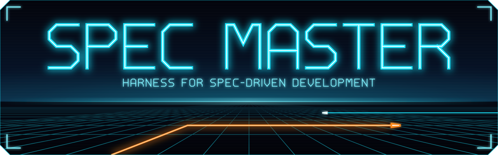
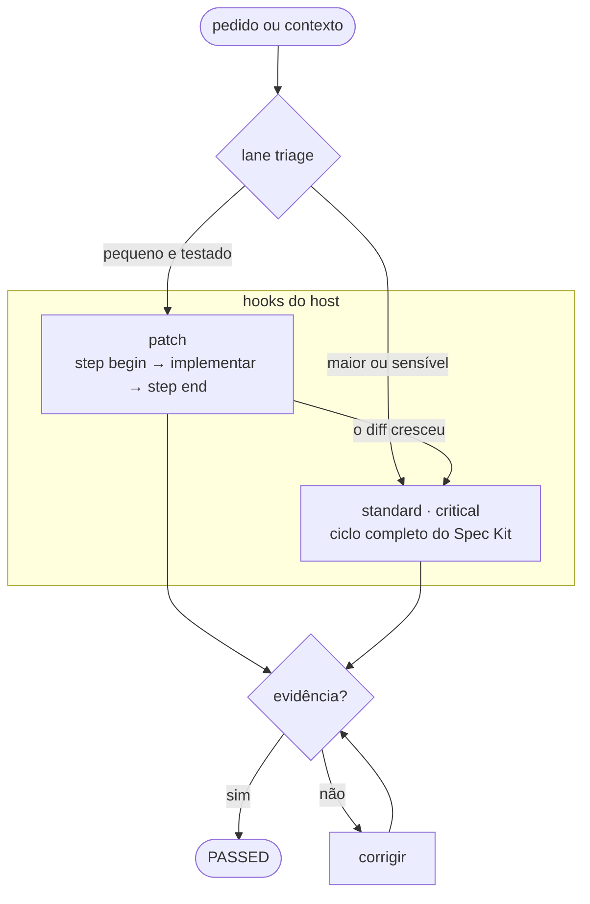

<div align="center">



**Processo na medida de cada mudança, regras aplicadas pelo host e nada pronto sem evidência.**

[](https://github.com/theguitarvity/spec-master/actions/workflows/ci.yml)


[](LICENSE)

[Começo rápido](#começo-rápido) · [Como funciona](#como-funciona) · [Instalação](#instalação) · [Comandos](#referência-de-comandos) · [Roadmap](#roadmap)

</div>

---

## O que é

O Spec Master é um **harness** para desenvolvimento orientado a
especificação: a camada entre você, o agente de código e o
[GitHub Spec Kit](https://github.com/github/spec-kit) que decide três coisas
que o agente sozinho não garante.

- **Quanto processo a mudança merece.** Antes de qualquer artefato, uma
  triagem determinística põe o pedido num lane: *patch* (uma mudança pequena
  e testada, resolvida na própria sessão), *standard* ou *critical* (o ciclo
  completo do Spec Kit).
- **Que regras o agente não pode furar.** Hooks do host (Claude Code, Codex,
  Copilot, Cursor, Gemini CLI, Antigravity, Qwen Code, Kiro) negam comandos
  destrutivos, escrita nos arquivos do core e escrita fora do escopo da
  mudança, e não deixam a sessão parar no meio de uma verificação.
- **Quando algo está pronto.** Uma fase só passa com os artefatos dela no
  lugar, e um patch só fecha com o teste, os gates reais e o escopo
  conferidos.

Para features de verdade, um único comando, `/spec-master <arquivo-de-contexto>`,
conduz o ciclo inteiro: `constitution → specify → clarify → plan → tasks →
analyze (+repair) → implement → validate`. A lógica estrutural fica num core
Python determinístico, só stdlib e testado sem LLM. A semântica (ler o
contexto, escrever specs, resolver ambiguidade) fica com o agente, seja ele
qual for: Claude Code, Copilot, Codex, Qwen ou qualquer um dos 30+ agentes
que o Spec Kit suporta.

## Por quê

O Spec Kit trouxe disciplina ao desenvolvimento orientado a especificação,
mas deixou três problemas para quem opera o agente:

1. **Tudo vira ciclo completo.** Corrigir um arredondamento custa sete
   comandos, uma constitution e um `analyze`. A cerimônia não acompanha o
   tamanho da mudança.
2. **O protocolo é só uma sugestão.** Um agente pode implementar antes do
   `analyze`, editar o próprio estado, rodar `git push --force` ou declarar
   sucesso sem artefato, e nada o impede.
3. **Os números são inventados.** Tokens e tempos digitados de memória pelo
   modelo não servem para decidir nada.

Uma avaliação multiagente deste repositório
([`docs/harness-reformulation/`](docs/harness-reformulation/)) mediu esses
problemas, e a reformulação atacou cada um deles:

| Medido | Antes | Agora |
|---|---|---|
| Saída do CLI por feature (as 58 chamadas do protocolo) | 100,8 KB | 14,1 KB |
| Tier de risco inflado sem motivo (features 003–005) | 3/3 | 0/3 |
| Escritas perdidas com 16 processos concorrentes | 6–50% | 0 |
| Fase aceita como `PASSED` sem artefato | aceita | recusada |
| Invocações quebradas nos documentos lidos pelo agente | 2 | 0 |
| Rodadas de métricas com uso medido pelo host | 0 de 9 | lidas do host (`telemetry ingest`) |
| Instruções para fazer um patch | 55,1 KB (ciclo completo) | ≈ 7,3 KB |

## Começo rápido

Tudo é Python 3 stdlib, então não há dependência para instalar. O caminho
mais curto é o plugin do seu agente (a tabela com os oito hosts está em
[Como plugin](#como-plugin-recomendado)), por exemplo no Claude Code:

```bash
claude plugin marketplace add theguitarvity/spec-master
claude plugin install spec-master@spec-master
```

Ou, sem plugin, com o instalador:

```bash
git clone https://github.com/theguitarvity/spec-master
cd spec-master
./init.sh    # instala o engine em ~/.spec-master-engine e o /spec-master global
```

Depois, em qualquer projeto:

```text
/spec-master CLAUDE.md                                 # ciclo completo a partir de um contexto
/spec-master new                                       # descoberta guiada: gera o contexto por perguntas
/spec-master --lane o total deve arredondar para cima  # a triagem decide o lane (opt-in)
```

O contexto pode ser qualquer documento que já exista (`CLAUDE.md`,
`AGENTS.md`, uma ADR, um discovery, uma spec preliminar): o Spec Master
interpreta o conteúdo e não exige headings. Na primeira execução ele faz
**uma única pergunta**, em lote: se deve inicializar o Spec Kit, caso o
projeto ainda não o tenha, e qual estratégia de git usar (Git Flow ou
trunk-based). Depois roda de ponta a ponta e só para numa
[condição de parada](#git-retomada-e-condições-de-parada) real.

## Como funciona



1. **Triagem.** `lane triage` olha os arquivos que a mudança vai tocar e os
   sinais do repositório (tamanho, módulos, testes, caminhos sensíveis, gate
   executável) e devolve o lane. O lane só sobe: nem o pedido do usuário nem
   a política do projeto o baixam. Sinais que só aparecem no texto do pedido
   ("abrir um PR") viram uma pergunta de confirmação, não uma mudança de lane
   silenciosa.
2. **Execução sob hooks.** Um patch roda na própria sessão; standard e
   critical passam pelo ciclo completo do Spec Kit. Os hooks do host
   acompanham os dois.
3. **Evidência.** Nada é promovido porque um processo saiu com código zero.
   Se o diff de um patch cresce além do lane, a mudança escala para o ciclo
   completo.

### Os lanes

| Lane | Quando | O que roda |
|---|---|---|
| `patch` | até 3 arquivos de produção, 1 módulo, ~50 linhas, com teste declarado e gate executável, sem caminho sensível | `step begin` → implementar → `step end` |
| `standard` | maior que um patch (até 12 arquivos, 3 camadas, 800 linhas) | ciclo completo do Spec Kit |
| `critical` | auth, pagamentos, segredos, schema ou migração, ações irreversíveis (push, publish, deploy, CI) ou repositório sem gate de teste | ciclo completo do Spec Kit |

Por enquanto o fluxo por lane é opt-in (`/spec-master --lane ...`), e
`/spec-master <contexto>` continua rodando o ciclo completo. A
[emenda 2.0.0 da constitution](docs/harness-reformulation/constitution-amendment.md)
já permite que o lane standard vire o padrão para features pequenas e médias,
mas só quando o baseline medido mostrar que ele não perde qualidade.

### O ciclo completo

```text
contexto ─► discovery (read-only) ─► Spec Kit + estratégia de git (uma pergunta)
         ─► contexto normalizado: project-goals · app-features · tech-stack
         ─► constitution (gerada ou evoluída, nunca sobrescrita às cegas)
         ─► features em ordem de dependência, cada uma:
              specify → clarify → plan → tasks → analyze ⟲ repair (máx. 3) → implement → validate
         ─► quality gates reais do projeto ─► matriz de rastreabilidade + relatório final
```

Toda inferência é marcada como `EXPLICIT`, `INFERRED`,
`DISCOVERED_FROM_CODEBASE` ou `UNRESOLVED`: nenhum requisito, critério de
aceite, dependência ou tecnologia entra sem apoio no contexto ou no código. O
Spec Master chama os comandos `speckit.*` pela integração instalada no agente
e nunca os reimplementa.

## Evidência, não promessa

- **Fases do ciclo completo.** `state transition ... --status PASSED` só
  aceita a fase com os artefatos dela no lugar e sem placeholder, com
  `tasks.md` todo marcado no `implement` e ao menos uma linha de
  rastreabilidade no `validate`. Histórico que nunca passou pelo Spec Master
  entra com `--import-unverified --reason "..."` e fica marcado como não
  verificado.
- **Patch.** `step end` só grava `PASSED` com quatro coisas: uma nota curta
  com a intenção citada (`[EXPLICIT]`) e cada critério apontando o teste que
  o cobre; os gates reais passando; nenhuma escrita fora dos arquivos
  declarados; e toda citação `[DISCOVERED_FROM_CODEBASE]` apontando um
  `arquivo:linha` que existe. Num bugfix, o teste de regressão também precisa
  falhar no commit base (num worktree temporário) e passar na árvore.
- **Estado.** `state.json` é escrito de forma atômica e sob lock. Fases,
  evidência e tentativas pertencem ao core; o agente só grava metadados.

```bash
python3 spec-master/lib/cli.py lane triage --path . --intent "..." --paths src/calc.py,tests/test_calc.py
python3 spec-master/lib/cli.py step begin  --path . --intent "..." --paths src/calc.py,tests/test_calc.py
python3 spec-master/lib/cli.py step end    --path .
python3 spec-master/lib/cli.py state evidence --feature <id>
```

## Hooks e auditoria

[`hookd`](spec-master/lib/kernel/hookd.py) responde aos eventos de cada host
no dialeto dele ([`kernel/hosts.py`](spec-master/lib/kernel/hosts.py)); a
tabela usa os nomes do Claude Code:

| Evento | O que faz |
|---|---|
| `PreToolUse` | passa comandos Bash por uma política por argv: nega `git reset --hard`, `git clean -f`, force push, `curl ... \| sh` e `sudo`, e pede confirmação para `git push`, publish, `gh pr create` e `terraform apply`. Nega escrita nos arquivos do core, fora dos arquivos de um patch em andamento e, no ciclo completo, em código antes do `analyze` |
| `PostToolUse` | avisa quando o diff saiu do lane patch |
| `Stop` | não deixa a sessão parar com um patch sem `step end` (até duas reentradas; depois o patch fica `PAUSED`) |
| `SessionStart` | reinjeta o passo atual depois de um restart ou de uma compactação |

O modo padrão é **audit**: o hook decide, registra e não interfere. Antes de
ligar o bloqueio, uma auditoria de 14 dias mede quantas decisões teriam
barrado o agente, e o bloqueio só entra se os falsos bloqueios ficarem em até
2%. `harness audit` mostra os números. Numa sessão na nuvem o log local some
com o container, então `--save` junta o resumo de cada sessão, com
credenciais mascaradas, em `.spec-master/hooks/audit.jsonl`. Este
repositório está em auditoria desde 2026-09-28.

Se o engine ou o `python3` sumirem, os hooks não bloqueiam nada (o comando
termina em `|| true`), e projetos sem `.spec-master/` nunca recebem escrita.

```bash
# por projeto: mescla os hooks em .claude/settings.json (idempotente e portátil);
# --host qwen grava em .qwen/settings.json e --host kiro em .kiro/hooks/
python3 spec-master/lib/cli.py harness install-hooks --project . --mode audit
python3 spec-master/lib/cli.py harness audit --path .

# os plugins já trazem os hooks (fora Qwen Code e Kiro): veja "Como plugin"

# quando a auditoria aprovar
python3 spec-master/lib/cli.py harness mode --project . --mode block
```

## Métricas medidas pelo host

Cada rodada significativa (uma fase, um pacote, uma revisão, uma rodada de
gates) vira uma linha em `.spec-master/metrics/rounds.json`, e cada linha
diz de onde vieram os números (`source`):

```bash
# Claude Code: lê só usage e timestamps do transcript da sessão (nunca o conteúdo)
python3 spec-master/lib/cli.py telemetry ingest --path . --latest --since <início da rodada> \
  --round-id r12 --phase plan --feature-id <id> --append
# execução headless: o JSON de `claude -p --output-format json` traz o custo medido
python3 spec-master/lib/cli.py telemetry ingest --headless-json result.json --ended-at <fim> \
  --round-id r13 --phase implement --append
# host sem contabilidade: a linha fica marcada como manual-unverified
python3 spec-master/lib/cli.py metrics record-round --round-id r14 --phase tasks \
  --started-at <início> --ended-at <fim> --source manual --append
```

`--append` valida a linha e grava de forma atômica, sob lock. `metrics
validate` acusa como erro uma linha medida pelo host com 0 tokens ou que
termina no futuro, e a calibração dos tiers ignora linhas não medidas. As
saídas de subagentes gravadas no transcript são um retrato do começo do
stream, então `output_tokens` vira um limite inferior e a linha avisa isso; o
custo exato vem do modo headless.

**Baseline.** `baseline plan|run|summarize` compara o fluxo do Spec Master
com um agente trabalhando direto nos mesmos casos: worktree limpo por
execução, checagens reais e custo medido pelo próprio host. `plan` não
executa nada e mostra o gasto no pior caso; `run` gasta dinheiro de verdade e
só roda com `--yes`.

## Instalação

### Como plugin (recomendado)

O repositório é ao mesmo tempo um marketplace de plugins, um pacote
[Agent Plugins](https://agent-plugins.org/) e uma extensão do Gemini CLI.
Cada host instala com o próprio comando e recebe as duas skills
(`spec-master`, o ciclo completo, e `spec-master-lane`, o fluxo por lane), o
servidor MCP e os hooks no dialeto dele:

| Host | Instalação | Hooks |
|---|---|---|
| Claude Code | `claude plugin marketplace add theguitarvity/spec-master`<br>`claude plugin install spec-master@spec-master` | no plugin |
| OpenAI Codex | `codex plugin marketplace add theguitarvity/spec-master`<br>`codex plugin add spec-master@spec-master` | no plugin; o Codex pede a sua revisão em `/hooks` |
| GitHub Copilot CLI | `copilot plugin marketplace add theguitarvity/spec-master`<br>`copilot plugin install spec-master@spec-master` | no plugin |
| VS Code (Copilot) | `"chat.plugins.marketplaces": ["theguitarvity/spec-master"]` no `settings.json`; depois `@agentPlugins` na aba Extensions | no plugin |
| Cursor | *Customize → Plugins → From GitHub Repository* com `https://github.com/theguitarvity/spec-master`, ou `agent plugin marketplace add https://github.com/theguitarvity/spec-master` | no plugin |
| Gemini CLI | `gemini extensions install https://github.com/theguitarvity/spec-master` | na extensão |
| Antigravity | `agy plugin install https://github.com/theguitarvity/spec-master` | no plugin: `PreToolUse` e `Stop` (o Antigravity não tem `SessionStart`) |
| Qwen Code | `qwen extensions install theguitarvity/spec-master` | por projeto, com `--host qwen` |
| Kiro | *Powers → Add Custom Power → Import power from GitHub* com `https://github.com/theguitarvity/spec-master` | por projeto, com `--host kiro` |

Um power do Kiro não carrega hooks, e o Qwen Code carrega um pacote Agent
Plugins só com skills e MCP. Nesses dois, rode uma vez por projeto (o caminho
do engine vem na resposta da tool `harness_entrypoint`):

```bash
python3 <engine>/lib/cli.py harness install-hooks --project . --host qwen   # ou --host kiro
```

Em todos os hosts os hooks começam em modo audit. O que muda de um host para
outro:

- **Codex** não aceita *ask* num `PreToolUse`: o que pediria confirmação fica
  com a política de aprovação do próprio Codex.
- **Kiro** não tem *ask* nos hooks: o bloqueio sai pelo código de saída 2.
- **Antigravity**: sem objeção, o hook responde `{}` e não `allow`, porque
  `allow` pularia a aprovação do usuário.

O servidor MCP que os plugins sobem expõe uma tool só, `harness_entrypoint`
(menos de 1 KB de schema): ela devolve as instruções com os caminhos reais do
engine, e o core roda pelo CLI. Com todas as tools, a lista passaria de
49 KB, e o host que carrega os schemas de uma vez pagaria isso em toda
sessão. Quem registra o servidor à mão continua com todas (veja
[Servidor MCP](#servidor-mcp)).

Os manifestos, hooks e skills de todos os hosts saem de um único gerador,
[`spec-master/lib/packaging.py`](spec-master/lib/packaging.py) (`generate` e
`check`); o `doctor` e os testes falham se um arquivo divergir dele. A
instalação acima é direto do GitHub; listar o Spec Master nos catálogos
oficiais de cada host é uma submissão à parte.

### Uso local (só este repositório)

Clonar basta. Para conferir:

```bash
python3 -m unittest discover -s spec-master/tests
```

Os entrypoints mantidos na raiz são os dos agentes com adapter dedicado, com
as mecânicas de cada um documentadas em
[`spec-master/adapters/`](spec-master/adapters/):

| Agente | Entrypoint | Invocação |
|---|---|---|
| Claude Code | [`.claude/commands/spec-master.md`](.claude/commands/spec-master.md) | `/spec-master <contexto>` · `/spec-master --lane <pedido>` |
| GitHub Copilot | [`.github/skills/spec-master/SKILL.md`](.github/skills/spec-master/SKILL.md) | `/spec-master <contexto>` |
| OpenAI Codex CLI | [`.agents/skills/spec-master/SKILL.md`](.agents/skills/spec-master/SKILL.md) | `$spec-master <contexto>` |
| Qwen-compatible shells | [`.qwen/commands/spec-master.md`](.qwen/commands/spec-master.md) | `/spec-master <contexto>` |
| Antigravity (`agy`) | [`.agents/agents/spec-master/agent.md`](.agents/agents/spec-master/agent.md) | selecione em `/agents` |

Os demais 30+ agentes que o Spec Kit suporta (Gemini CLI, Cursor, IBM Bob,
Trae, Kilo Code, Goose, Cline, Auggie, Devin, Factory Droid, Grok Build,
RovoDev, ZCode, Zed, Kiro CLI, Tabnine, Forge, Kimi Code e outros) são
gerados sob demanda para o projeto alvo, no diretório e formato que cada um
lê (`SKILL.md`, custom agent, comando Markdown, TOML ou recipe YAML), a partir
da tabela em [`spec-master/lib/adapters_gen.py`](spec-master/lib/adapters_gen.py):

```bash
python3 spec-master/lib/adapters_gen.py list
python3 spec-master/lib/adapters_gen.py generate --root ~/code/projeto --engine-ref ~/.spec-master-engine
```

As ressalvas de cada agente (Kiro CLI não substitui `$ARGUMENTS` em prompts
de arquivo, Goose roda via `goose run`, Hermes só instala globalmente) estão
em [`spec-master/adapters/generic.md`](spec-master/adapters/generic.md).

### Instalação global (todos os projetos)

`./init.sh`, uma vez por máquina, espelha o engine para
`~/.spec-master-engine` e registra um entrypoint global em cada agente com
convenção pessoal documentada. Nada existente nesses diretórios é
sobrescrito; o Spec Master só adiciona a própria entrada:

| Agente | Entrypoint global |
|---|---|
| Claude Code | `~/.claude/commands/spec-master.md`, `~/.claude/skills/spec-master/` |
| GitHub Copilot CLI | `~/.copilot/skills/spec-master/`, `~/.copilot/agents/spec-master.agent.md` |
| OpenAI Codex CLI | `~/.codex/skills/spec-master/` |
| Hermes | `~/.hermes/skills/spec-master/` (o Spec Kit só instala Hermes globalmente) |
| fallback compartilhado (Copilot CLI e Codex CLI também leem) | `~/.agents/skills/spec-master/` |

Os outros 30+ agentes não têm convenção global documentada pelo Spec Kit, e
criar um `~/.<agente>` para eles seria um chute. Eles entram por projeto:

```bash
./init.sh link ~/code/outro-projeto   # pointers Copilot/Codex + os 30+ gerados ali
./init.sh --engine-only               # só atualiza o engine e os globais confirmados
./init.sh --project ~/code/projeto    # instala tudo mirando outro diretório
```

O `init.sh` também confere se o Spec Kit está inicializado no projeto
(`.specify/`) e, se o CLI `specify` (ou `uvx`) existir, oferece rodar
`specify init --here`. O bootstrap usa uma versão fixa do Spec Kit
(`SPEC_KIT_REF`, hoje `v0.16.4`). Sem terminal interativo, ele pula o passo e
imprime o comando manual em vez de travar.

### Servidor MCP

[`spec-master/mcp/spec_master_mcp.py`](spec-master/mcp/spec_master_mcp.py) é
um servidor MCP stdio (só stdlib) que expõe todos os comandos do `cli.py`
como tools: `state show` vira `state_show`, `lane triage` vira `lane_triage`.
A lista é introspectada do parser, então um grupo novo da CLI aparece no MCP
sem mudar o servidor, e cada chamada roda o próprio `cli.py`, com o mesmo
JSON e os mesmos códigos de saída. Para registrar no projeto:

```json
{"mcpServers": {"spec-master": {"type": "stdio", "command": "python3",
  "args": ["spec-master/mcp/spec_master_mcp.py"],
  "env": {"SPEC_MASTER_MCP_TIMEOUT": "120"}}}}
```

Com o engine global, aponte para `~/.spec-master-engine/mcp/spec_master_mcp.py`
e passe `--project <repo>` (ou `SPEC_MASTER_PROJECT`). Sem `--project`, o
servidor usa as *roots* que o cliente informa e, se o host o iniciou na
própria pasta de instalação sem informar nenhuma, recusa as tools que mexem
no projeto. `--tools entrypoint` limita a lista a `harness_entrypoint`, como
nos plugins. Detalhes em [`spec-master/mcp/README.md`](spec-master/mcp/README.md).

## Referência de comandos

O core é um CLI (`python3 spec-master/lib/cli.py <grupo> <ação>`). A saída é
JSON compacto; `--pretty` (ou `SPEC_MASTER_PRETTY=1`) formata.

| Área | Comando | O que faz |
|---|---|---|
| Estado | `state init\|show\|set-workflow\|transition\|analyze-cycle\|evidence` | máquina de estados e checkpoint em `.spec-master/state.json`; `PASSED` só com evidência |
| Harness | `lane triage` | decide patch, standard ou critical a partir dos caminhos e sinais do repositório |
| Harness | `step next\|begin\|end\|widen\|pause\|resume` | uma mudança patch, fechada só com evidência |
| Harness | `harness install-hooks\|mode\|audit` | liga os hooks do host ao kernel, escolhe audit ou block, mede a auditoria |
| Harness | `doctor run` | autoverificação para CI: invocações documentadas × parser, orçamentos de LOC e latência, registros |
| Ciclo | `discovery scan` | varre o repositório (linguagem, build/test/lint, CI, Spec Kit, constitution) sem alterar nada |
| Ciclo | `fingerprint compute\|compare` | hash dos documentos normalizados e propagação de staleness |
| Ciclo | `features order` | ordem topológica das features por dependência, com detecção de ciclo |
| Ciclo | `git-strategy plan` | branch e idempotência para Git Flow ou trunk-based |
| Ciclo | `gates detect` | os comandos reais de build/test/lint/coverage e os scanners SAST/secrets já configurados; `.spec-master/gates.json` tem precedência |
| Ciclo | `constitution diff` | diff estrutural, seção a seção, entre a constitution existente e uma proposta |
| Ciclo | `traceability add\|render\|migrate` | matriz de rastreabilidade por feature |
| Ciclo | `delta snapshot\|report` | o que entrou, mudou ou saiu de spec/plan/tasks entre execuções, e as fases que ficaram stale |
| Ciclo | `hooks init\|list\|validate\|emit\|firings` | hooks declarativos por evento (`.spec-master/hooks.json`): gate falhou → repair, contrato mudou → revalidar constitution |
| Ciclo | `risk classify\|override\|profiles\|work-packages` | tier de cerimônia XS–XL por feature: se o clarify é pulável, a profundidade do analyze, revisores e work packages |
| Métricas | `telemetry locate\|ingest` | uso medido pelo host (transcript do Claude Code ou JSON do `claude -p`) |
| Métricas | `metrics record-round\|summarize\|validate\|export\|calibrate` | rodadas, velocidade, validação do schema, export OTLP/JSONL e calibração dos tiers |
| Métricas | `baseline plan\|run\|summarize` | fluxo do Spec Master × agente direto nos mesmos casos (`run` exige `--yes`) |
| Team Mode | `team roles\|intake\|adopt\|workstreams\|escalate\|resolve\|decisions\|routes` | papéis, intake guiado, adoção incremental, work packages, escalonamento e memória de decisão |
| Team Mode | `workstreams review\|integrate\|aggregate` | vereditos de peer review e integração dos pacotes paralelos |
| Extras | `worktree waves\|plan\|conflicts\|aggregate` | features independentes em paralelo, em git worktrees |
| Extras | `tracker orchestrate` | qual extensão de tracker do Spec Kit (Jira, Azure DevOps, Linear, GitHub Issues) invocar |
| Extras | `dashboard render\|model` | dashboard HTML autocontido, re-renderizado a cada fase |
| Extras | `pr plan` | corpo do PR no fim de uma feature Git Flow; o comando `gh`/`glab`/`az` só sai depois de confirmação explícita |
| Extras | `ears check` | lint opcional de critérios de aceite em EARS (EN/PT) |
| Extras | `bundle build` | um Markdown colável (prompt da fase + artefatos + contexto) para chats sem acesso a arquivos |

```bash
python3 spec-master/lib/cli.py discovery scan --path .
python3 spec-master/lib/cli.py gates detect --path .
python3 spec-master/lib/cli.py git-strategy plan --strategy trunk --feature-name "Demo feature"
python3 spec-master/lib/cli.py doctor run --path .
```

A referência de cada subcomando está no `--help` do CLI e em
[`spec-master/PROTOCOL.md`](spec-master/PROTOCOL.md).

## Team Mode

O Team Mode organiza o mesmo ciclo como uma equipe multiagente, sem trocar as
fases do Spec Kit:

| Papel | Responsabilidade |
|---|---|
| Spec Master | processo, estado, rastreabilidade e gates |
| PO | escopo, valor, MVP, prioridade e decisões de negócio |
| Scrum Master | bloqueios, dependências e paralelismo seguro |
| Architect | arquitetura macro, integrações e riscos técnicos |
| Tech Lead | quebra técnica, ownership, conflitos de código e integração |
| UI/UX + Brand | experiência, fluxos, identidade visual e design system inicial |
| Backend / Frontend / Fullstack Dev | implementação dos pacotes, com peer review obrigatório |
| QA / DevOps / Infra / Security | validação, entrega, ambientes e riscos |

Num projeto novo, `/spec-master new` usa `team intake` para gerar o contexto.
Num projeto que já roda o Spec Master, `team adopt` adota o Team Mode sem
refazer nada: preserva estado, constitution, decisões e fases concluídas, e
aplica os novos gates dali em diante. Cada papel tem um playbook em
`spec-master/knowledge/playbooks/<papel>.md` (mandato, direitos de decisão,
práticas obrigatórias e rotas de escalonamento), que o Knowledge Router
(`knowledge for-role`, `knowledge route`) prioriza. Detalhes em
[`spec-master/docs/team-mode.md`](spec-master/docs/team-mode.md).

## Git, retomada e condições de parada

A estratégia de git é perguntada uma única vez por workflow:

| Estratégia | Comportamento |
|---|---|
| **Git Flow / Feature Branches** | cada feature ganha uma branch (`feature/<slug>`, ou um identificador explícito como `APP-1234`, preservado); reaproveita a extensão git do Spec Kit se ela já existir |
| **Trunk-Based Development** | nenhuma branch automática; o trabalho segue na branch atual e as features se separam em `specs/<feature>/` |

Rodar `/spec-master` de novo com `.spec-master/state.json` existente compara
o fingerprint do contexto. Se for idêntico, retoma sozinho da primeira fase
não concluída. Se mudou, pergunta se deve retomar ou recomeçar e, ao retomar,
refaz só as fases que ficaram stale. Toda etapa administrativa é idempotente:
nada é reinstalado, reescrito ou reimplementado à toa.

| Status | Quando |
|---|---|
| `SUCCESS` | constitution válida, todas as features implementadas, todo critério de aceite rastreado, analyze sem findings bloqueantes, gates bloqueantes passando, nenhum `SPEC_DRIFT` aberto |
| `BLOCKED` | ambiguidade sem resolução, conflito com a constitution, decisão destrutiva pendente, dependência ou credencial faltando, gate falhando sem correção segura |
| `FAILED` | Spec Kit indisponível, repositório inconsistente além de reparo seguro, critérios de aceite impossíveis, testes críticos falhando |
| `PARTIAL` | algumas features `SUCCESS`, outras `BLOCKED` ou `FAILED`, reportado por feature |

## Modo guarded (experimental)

Para modelos locais menos confiáveis, que podem implementar cedo demais,
simular chamadas de ferramenta ou declarar sucesso sem artefato, um
controlador determinístico conduz cada fase numa sessão isolada e valida o
artefato antes de promovê-la. Por enquanto ele suporta só a integração
OpenCode e é chamado direto:

```bash
python3 spec-master/lib/controller.py run --project . --context context.md \
  --mode guarded --integration opencode --model <modelo>
python3 spec-master/lib/controller.py resume --project .
python3 spec-master/lib/controller.py status --project .
```

Design e contrato das fases em
[`docs/spec-master/guarded-mode-spec.md`](docs/spec-master/guarded-mode-spec.md).

## Arquitetura

```text
spec-master/                  engine neutro, compartilhado por todos os adapters
├── PROTOCOL.md               protocolo model-agnostic do ciclo completo
├── cards/                    instruções curtas do fluxo por lane (roteador, patch, escalada)
├── adapters/                 mecânicas de Claude Code, Copilot, Codex, Qwen e dos genéricos
├── templates/                documentos normalizados e prompts por fase
├── lib/                      core determinístico, Python 3 stdlib
│   ├── cli.py                todos os grupos de comando
│   ├── kernel/               harness: lanes, step, política, verify, hookd, auditoria, doctor
│   ├── state.py · evidence.py   estado atômico sob lock e evidência por fase
│   ├── telemetry.py · baseline.py · metrics*.py   métricas medidas pelo host
│   ├── risk_profile.py · hooks.py · quality_gates.py · discovery.py
│   ├── team_model.py · decision_memory.py · traceability.py · context_delta.py
│   └── adapters_gen.py       entrypoints dos 30+ agentes, a partir de uma tabela
├── .claude-plugin/ · .codex-plugin/ · .cursor-plugin/ · .github/plugin/
│   hooks/ · skills/          plugin de cada host, gerado por lib/packaging.py
├── mcp/                      servidor MCP stdio
├── docs/                     referência do protocolo e do Team Mode, lida sob demanda
└── tests/                    suíte unittest, sem LLM

.claude/ · .github/ · .agents/ · .qwen/   entrypoints finos de cada agente
plugin.json · mcp.json · skills/          pacote Agent Plugins (Kiro, Qwen Code, Antigravity)
gemini-extension.json · hooks/            extensão do Gemini CLI
hooks.json · mcp_config.json              hooks e MCP do Antigravity
.claude-plugin/ · .cursor-plugin/         marketplaces (Claude, Codex, Copilot, VS Code, Cursor)
.github/workflows/ci.yml      suíte e doctor em Python 3.10 a 3.13
init.sh                       instalador global e `link` por projeto
docs/                         referência técnica, reformulação do harness e a logo
```

Nenhum diretório de plataforma contém Python, template ou protocolo próprio:
cada um é um arquivo fino que manda ler o protocolo, chamar o `cli.py` e
explica como *aquela* plataforma pergunta ao usuário. Um core testado, cinco
entrypoints escritos à mão e 30+ gerados de uma única tabela. O detalhamento
de cada módulo está em [`docs/spec-master/README.md`](docs/spec-master/README.md).

## Qualidade

```bash
python3 -m unittest discover -s spec-master/tests   # 896 testes
python3 spec-master/lib/cli.py doctor run --path .
```

O core e a suíte são stdlib pura; o `PyYAML`, se instalado, é só um parser
mais rápido para o front matter do grafo. A suíte roda sem LLM e cobre desde
a máquina de estados e o repair loop até evals de replay do harness: o lane
patch de ponta a ponta num repositório git temporário com gate real
(inclusive um bugfix que precisa falhar no commit base) e o `hookd` recebendo
os eventos que o host mandaria. O CI
([`.github/workflows/ci.yml`](.github/workflows/ci.yml)) roda a suíte e o
`doctor` em Python 3.10 a 3.13 a cada push no `main` e em cada pull request.

O projeto segue a própria
[constitution](.specify/memory/constitution.md) (versão 2.0.0): core
determinístico e model-agnostic, só stdlib, testes com fronteiras mockáveis,
promoção de estado atômica e verificável, recuperação que nunca destrói
trabalho, evolução compatível, o Spec Master dono do harness sem
reimplementar o Spec Kit, gates detectados em vez de hardcoded e confirmação
explícita antes de qualquer publicação.

## Roadmap

| Onda | Conteúdo | Status |
|---|---|---|
| 0 | medir e parar o desperdício: telemetria do host, evidência, estado sob lock, contratos por feature, saída enxuta do CLI | feita |
| 1 | kernel do harness: lanes, lane patch, hooks, plugin, doctor, CI | feita (opt-in); hooks em auditoria até 2026-10-12 |
| 2 | lane standard (spec-lite), subagentes isolados, escalonamento automático, evals com e sem plugin | depende do baseline medido |
| 3 | lane critical via compat do Spec Kit 1.x, runner self-hosted, consolidação do protocolo em cards | planejada |
| 4 | paralelismo e modelo por passo, só com demanda | condicional |

O que falta em cada onda, e os números medidos até aqui, estão em
[`docs/harness-reformulation/implementation-status.md`](docs/harness-reformulation/implementation-status.md);
a proposta completa, em
[`docs/harness-reformulation/proposal.md`](docs/harness-reformulation/proposal.md).
Os 16 itens do benchmark de mercado
([`docs/market-benchmark-roadmap.md`](docs/market-benchmark-roadmap.md)) já
estão implementados.

## FAQ

<details>
<summary><strong>Os hooks vão travar o meu agente?</strong></summary>

Não enquanto estiverem em modo audit, que é o padrão: eles só registram o que
fariam. O bloqueio só é ligado depois da auditoria, e mesmo em modo block um
engine ausente não bloqueia nada, porque o comando termina em `|| true`.
</details>

<details>
<summary><strong>Posso continuar usando só o ciclo completo do Spec Kit?</strong></summary>

Sim. `/spec-master <contexto>` roda o ciclo completo, como sempre; o fluxo
por lane só entra quando você chama `/spec-master --lane ...`.
</details>

<details>
<summary><strong><code>/spec-master</code> parou com <code>FAILED: Spec Kit unavailable</code></strong></summary>

O projeto não tem `.specify/` e você recusou (ou não pôde) inicializar. Rode
`specify init --here` no projeto, ou `./init.sh link .` para o Spec Master
oferecer isso de novo, e chame `/spec-master` outra vez: ele retoma de onde
parou.
</details>

<details>
<summary><strong>Mudei algo em <code>spec-master/</code>; como atualizo o engine global?</strong></summary>

```bash
./init.sh --engine-only
```

Isso atualiza `~/.spec-master-engine` sem tocar em nenhum projeto.
</details>

<details>
<summary><strong>Como uso num projeto Copilot ou Codex depois da instalação global?</strong></summary>

```bash
./init.sh link /caminho/do/projeto
```

Gera só os arquivos-pointer (`.github/skills/spec-master/SKILL.md`,
`.agents/skills/spec-master/SKILL.md`) apontando para o engine global; nada
do core é copiado.
</details>

<details>
<summary><strong>Por que existem <code>spec-master/</code> e <code>.spec-master/</code>?</strong></summary>

`spec-master/` (sem ponto) é o código-fonte, versionado. `.spec-master/`
(com ponto) é o que cada execução gera no projeto: estado, relatórios,
métricas, mudanças e a política dos hooks.
</details>

## Contribuindo

- Lógica estrutural nova vai em `spec-master/lib/`, com teste `unittest`
  espelhado em `spec-master/tests/` (sem LLM).
- Mudança de protocolo ou prompt vai em `spec-master/PROTOCOL.md`,
  `spec-master/cards/` e `spec-master/templates/prompts/`.
- Mudança de um agente com adapter dedicado vai no `adapters/*.md` dele; o
  entrypoint real (`.claude/`, `.github/`, `.agents/`, `.qwen/`) continua um
  pointer fino.
- Se o Spec Kit mudou um dos 30+ agentes gerados, atualize a tabela `AGENTS`
  em [`spec-master/lib/adapters_gen.py`](spec-master/lib/adapters_gen.py) e
  rode `python3 spec-master/lib/adapters_gen.py generate --root . --engine-ref spec-master`.
  Nunca edite um arquivo gerado à mão.

Antes de enviar, rode o mesmo que o CI:

```bash
python3 -m unittest discover -s spec-master/tests
python3 spec-master/lib/cli.py doctor run --path .
```

## Licença e créditos

O Spec Master é distribuído sob a [licença MIT](LICENSE). Os arquivos que o
`specify init` instala neste repositório (`.specify/` e as skills
`speckit-*`) são do Spec Kit, também MIT, e estão listados em
[`THIRD_PARTY_NOTICES.md`](THIRD_PARTY_NOTICES.md).

Construído sobre o [GitHub Spec Kit](https://github.com/github/spec-kit): o
Spec Master orquestra os comandos `speckit.*` e nunca os reimplementa. A logo
é uma arte original em estética retro de neon, gerada por
[`docs/assets/build_logos.py`](docs/assets/build_logos.py), que também
produz a versão quadrada ([`spec-master-mark.svg`](docs/assets/spec-master-mark.svg)).
