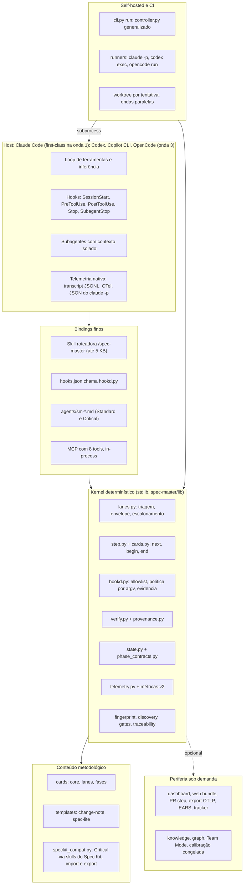
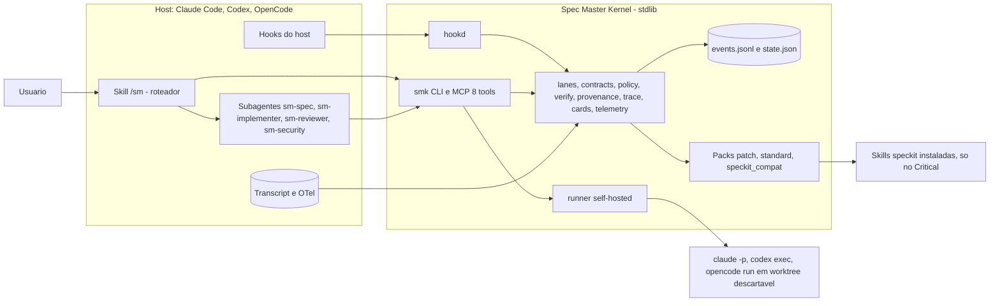

# Alternativas avaliadas — propostas A e B e matriz de decisão

> Duas propostas concorrentes, escritas por arquitetos independentes a partir
> dos mesmos 6 relatórios de diagnóstico ([`evidence.md`](evidence.md)), e a
> crítica do avaliador independente. A opção recomendada (H, híbrida) está na
> [proposta](proposal.md); este documento preserva as alternativas para que a
> decisão possa ser auditada. Referências a scripts do *scratchpad* indicam
> medições feitas em cópias descartáveis, não versionadas. Custos usam a
> tabela de **preço A** (US$4/US$20 por MTok de input/output).

## Índice

- [Proposta A — evolução incremental](#proposta-a--evolução-incremental)
- [Proposta B — kernel de harness enxuto](#proposta-b--kernel-de-harness-enxuto)
- [Matriz de decisão com justificativas](#matriz-de-decisão-com-justificativas)

---

## Proposta A — evolução incremental

**Strangler Harness: do Spec Master como extensão do Spec Kit a harness imposto pelo host, em 4 ondas medidas (medir, impor, encurtar, isolar)**

### Tese

O core determinístico do Spec Master é bom e rápido: cerca de 0,1 s por chamada e 631 testes. O que custa caro e falha é a borda:
- um protocolo de 50 KB em prosa, lido a cada sessão;
- 47 a 58 chamadas de contabilidade por feature;
- a cerimônia completa do Spec Kit até em mudanças triviais (artefatos de 4 a 12 vezes o tamanho do código; 13 de 16 itens foram entregues fora do fluxo);
- nenhuma regra imposta e nenhuma medição real (tokens 0 em 9 de 9 rodadas).

A proposta preserva o núcleo e estrangula a borda em ondas:
1. Medir com a telemetria do host e cortar o desperdício óbvio.
2. Impor as regras via hooks do host e uma API transacional (`step next|begin|end`).
3. Rotear o trabalho por 3 lanes (Patch, Standard e Critical), com o Spec Kit restrito ao Critical e ao formato de troca.
4. Isolar contexto e rodar self-hosted e em paralelo.

Cada onda tem baseline, KPIs e critério go/no-go. `/spec-master`, `specs/NNN` e o state.json atual continuam funcionando durante toda a transição.

### Arquitetura-alvo

#### 1. Visão em camadas



O kernel é o mesmo em todos os modos e falha fechado: sem evidência validada em `step end`, nada é promovido, haja hooks ou não. São três linhas de defesa:
1. Os hooks do host bloqueiam antes da ação.
2. `step end`/`verify` valida depois da ação.
3. No self-hosted, a worktree descartável reverte escritas fora da allowlist. Isso não viola o Princípio V, porque quem criou a worktree foi a própria tentativa.

#### 2. Componentes

| Camada | Componente | Arquivo | Origem | Papel |
|---|---|---|---|---|
| Entrada | Roteador `/spec-master` | `.claude/commands/spec-master.md` + `spec-master/cards/router.md` (até 5 KB) | reescrito | chama `lane triage` e repete o ciclo: step next, trabalho, step end |
| Kernel | Triagem de lane | `lib/lanes.py` (~200 LOC) | novo; reusa `risk_profile.DEFAULT_THRESHOLDS` e as regex `paths` de `hooks.SENSITIVITY_RULES` | lane, envelope (arquivos, camadas, caminhos sensíveis), escalonamento pelo diff |
| Kernel | API transacional | `lib/step.py` + `lib/cards.py` (~400 LOC) | novo; reusa `state`, `phase_contracts`, `context_delta`, `traceability`, `hooks`, `phase_result` | next, begin, end; usa a mesma função de próximo passo que o `controller.py` |
| Kernel | Ponte de hooks | `lib/hookd.py` (~200 LOC; parte do protótipo `sm_guard.py`) | novo; entrypoint próprio com imports mínimos (não passa pelo cli.py) | allow, deny ou ask, e cobrança de evidência nos eventos do host |
| Kernel | Verificação | `lib/verify.py` + `lib/provenance.py` (~350 LOC) | novo; reusa `quality_gates`, `sast_gates`, `traceability`, `ears` | pre: cobertura AC, task e teste, e itens UNRESOLVED; post: gates, AC mapeado a teste, escopo do diff |
| Kernel | Telemetria | `lib/telemetry.py` (~150 LOC) + `metrics.py` v2 | novo | ingere usage e timestamps do host e atribui a feature, lane e fase |
| Kernel | Núcleo mantido | `state.py`, `phase_contracts.py`, `fingerprint.py`, `discovery.py`, `quality_gates.py`, `sast_gates.py`, `traceability.py`, `git_strategy.py`, `constitution_diff.py` | mantido e corrigido | estado, contratos, staleness, gates, rastreabilidade |
| Método | Cards e templates | `spec-master/cards/{core,lanes/*,phases/*}.md`, `templates/{change-note,spec-lite}.md`, `reference/*.md` | extraídos do PROTOCOL.md | conteúdo carregado sob demanda |
| Método | Pack Spec Kit | `lib/speckit_compat.py` (~250 LOC) | novo | Critical via skills instaladas; import e export; doctor de versão |
| Binding | Plugin Claude Code | `spec-master/plugins/claude-code/` (`.claude-plugin/plugin.json`, `hooks/hooks.json`, `agents/sm-*.md`, `skills/spec-master/SKILL.md`, `.mcp.json`) | novo | `init.sh link --hooks` gera um `.claude/settings.json` equivalente para quem não usa plugin |
| Self-hosted | Runner | `controller.py` + `phase_runner.py` (INTEGRATIONS: claude, codex, opencode) | generalizado | `cli.py run` |
| Periferia | Plugins sob demanda | dashboard, web_bundle, pr_step, metrics_export, ears, tracker, knowledge, graph, team | vira plugin ou é congelado | fora do caminho quente |

#### 3. Fronteira host x Spec Master

| Responsabilidade | Host | Spec Master (kernel) |
|---|---|---|
| Inferência, loop de ferramentas, compactação | executa | nunca chama modelo no modo hosted |
| Permissões e sandbox | aplica a decisão (allow, deny, ask) | decide via `hookd`, a partir de `phase_contracts` e da política por argv |
| Isolamento de contexto | fornece subagentes e `claude -p` | define o que entra (card + insumos mínimos) e o schema do PhaseResult que volta |
| Perguntas ao usuário | UI (AskUserQuestion) | decide o momento: só na fronteira de fase e em lote; subagentes devolvem `questions[]` |
| Telemetria | emite (transcript, OTel, JSON do `-p`) | ingere só usage e timestamps, atribui a feature, lane e fase, valida a cronologia |
| Próxima ação, fim de fase, estado, rastreabilidade, proveniência | não faz | `step`, `verify`, `state`, `traceability`, `provenance` |
| Metodologia | não faz | cards e templates próprios; Spec Kit no Critical |

#### 4. Hooks no Claude Code (onda 1): de regra em prosa a regra imposta

| Evento | O que o `hookd` faz | Regra que deixa de depender da prosa |
|---|---|---|
| SessionStart (startup, resume, compact) | grava session_id e transcript_path em `.spec-master/session.json`; injeta o core card + o card da fase RUNNING (até 2k tok) | "leia o PROTOCOL.md inteiro"; perda da fase depois da compactação |
| PreToolUse Edit, Write, MultiEdit | nega escrita fora de `allowed_writes` da fase RUNNING e em `PROTECTED_PATHS` (state.json, logs) | implementar antes de tasks/analyze; editar state.json à mão |
| PreToolUse Bash | política por argv: deny para push forçado ou com +ref, `clean -xfd`, rm/rmtree fora do repo, `branch -D` do branch default; ask para push, PR, publish e deploy | `policy preflight` voluntário (11 de 16 comandos destrutivos passavam) |
| PostToolUse Edit, Write | `lane check --diff` (escalonamento) e lint de proveniência em `specs/**` | escalonamento e tags que dependiam de o modelo lembrar |
| Stop, SubagentStop | se há fase RUNNING, exige `step end` com evidência verde (exit 2, respeitando stop_hook_active); ingere o usage do transcript | declarar sucesso sem artefato; métricas inventadas |

#### 5. Modos de execução

**Hosted (padrão, interativo)**
- O usuário roda `/spec-master <contexto ou "descrição curta">`.
- A skill roteadora chama `python3 spec-master/lib/cli.py lane triage` e depois repete o ciclo `step next`, trabalho, `step end`.
- Standard e Critical rodam as fases em subagentes `agents/sm-<fase>.md`, com ferramentas restritas e maxTurns.
- Os hooks impõem as regras e a telemetria vem do transcript.
- Os outros ~30 agentes gerados ficam num tier "prompt-only", rotulado como advisory.

**Self-hosted (headless, CI, evals, modelos locais)**
- Entrada: `cli.py run --runner claude|codex|opencode --feature F --max-budget-usd N [--parallel K]`.
- Cada fase roda numa worktree descartável com um destes comandos:
  - `claude -p --output-format json --json-schema spec-master/schemas/phase-result.schema.json --append-system-prompt "<card>" --allowedTools <ferramentas da fase> --max-budget-usd N --plugin-dir spec-master/plugins/claude-code` (carrega os mesmos hooks e agentes);
  - `codex exec --json`;
  - `opencode run --format json` (o runner atual).
- O kernel valida o contrato da fase e só então integra a worktree.
- A telemetria vem de `total_cost_usd`, `num_turns` e `usage`.
- Mesmo kernel, mesmos contratos e mesmo formato de métricas do hosted.

#### 6. Roteamento do strangler

```text
/spec-master <ctx | "descrição">
  -> cli.py lane triage
       patch    -> rota nova: router + card Patch + hookd + verify post              (onda 1)
       standard -> rota nova: spec-lite + subagentes + verify pre/post                (onda 2)
       critical -> rota compat: fases Spec Kit em cards + step + hookd + isolamento  (ondas 1-2)
/spec-master --legacy <ctx> -> PROTOCOL.md atual, congelado (removido só pelo go/no-go da onda 3)
cli.py <grupo> <ação>       -> os 76 subcomandos continuam; o formato antigo volta com --pretty/--full/--with-content
```

#### 7. Contrato do phase card (saída de `step next`)

```json
{"feature": "flag-dry-run", "lane": "standard", "phase": "spec",
 "card": "cards/phases/spec-lite.md renderizado (~1,5k tok)",
 "inputs": [".spec-master/context/cards/flag-dry-run.md", ".specify/memory/constitution.md"],
 "required_outputs": ["specs/013-flag-dry-run/spec.md"],
 "allowed_writes": ["specs/013-flag-dry-run/*"],
 "checks": ["provenance", "ac_task_test", "no_placeholders"],
 "on_done": "cli.py step end --feature flag-dry-run --phase spec"}
```

#### 8. Estado e artefatos

**`.spec-master/state.json` v2**
- Campos novos: `lane`; `attempts` por feature e fase (corrige o bug do guarded com 2 features); `evidence` por fase (hash do artefato + resultado dos checks).
- Escrita com lock e mkstemp.
- Migração `state migrate`: idempotente e com backup.
- As 7 features `agentic-outside-spec-master` ficam marcadas `evidence: none` e são contadas à parte.

**Outros arquivos em `.spec-master/`**
- `session.json`: session_id e transcript_path.
- `changes/<id>.md`: change notes da lane Patch.
- `metrics/rounds.json` v2: acrescenta cache_read, cache_creation, cost_usd, turns, model, human_wait_s, lane e `source` (host, estimated ou manual-unverified).
- `policy.json`: min_lane, sensitive_paths extras, gates declarativos e hooks_mode (audit ou block).
- `overrides.jsonl`: overrides auditados.

**`specs/NNN-slug/`**
- Mantido. O número passa a ser alocado pelo kernel (`features allocate`).

#### 9. Pilares de harness por onda

| Pilar | Hoje (evidência) | Alvo | Onda |
|---|---|---|---|
| Controle do loop | prosa de 837 linhas; ~58 chamadas por feature | step next/begin/end; `run` no self-hosted | 1 e 3 |
| Contexto | PROTOCOL, os 3 docs normalizados e as skills entram inteiros | cards por lane, fase e feature; prefixo estável; isolamento por fase | 1 e 2 |
| Política e permissões | preflight voluntário | PreToolUse com argv (audit, depois block) | 1 |
| Hooks de ciclo de vida | 0 hooks do host | 5 eventos via hookd | 1 |
| Subagentes | personas no mesmo contexto | sm-fase e revisor independente | 2 |
| Verificação | ~20 checagens; só 1 executa código, e retorna [] neste repo | verify pre/post + gates declarativos | 1 e 2 |
| Observabilidade | tokens 0 e horários inventados | telemetria do host, schema v2 | 0 |
| Evals | 5 checagens fixas | 4 a 6 casos com braço sem plugin + replay determinístico | 2 |
| Recuperação | só o transcript é copiado | worktree por tentativa; tentativas por feature | 3 |
| Distribuição | init.sh + ponteiros em prosa | plugin + init.sh link --hooks; 4 hosts first-class | 1 e 3 |

#### 10. Não-objetivos
- Nenhum DSL ou engine de workflow próprio (loops, fan-out, expressões). As lanes são um dicionário de dados em `lanes.py`.
- Nenhum marketplace de packs e nenhum conjunto de 30+ bindings first-class.
- Nenhum SDK ou dependência externa no kernel (Princípio II). O self-hosted só dispara CLIs de host por subprocess.
- O kernel nunca chama modelo no modo hosted.
- O knowledge graph não será reescrito, e a calibração não será automatizada antes de haver dados reais.

### Lanes

#### Patch (equivale ao XS atual)

- **Entrada:** A mudança cabe numa frase e a lane é decidida por `cli.py lane triage` antes de qualquer artefato, com sinais medidos no caminho e no repositório, não por contagem de ACs nem por regex sobre prosa. Condições: (1) até 2 arquivos de produção e 1 camada (limite XS atual de DEFAULT_THRESHOLDS), mais os testes; (2) nenhum caminho sensível, segundo as regex paths que já existem para auth, payment, secrets/.env/*.pem, migrations/*.sql e openapi/*.proto, mais .github/workflows, infra e a lista sensitive_paths do .spec-master/policy.json; (3) nenhuma mudança de contrato público, nenhuma dependência nova (manifesto alterado) e nenhuma ação irreversível (push, PR, publish, deploy, migração); (4) teste existente para o módulo tocado, ou teste adicionado; (5) 0 itens UNRESOLVED. Se o caminho for desconhecido, a triagem manda para Standard (default conservador). Na variante bugfix, o verify exige um teste que falhava antes da correção.
- **Fases:** triage, implement, verify(post), done. Nenhuma fase ou skill do Spec Kit é carregada: não há specify, clarify, plan, tasks nem analyze. Roda em sessão única, porque o contexto já é pequeno. A lane escala automaticamente para Standard em três casos: o diff real sai do envelope (PostToolUse chama `lane check`); o verify falha 2 vezes seguidas; ou surge uma decisão que depende do usuário. Na escalada, o trabalho feito é reaproveitado e só se gera o que falta (spec-lite retroativo + revisão).
- **Artefatos:** Uma change note de até 1 KB em .spec-master/changes/<id>.md. Ela contém a intenção, 1 a 3 checks de aceite com tag EXPLICIT/INFERRED/DISCOVERED_FROM_CODEBASE, os arquivos tocados e a evidência, que o kernel anexa. Pode virar o corpo do commit. A linha de rastreabilidade e a rodada de métricas são gravadas pelo `step end`. Nada vai para specs/ (se alguém pedir, `speckit export` gera o formato Spec Kit).
- **Gates:** Nenhum gate humano. Um único gate automático, `verify --stage post`: gates detectados (testes e lint) verdes, diff dentro do envelope, cada check de aceite mapeado a um teste ou gate e tags de proveniência presentes. O Stop hook impede declarar 'concluído' sem essa evidência, com no máximo 1 reinjeção por turno. Ação irreversível sempre pede confirmação explícita (Princípio X).

#### Standard (equivale a S e M atuais)

- **Entrada:** Tudo o que não cabe no Patch nem aciona o Critical: até 12 arquivos e 3 camadas (limite M atual), contrato público só com adições, nenhum caminho sensível, nenhuma migração e nenhuma ação irreversível. É onde deveriam cair as features de produto de tamanho comum, como as 3 do dogfood (003 a 005), que eram S na intake e acabaram infladas para M pelo vocabulário dos próprios artefatos.
- **Fases:** triage; spec (spec-lite em uma passada, num subagente); clarify, só se houver UNRESOLVED ou [NEEDS CLARIFICATION], num único lote e na fronteira da fase (o subagente devolve questions[]); verify(pre), determinístico e no lugar do analyze por LLM (cobertura AC/task/teste planejado, proveniência, EARS opcional e regras da constitution expressas como checagem de máquina); implement test-first num subagente; verify(post); revisão independente por um subagente de contexto limpo, que vê só o diff, os ACs e a evidência e reporta apenas lacunas de correção ou de requisito.
- **Artefatos:** Um único specs/NNN-slug/spec.md, de ~8 a 10 KB no máximo: problema, ACs com tags de proveniência, plano curto e checklist de até 12 tasks. O NNN é alocado pelo kernel (`features allocate`). research, data-model, contracts e quickstart só são gerados com gatilho explícito (o plano toca schema ou contrato). A rastreabilidade AC/teste é derivada pelo verify. `speckit export` gera spec, plan e tasks no formato Spec Kit sob demanda.
- **Gates:** No máximo 1 gate humano: o clarify em lote, só quando há UNRESOLVED; o resto vira SAFE_DEFAULT registrado na decision memory. Gates automáticos: verify-pre bloqueia o implement se houver UNRESOLVED ou AC sem task/teste; verify-post cobre gates, mapeamento AC/teste e escopo do diff; a revisão independente não pode ter achado de correção. A feature escala para Critical pelo diff real ou por sinal sensível, gerando só o que falta (clarify completo, analyze, ADR e aprovação).

#### Critical (equivale a L/XL atuais e a qualquer piso sensível)

- **Entrada:** Basta um destes: caminho sensível (auth, pagamento, segredos, migração ou schema, CI ou infra, provedor externo novo); contrato público modificado ou removido (breaking); ação irreversível; dependência nova; mais de 12 arquivos ou mais de 3 camadas; área sem testes; exigência regulatória ou constitucional. Também entra por override do usuário (--lane critical) ou por min_lane: critical no .spec-master/policy.json, para caminhos ou projetos regulados.
- **Fases:** O fluxo atual, via pack speckit-compat: specify, clarify, plan, tasks, analyze (+repair, até 3 ciclos), implement e validate. Cada fase é conduzida pelo step e executada num subagente isolado (ou num worker claude -p no self-hosted), com phase card e insumos mínimos. Somam-se o ADR check e a revisão de segurança quando há sensibilidade. O Team Mode é opcional, com 3 a 4 papéis executáveis e pacotes derivados das camadas realmente tocadas.
- **Artefatos:** Conjunto Spec Kit em specs/NNN-slug/, com diretório e número definidos pelo harness (SPECIFY_FEATURE_DIRECTORY e --number): spec, plan, tasks e checklists; research, data-model e contracts quando o plano toca dados ou contrato. Mais: ADR, validation report, matriz de rastreabilidade, decisões na decision memory e evidência por fase (hash + checks) no state.
- **Gates:** Aprovação humana antes do implement e antes de qualquer ação irreversível. Clarify em lote, sobrepondo a regra 'uma pergunta por vez' da skill. Analyze com teto de 3 ciclos; ao estourar, a feature vai para BLOCKED. Depois: verify-post, revisão independente e revisão de segurança. O PR é sempre um passo separado e confirmado (Princípio X). No máximo 3 interrupções por feature.

### Cortes

| Item | Ação | Justificativa |
|---|---|---|
| PROTOCOL.md monolítico (49,8 KB, lido integralmente) e as 14 referências a 'CLAUDE.md §N' | reescrever | Só 21–27% do texto serve à fase em execução. São ~9,8k tok mortos reenviados a cada turno, cerca de 1,27M tok de cache read por feature. O CLAUDE.md citado está no .gitignore e não existe no repo. O protocolo passa a ter: (1) um roteador de até 5 KB; (2) um core card; (3) cards por lane e fase gerados pelo kernel; (4) um diretório reference/ com instalação, portabilidade, MCP, web bundle, dashboard e calibração. O PROTOCOL atual fica congelado como rota --legacy até a onda 3. |
| Tiers XS–XL e CEREMONY_PROFILES (rótulos analyze light/deep e review self/peer) | fundir | Um XS ainda exige 6 das 7 fases, e os rótulos light/deep e self/peer não têm nenhum consumidor no código. Os tiers passam a ser só entrada da triagem (DEFAULT_THRESHOLDS e os pisos de sensibilidade são reaproveitados). Quem muda o pipeline são as 3 lanes. `risk classify` continua respondendo, agora devolvendo também a lane. |
| Sensibilidade por regex sobre a prosa de tasks e spec no pre_implement | cortar | Causou escalada espúria de S para M em 3 de 3 features, disparada por 'data-model' e 'contracts', que são vocabulário do próprio Spec Kit. Também não pegou push/PR: optional-pr-open-step saiu S. Fica só a sensibilidade por caminho (as regex paths de hooks.SENSITIVITY_RULES) e pelo diff real, e push/PR/publish/deploy passam a contar como ação irreversível. |
| Contabilidade manual feita pelo LLM: metrics record-round com edição do rounds.json, traceability add linha a linha, delta snapshot por fase e budget file por prompt | fundir | Essas chamadas são a maior parte das 47–58 por feature, e o resultado foram 9 de 9 rodadas com tokens 0 e horários inventados. O trabalho passa para dentro de `step begin\|end` e do ingest de telemetria. Os comandos continuam existindo como primitivas. |
| Eco de conteúdo no budget file e JSON indentado por padrão | reescrever | O budget file responde por 74–82% dos bytes de stdout (12–24 KB por chamada) e anula o próprio objetivo de orçar contexto. O indent=2 infla o JSON em 18–47%. O padrão passa a ser ids + tokens, em JSON compacto. As flags --with-content e --pretty restauram o formato antigo: mudança escopada e documentada, como exige o Princípio VI. |
| tool_policy.py / policy preflight consultivo | reescrever | É uma classificação por string que o próprio agente precisa chamar, e aprovou 11 de 16 comandos destrutivos (push -f, +main, clean -xfd, shutil.rmtree). Vira política por argv aplicada pelo hookd no PreToolUse(Bash), com deny e ask. Começa em modo audit e só depois bloqueia. |
| state upsert-feature aceitando fases PASSED ou status COMPLETED sem evidência | reescrever | Foi o bypass que deixou 7 de 10 features COMPLETED com as 7 fases PENDING, e aceita uma feature 'ghost' com diretório inexistente, contra o Princípio IV. O upsert passa a editar só metadados. Promoção só por `step end` ou por `state transition --require-evidence`, que vira o default na onda 3. O histórico entra por `speckit import`, marcado como sem evidência. |
| state.py, phase_contracts.py, fingerprint.py, traceability.py, quality_gates.py, sast_gates.py, discovery.py, git_strategy.py, constitution_diff.py | manter | É o núcleo determinístico: testado, com ~0,1 s por chamada e sem substituto no host. Recebe correções pontuais: (1) lock + mkstemp no save, porque hoje 19–50% dos updates se perdem sob concorrência; (2) contratos escopados ao spec_directory, contra falso PASSED/BLOCKED em repo com várias features; (3) gates detect reconhecendo projeto stdlib com unittest (hoje retorna [] aqui); (4) discovery via .specify/integration.json (hoje detecta 0 das 10 skills). |
| Disciplina anti-alucinação (EXPLICIT/INFERRED/DISCOVERED_FROM_CODEBASE/UNRESOLVED) | manter | É o diferencial sem equivalente nos concorrentes pesquisados, mas hoje é só prosa. Vira provenance.py, um validador determinístico chamado no PostToolUse de specs/** e no verify. Regras: todo AC tem tag; DISCOVERED exige file:line verificável; UNRESOLVED bloqueia o implement em Standard e Critical. |
| controller.py + phase_runner.py (guarded mode) | manter | É o único loop realmente imposto hoje (tentativas, timeout, lock, retry sem transcript). Na onda 3 é generalizado para claude -p, codex exec e opencode run, com: tentativas por feature+fase (corrige o bug com 2 features); timeout nos gates, que hoje rodam com shell=True e sem timeout; e uma worktree descartável por tentativa. O prompt genérico de uma frase dá lugar ao phase card. |
| opencode_runner.py | cortar | Fan-in zero em produção: foi substituído por phase_runner._run_opencode e só é citado em specs/001. |
| evals.py (5 checagens fixas) e runtime_contract.py (dict constante) como gates obrigatórios | cortar | Sempre passam e sustentaram o '100% readiness' sem medir comportamento. Entram no lugar: replay determinístico sobre fixtures/fake_agent.py em todo PR, com custo zero; e 4 a 6 evals de trajetória com braço sem plugin (claude plugin eval) a cada release. |
| Autoauditoria no fechamento de cada run (graph enrich/validate/snapshot/health, evals, runtime contract) | congelar | Essas checagens validam o harness, não a feature. Além disso, o enrich-discovery obrigatório apaga as arestas de decisão e reprova o graph validate que vem logo depois. Elas saem do Step 8 e vão para `cli.py doctor` no CI. O bug de perda de arestas é corrigido na onda 0. |
| calibration.py (413 LOC, complexidade ciclomática 51) | congelar | Tem 0 rodadas utilizáveis e um laço latente: com tokens reais, toda feature ficaria 'under' e os thresholds apertariam 0,8x por janela, gerando mais cerimônia. Só volta com ≥10 features medidas e com duas mudanças: orçamento em tokens novos ou custo, nunca input cumulativo; e 'under' disparando primeiro uma revisão da cerimônia, antes de apertar limites. |
| Team Mode com 12 papéis como personas no mesmo contexto | congelar | Após 10 features: 0 workstreams, 0 decisões registradas, e o peer review é uma checagem de string no mesmo contexto. O passo de carga de playbook nunca rodou, porque cita comandos que não existem. Fica opcional e restrito ao Critical. Nas ondas 2–3 vira 3 a 4 subagentes executáveis (implementador, revisor independente, segurança, arquiteto), com pacotes derivados das camadas tocadas em vez do template fixo de 6 etapas. |
| Knowledge graph (lib/graph/, ~2k LOC, 4 nós e 3 arestas) | virar_plugin | Não teve uso real depois de 10 features, e ~350 LOC só são usadas por testes (context, query, resolver, temporal). Sai do caminho quente como plugin. Os módulos só-teste são removidos na onda 3 se a telemetria não mostrar uso. |
| dashboard (re-render a cada transição), web_bundle, pr_step, metrics_export OTLP, ears, tracker_orchestration | virar_plugin | Nenhum deixou rastro no dogfood. O dashboard re-renderiza a cada transição e lê o firings.jsonl inteiro, custo O(n): 134 ms hoje, 1,1 s com 40 MB. Passam a ser carregados sob demanda (cli.py report, bundle, pr). O PR continua sendo um passo separado e confirmado (Princípio X). |
| Artefatos Spec Kit completos em mudanças pequenas (research, data-model, contracts, quickstart, checklists, 21–29 tasks) | cortar | Os artefatos chegaram a 4,3–5,4x o tamanho de código+testes (8,7–12,5x só do código) em módulos de 92–131 linhas, e o clarify não teve efeito em 3 de 3 features. Saem das lanes Patch e Standard. No Critical, research, data-model e contracts só aparecem quando o plano toca dados ou contrato. |
| Servidor MCP com 76 tools e um subprocess por chamada | reescrever | Custa ~8,7k tok de schema por sessão e 112 ms por chamada. Vira 8 tools de alto nível executadas in-process: triage, step_next, step_begin, step_end, verify, status, export e doctor. O catálogo completo fica atrás de --expert. |
| adapters_gen.py e os 30+ entrypoints gerados | congelar | São ponteiros em prosa, sem enforcement, e já estão defasados em relação ao registry do Spec Kit: faltam 3 agentes e o qodercli migrou para skills. Ficam como tier 'prompt-only', rotulado. Só são first-class os hosts capazes de negar uma ferramenta: Claude Code na onda 1; Codex, Copilot CLI e OpenCode na onda 3. |
| Registries duplicados (AGENT_ROLES em dois lugares, 5 listas de fases, 4 tuplas de tiers, 9 funções _now, 8 escritas atômicas próprias) | fundir | São fonte de deriva e obrigam o protocolo a pedir resolução manual de ids de papel. Tudo converge para um common.py (fases, tiers/lanes, now_iso, escrita atômica com lock) e para um registry único de papéis gerado a partir dos playbooks. |
| cli.py monolítico (38 imports no topo, build_parser com 450 linhas) | reescrever | Nas chamadas leves, 63–73% do tempo vai para imports que o comando não usa. Mesmo assim, isso é menos de 4% do custo de um turno de LLM, por isso fica para a onda 3: commands/<grupo>.py com import lazy e um índice JSON do knowledge, tirando o PyYAML do caminho quente. |
| Worktree waves (worktree waves/plan/conflicts/aggregate) | congelar | O cálculo coloca 9 de 10 features na onda 0, mas nenhum executor usa o resultado. Só volta ao caminho quente na onda 3, junto com o runner self-hosted paralelo e com o lock de estado já corrigido. |
| Barramento duplo de hooks (hooks.py do Spec Master e extensions.yml do Spec Kit) | fundir | São dois barramentos para o mesmo ciclo, e o boilerplate de extension hooks ocupa ~3,8 KB por skill mesmo sem extensions.yml no repo. hooks.py fica como barramento único; suas diretivas passam a ser consumidas pelo step, não pelo LLM; e o hookd faz a ponte com os hooks do host. |

### Plano de performance

| Ação | Ganho estimado | Como medir | Esforço |
|---|---|---|---|
| Telemetria nativa do host e baseline. (1) O hook Stop/SubagentStop e o `step end` leem só usage e timestamp do transcript_path; já foi verificado que o transcript traz input, cache_creation, cache_read e output por mensagem. (2) No self-hosted, a fonte é o JSON do claude -p (total_cost_usd, num_turns, usage) e do opencode run --format json. (3) Schema v2 das métricas com cache_read, cache_creation, cost_usd, turns, model, human_wait_s, lane e source. (4) metrics validate passa a rejeitar sobreposição e cronologia impossível. (5) Baseline: uma tarefa XS e o escopo da feature 003, este reproduzido a partir do commit 9f1fa2b num clone de scratch, com 3 execuções headless de cada. | Sozinha, não acelera nada. Leva as rodadas utilizáveis de 0/9 para 100% no Claude Code, elimina 7 chamadas manuais por feature e desarma o laço de calibração. É pré-requisito para provar ou refutar todos os outros ganhos. | Percentual de rodadas com source=host e tokens > 0. Total por feature conferido contra o total_cost_usd do claude -p, com desvio máximo de 5%. Baseline versionado em .spec-master/metrics/baseline/ com mediana e dispersão de 3 execuções. | M |
| Dieta de saída da CLI: budget file devolve só ids e tokens; JSON compacto por padrão; state transition responde com ack mínimo; Step 0 usa state show --summary. As flags --with-content, --pretty e --full restauram o formato antigo. | stdout por feature cai de 100,8 KB (sim_feature.sh) ou 197 KB (simulate.py) para ~12–20 KB (−80 a −94%), o que tira ~20–45k tok do contexto por feature. Estimativa de −8 a −15% no input cumulativo do fluxo atual. | sim_feature.sh e simulate.py do scratchpad antes e depois (bytes de stdout por comando). Tokens da feature de referência via telemetria. | S |
| Eliminar a deriva protocolo↔CLI↔host. Correções: `knowledge get <id>`; `knowledge route` no lugar de for-context; caminho das skills no adapter; `/speckit-<fase>` resolvido pelo invoke_separator e sem --files; discovery via .specify/integration.json. Criar test_protocol_cli_contract.py, que faz parse de todo comando citado em PROTOCOL, playbooks e README com build_parser(). | Remove turnos de erro e retry: as 2 invocações quebradas do Team Mode e o FAILED indevido por skill dada como inexistente. Skills Spec Kit detectadas passam de 0/10 para 10/10. | Teste de contrato no CI (0 invocações quebradas). Contagem de tool results com erro por run nos transcripts. | S |
| Desarmar a inflação de tier. O pre_implement passa a medir arquivos e camadas pelos caminhos e pelo diff, sem contar as tasks do template nem rodar regex sobre prosa. push, PR, publish e deploy passam a contar como ação irreversível. | Evita a escalada S→M vista em 3/3 features. Economiza uma passada de analyze por feature: ~12,6k tok, ~8 turnos, ~−12% do input cumulativo (modelo). | risk classify --stage pre_implement sobre as specs 003–005 precisa manter S, e optional-pr-open-step precisa subir. Teste de regressão com os payloads reais. | S |
| Gates só na fronteira de fase. Mudanças: clarify em lote (sobrepõe o EXACTLY ONE da skill); sem oferta de remediação no analyze; sem gate de checklist no implement; SAFE_DEFAULT registrado na decision memory em Patch e Standard; subagentes devolvem questions[] em vez de perguntar. | De até 9 interrupções por feature para 0 (Patch), ≤1 (Standard) e ≤3 (Critical). Evita reescrever o cache depois de esperas acima de 5 min: ~US$0,48 por gate com 100k de contexto, até ~US$2,4 por feature (modelo). | Número de AskUserQuestion por feature e human_wait_s na telemetria v2. cache_creation_input_tokens medido depois de cada gate. | S |
| Fatiar o PROTOCOL.md: roteador de até 5 KB, core card de ~3–4 KB e cards por lane e fase de 1–3 KB, gerados pelo kernel. Ordem de carga estável: core, constitution, feature card, phase card. No SessionStart(compact), o hook reinjeta o card da fase RUNNING. | −9,8k tok fixos por turno (~−1,27M tok de cache read por feature, ~−10% do input cumulativo). Carga de bootstrap de 55,1 KB para ≤8 KB. O card cabe no limite de 5k tok que o host re-anexa por skill depois da compactação. | wc -c do que o entrypoint manda carregar. cache_read_input_tokens por feature na telemetria. `claude plugin details` para o custo fixo projetado do plugin. | M |
| step next/begin/end como caminho único. O end faz: transition, validate_artifacts escopado à feature, delta snapshot, rastreabilidade em lote, métricas vindas da telemetria e risk classify quando couber. O controller.py usa a mesma função de próximo passo. | Chamadas por feature caem de 58 para ~9–16 (−72 a −84%). Input cumulativo −25 a −43%. Custo por feature no fluxo completo de ~US$6,33 para 5,2–5,7 (modelo do analista de custo). | Contagem de chamadas Bash/MCP ao spec-master e num_turns por feature (telemetria), na feature S de referência, com 3 execuções. | M |
| Feature cards. O kernel extrai a seção da feature em app-features.md, mais Cross-feature, Non-goals e excertos de tech-stack, em vez de passar os 3 docs normalizados inteiros. | Insumo do specify de 28,1 KB para ~4,6 KB (−84%). Implement com −17,5 KB. | Bytes de inputs[] por fase, registrados pelo step next. Tokens por fase na telemetria. | S |
| Lane Patch: triage, implement e verify(post); change note de até 1 KB; nenhuma skill Spec Kit carregada; escalonamento pelo diff real. | Numa tarefa XS: instruções de ~34,5k para ~2–3k tok; artefatos de ~12–14k tok para menos de 0,5k; de ≥36 para ≤4 chamadas; 0 gates humanos. Meta de custo: ≤25% do baseline S. | Tarefa XS de referência (correção pequena com teste) em headless, 3 execuções por braço (fluxo atual vs Patch): tokens, custo, turnos, testes verdes. Também claude plugin eval com braço sem plugin. | M |
| Lane Standard (spec-lite): um único spec.md com ACs rotulados, plano curto e até 12 tasks; verify-pre determinístico no lugar do analyze por LLM; implement e revisão em subagentes. | Numa feature S/M: artefatos de 47,7 KB para ≤5–10 KB (−80 a −90%); instruções de 26,4k para ~5k tok; de ~130 para ~45 turnos; input cumulativo de 13,0M para ~2,8M (−78%); custo de ~US$6,3 para ~2,2 por feature. Os números vêm do modelo, e os tokens de saída são HIPÓTESE. | Replay do escopo das features 003–005 em clones de scratch, 3 execuções por braço. Razão artefato/código. Graders de evals (testes verdes, ACs cobertos) para checar não-inferioridade. | L |
| Isolamento de contexto por fase: subagentes agents/sm-<fase>.md no hosted (Standard e Critical) e workers claude -p no self-hosted. O orquestrador recebe só o PhaseResult JSON, com até 2k tok. | Input cumulativo de 13,0M para ~4,2M por feature (−68%), com custo linear no número de features: hoje a 3ª feature na mesma sessão custa ~39,6M. Somado a step, cards e lanes leves em XS/S: ~1,3M (−90%) e ~US$1,65 por feature (−74%). Tudo pelo modelo. | Sequência de 3 features na mesma sessão vs isoladas: a 3ª deve ficar a ±15% da 1ª no input cumulativo. Medir também o cache_creation adicional, para confirmar que ele não anula o ganho. | L |
| Latência do core e schema de tools: MCP enxuto in-process com 8 tools; CLI com registro lazy por grupo; índice JSON do knowledge; tail-read do firings.jsonl; dashboard fora do caminho quente. | −~7,7k tok de schema MCP por sessão. MCP de 112 para 2–10 ms por chamada; CLI de 105–120 para 30–45 ms; knowledge de 180 para ~35 ms. transition passa a ser O(1) em relação ao histórico (hoje leva 1,1 s com 40 MB de firings). A latência de parede é menos de 4% do custo de um turno de LLM, por isso este item fica por último. | bench.py, bench_inproc.py e firings_scale.py do scratchpad (mediana de 7 repetições). Bytes de tools/list. | M |
| Paralelismo por ondas no self-hosted: features independentes da mesma onda rodam em worktrees, com concorrência limitada, --max-budget-usd por worker e agregação via worktree conflicts/aggregate. No Critical, os pacotes viram um DAG (backend em paralelo com frontend depois do contrato). | O wall-clock de N features independentes fica próximo do da mais longa: até −80% com 10 features em 2 ondas (HIPÓTESE, limitada por rate limit e merge). Caminho crítico de L de 6 para 4 pacotes. Os tokens não aumentam. | Wall-clock de 3 features independentes num repo de scratch, serial vs paralelo. Teste de concorrência de estado com 0 updates perdidos. | M |

### Relação com o Spec Kit

**Diagnóstico**

O acoplamento real está no ritual e no protocolo, não no código: o PROTOCOL.md menciona o Spec Kit 52 vezes, enquanto só 0,7% das linhas do core tocam nele. Esse acoplamento já está quebrado:
- o discovery não enxerga as 10 skills instaladas;
- o adapter aponta para `.claude/commands/speckit.<phase>.md`, que não existe;
- os prompts usam `/speckit.<phase> --files`, com separador errado e uma flag inexistente;
- o bootstrap instala o HEAD sem pin.

Enquanto isso, o upstream foi de 0.16.4 a 1.0.12 em 42 dias, ganhou engine de workflows e mais de 150 extensões, e está absorvendo o papel de "orquestrador acima do Spec Kit". O que continua diferenciando o Spec Master é o harness.

**Alvo: o Spec Kit deixa de ser dependência obrigatória e vira o pack do lane Critical e o formato de troca**

1. **Onda 0: estancar.**
   - O discovery lê `.specify/integration.json` e os manifests (skills e commands).
   - As fases são resolvidas pelo `invoke_separator` (`/speckit-plan`).
   - Pin com `speckit_compat: ">=0.16,<1.1"`.
   - Bootstrap com tag: `uvx --from git+https://github.com/github/spec-kit.git@vX.Y.Z specify init --here --integration <agente>`.
   - O `doctor` compara `.specify/integration.json.version` com a faixa suportada.
   - Smoke test contra o último release do upstream.

2. **Ondas 1 e 2: pack do Critical.**
   - `speckit_compat.py` delega cada fase do Critical à skill instalada, rodando isolada.
   - Não reescreve os prompts de clarify e analyze e não edita os arquivos instalados (o manifest guarda o sha256 de cada um).
   - O harness decide número, diretório e branch pelas alavancas oficiais: `SPECIFY_FEATURE_DIRECTORY`, `--number` do create-new-feature.sh e `GIT_BRANCH_NAME`. Isso elimina a colisão em 006 e a dependência do `.specify/feature.json`, que o git ignora.
   - A atualização para 1.0.x só acontece depois do smoke verde.

3. **Patch e Standard não exigem `.specify/`.** Usam change note e spec-lite próprios, derivados dos templates MIT do Spec Kit (que não mudaram entre 0.16.4 e 1.0.12), com atribuição.

4. **Interoperabilidade.**
   - `speckit export` materializa qualquer feature como `specs/NNN-slug/{spec,plan,tasks}.md`.
   - `speckit import` traz specs existentes como histórico sem evidência; nada fica PASSED sem revalidação.
   - Quem usa o Spec Kit hoje continua com `specs/NNN` e com as skills.

5. **Governança.**
   - A constitution continua em `.specify/memory/constitution.md`, sem mudar de lugar.
   - `constitution diff` passa a calcular o bump semver e o Sync Impact Report que a skill exige (os princípios VII–X entraram sem bump).
   - `hooks.py` fica como único barramento de eventos.
   - Emenda proposta, que exige aprovação explícita pela seção Governance:
     - o Princípio VII passa a dizer "o Spec Master é dono do harness e das lanes Patch/Standard; o Spec Kit é o motor do lane Critical e o formato de troca; integrações do ecossistema (trackers, extensões, presets) continuam sendo reaproveitadas";
     - a Development Workflow deixa de exigir fase Spec Kit para toda mudança.
   - Sem aprovação, as lanes nativas ficam opt-in e o default continua sendo o Spec Kit.

6. **O que não reimplementar.**
   - O instalador e o registry de mais de 40 agentes.
   - Uma engine genérica de workflow (loops, fan-out, expressões).
   - O catálogo de extensões e presets.
   - Os clientes de tracker.
   - Os prompts de clarify e analyze do Spec Kit.

   Compilar o Critical para o `workflow.yml` do Spec Kit 1.x fica fora de escopo até haver demanda medida.

**Resultado**

O Spec Master deixa de ser uma "extensão que orquestra o Spec Kit" e passa a ser um harness que usa o Spec Kit onde ele se paga (incerteza de design em mudanças críticas) e como formato de interoperabilidade.

### Roadmap

#### Onda 0 — Medir e estancar (0–2 semanas (28/09 a 09/10/2026))

**Entregáveis:**

- Telemetria: telemetry.py, hook Stop/SubagentStop e SessionStart gravando .spec-master/session.json. Schema de métricas v2 retrocompatível e metrics validate checando cronologia. As rodadas r5–r9 passam a ter source: manual-unverified.
- Baseline medido: uma tarefa XS e o replay da feature 003 (a partir do commit 9f1fa2b), 3 execuções headless de cada com claude -p --output-format json --max-budget-usd, versionado em .spec-master/metrics/baseline/.
- Dieta de saída da CLI: budget file sem conteúdo, JSON compacto, ack mínimo no transition e state show --summary no Step 0.
- Deriva protocolo↔CLI↔host corrigida, com test_protocol_cli_contract.py, discovery via .specify/integration.json, pin speckit_compat e bootstrap com tag.
- Integridade: lock + mkstemp em state, traceability e rounds; FileGraphStore carregando antes de salvar; tentativas por feature+fase no controller; gates detect para stdlib/unittest; os 21 módulos de teste passando com unittest (Princípio III).
- Inflação de tier desarmada: pre_implement por caminho e diff; push/PR como ação irreversível.

**KPIs:**

- Rodadas novas com tokens do host: 100% (hoje 0 de 9).
- stdout da CLI por feature (sim_feature.sh): de 100,8 KB para ≤20 KB.
- Invocações quebradas no protocolo: de 2 para 0. Skills Spec Kit detectadas: de 0/10 para 10/10.
- Escaladas espúrias S→M em 003–005: de 3/3 para 0/3.
- Updates perdidos em 16 escritas concorrentes: de 19–50% para 0%. graph validate após enrich-discovery: verde.
- unittest discover: de 21 erros para 0, com os testes do modo native inalterados e verdes.

**Go/No-go:** GO para a onda 1 exige três condições: baseline com tokens reais (≥3 execuções por tarefa, com dispersão conhecida), suíte existente verde sem editar testes do modo native (Princípio VI) e teste de contrato verde. NO-GO parcial se o host não expuser usage de forma confiável: segue-se com duração e turnos rotulados source: estimated, sem anunciar ganhos de tokens ou custo até resolver.

#### Onda 1 — Impor o harness e abrir a lane Patch (semanas 3–8 (12/10 a 20/11/2026))

**Entregáveis:**

- step.py + cards.py: comando step next/begin/end com phase card. PROTOCOL fatiado em roteador de até 5 KB, core card, cards por fase e reference/. A flag --legacy preserva o fluxo antigo, congelado.
- hookd.py, entrypoint próprio construído a partir do protótipo sm_guard.py, cobrindo 5 eventos: SessionStart, PreToolUse(Edit/Write), PreToolUse(Bash) com política por argv, PostToolUse (lane check) e Stop/SubagentStop (evidência). Roda em hooks_mode: audit por 2 semanas e depois passa a block. Overrides via override --reason em overrides.jsonl.
- Distribuição: plugin spec-master/plugins/claude-code/ (plugin.json, hooks/hooks.json, skills/spec-master) e init.sh link --hooks gerando .claude/settings.json.
- lanes.py (triagem, envelope e escalonamento pelo diff) com a lane Patch. verify.py --stage post (gates, mapeamento AC→teste, escopo do diff) e provenance v1 (tags obrigatórias).
- Gates só na fronteira: clarify em lote, sem remediação no analyze e sem gate de checklist no implement.
- Proposta de emenda ao Princípio VII e à Development Workflow via constitution diff, com aprovação explícita. Até a aprovação, a lane Patch é opt-in (--lane patch).
- Dogfood reaberto: a evolução do próprio Spec Master passa pela lane Patch ou pela rota legada.

**KPIs:**

- Chamadas obrigatórias por feature no fluxo completo: de 58 para ≤16.
- Carga fixa de instruções no bootstrap: de 55,1 KB para ≤8 KB.
- Tarefa Patch de referência: ≤3k tok de instruções, ≤4 chamadas, 0 gates, artefato ≤1 KB e custo ≤25% do baseline S.
- Latência de decisão do hookd: p95 ≤50 ms (o protótipo mediu 28–33 ms).
- Falsos bloqueios em modo audit: ≤1% das tool calls de escrita e Bash.
- Fases PASSED sem artefato na rota nova: 0 (Princípio IV imposto).
- Itens do dogfood entregues pelo fluxo: de 19% (3 de 16) para ≥80%.

**Go/No-go:** GO exige que a lane Patch corte ≥60% de tokens e custo medidos contra o baseline numa tarefa XS equivalente, com os mesmos testes verdes, e que o modo audit fique em ≤1% de falsos bloqueios por 2 semanas; aí os hooks passam a bloquear. Acima de 1%, os hooks continuam só avisando e as regras são corrigidas antes de avançar. Se a emenda não for aprovada, a onda 2 concentra-se em isolamento e step no Critical, e as lanes nativas seguem opt-in.

#### Onda 2 — Lane Standard, isolamento e Spec Kit como pack do Critical (meses 2–4 (23/11/2026 a 29/01/2027))

**Entregáveis:**

- Lane Standard: template spec-lite (derivado dos templates MIT do Spec Kit, com atribuição), verify --stage pre determinístico e subagentes para o implement test-first e para o revisor independente.
- Subagentes agents/sm-spec, sm-implement e sm-review (mais sm-<fase> para o Critical), com ferramentas restritas, maxTurns e PhaseResult com schema JSON de até 2k tok, reusando phase_result.py.
- speckit_compat.py: o Critical delega cada fase à skill instalada, com diretório e número alocados pelo harness (SPECIFY_FEATURE_DIRECTORY, --number). Inclui speckit export/import e o doctor de versão; atualização para 1.0.x depois do smoke.
- Feature cards e MCP enxuto: 8 tools in-process, com o catálogo completo atrás de --expert.
- Evals v1: 4 a 6 casos (bugfix XS, S brownfield, feature M, L com auth, prompt adversarial 'implemente já', retomada após compactação), com graders determinísticos, 3 trials e braço sem plugin. Replay determinístico do hookd sobre fake_agent.py em todo PR.
- Proveniência como gate duro: DISCOVERED exige file:line verificável, e UNRESOLVED bloqueia o implement em Standard e Critical.

**KPIs:**

- Feature Standard: artefatos ≤10 KB (hoje 47,7–54,8 KB) e razão artefato/(código+testes) ≤1,5x (hoje 4,3–5,4x).
- Input cumulativo por feature Standard: ≤30% do baseline (a meta do modelo é 22%).
- Interrupções humanas: ≤1 no Standard e ≤3 no Critical (hoje até 9).
- Evals: taxa de sucesso do Standard no máximo 5 pp abaixo da do fluxo completo e ≥ ao braço sem plugin; 100% dos ACs com tag de proveniência.
- Critical com isolamento: a 3ª feature da sessão custa até ±15% da 1ª (hoje ~3x).
- Schema MCP: de 34,8 KB para ≤5 KB.

**Go/No-go:** O Standard vira default de S/M se for não-inferior ao fluxo completo nos evals (diferença ≤5 pp) com ≥50% menos tokens medidos. Se ficar pior, o Standard é restrito a S e as features M vão para o Critical. O Critical com isolamento não pode custar mais que o baseline; se custar, volta à sessão única com cards.

#### Onda 3 — Self-hosted, paralelismo e consolidação do ecossistema (meses 4–6 (01/02 a 31/03/2027))

**Entregáveis:**

- cli.py run: controller generalizado com runners claude, codex e opencode, worktree descartável por tentativa, timeout nos gates e os mesmos hooks via --plugin-dir.
- Paralelismo por ondas, com limite de concorrência e --max-budget-usd por worker, e DAG nos pacotes do Critical. Team Mode reduzido a 3–4 subagentes executáveis.
- Bindings de hooks para Codex, Copilot CLI e OpenCode, só onde o host consegue negar uma ferramenta. Os demais agentes ficam no tier prompt-only, rotulado.
- Consolidação: periferia vira plugin; remoção dos módulos só-teste do graph; cli.py dividido com import lazy; common.py e registry único de papéis; calibração reativada com ≥10 features reais.
- Deprecação da rota --legacy e de state transition sem evidência (o default vira --require-evidence), com aviso prévio de 1 versão.

**KPIs:**

- Execuções self-hosted com tokens reais nos 3 runners: 100%.
- 3 features independentes em paralelo: wall-clock ≤1,5x o da mais longa, com 0 corrupção de estado.
- 4 hosts first-class passando no teste de contrato de hooks de cada versão.
- LOC importadas no caminho quente: ≤~4k (hoje o cli.py importa ~12,9k de lib). CLI com p50 ≤45 ms.
- ≥80% das features pelas lanes novas por ≥4 semanas seguidas.
- Nota de harness na rubrica de 14 dimensões do analista: de 31 para ≥75/100. Cada dimensão só conta com evidência executável (teste ou eval); a simples existência de um comando não pontua.

**Go/No-go:** A rota legada só é removida com ≥4 semanas seguidas de ≥80% das features em lanes novas, 0 regressões P0 abertas e evals verdes em 2 releases seguidas. O paralelismo só vira padrão com o teste de concorrência verde; até lá fica atrás de flag.

### Riscos

| Risco | Probabilidade | Impacto | Mitigação |
|---|---|---|---|
| Subclassificação na lane Patch: uma mudança arriscada passa com pouca cerimônia. | media | alto | Pisos por caminho que já existem, mais os sensitive_paths do projeto. Caminho desconhecido cai em Standard. Escalonamento pelo diff real a cada edição (PostToolUse) e também no verify. O verify-post sempre roda os gates. Override para cima sempre permitido; para baixo, só com confirmação registrada. min_lane configurável por projeto ou caminho. Casos adversariais nos evals ('implemente já', auth disfarçada). |
| Falsos bloqueios dos hooks, ou mudança de API e de semântica de hooks entre hosts e versões (ex.: issue #3874 do Copilot CLI sobre deny em preToolUse). | media | medio | Modo audit (só registra) por ≥2 semanas antes de bloquear. O hookd só age quando há fase RUNNING. override --reason auditado em overrides.jsonl. Guarda stop_hook_active e no máximo 1 reinjeção por turno. Bindings finos com teste de contrato por versão do host. Um único host first-class na onda 1. |
| Strangler que nunca termina: rota legada e rota nova convivendo indefinidamente, com manutenção dobrada. | alta | medio | Os cards são a fonte única; o PROTOCOL legado fica congelado e só recebe correção de bug. step.py e controller.py compartilham a mesma função de próximo passo. A deprecação do --legacy tem critério objetivo e data na onda 3. ~20% do esforço de cada onda fica reservado para remover o que foi substituído. |
| Emenda da constitution (Princípio VII e o 'never simulated' da Development Workflow) não aprovada. | media | alto | Proposta via constitution diff na onda 1, com texto pronto e evidência (13 de 16 itens fora do fluxo, 3 de 3 escaladas espúrias). Até a aprovação, Patch e Standard ficam opt-in e rotuladas, e o Critical segue 100% Spec Kit. Nenhum default muda sem aprovação explícita. |
| Os ganhos estimados não se confirmarem: o modelo de custo usa HIPÓTESES de turnos e de tokens de saída, e subagentes e o Stop hook podem acrescentar turnos. | media | medio | Baseline medido na onda 0. O go/no-go de cada onda usa deltas medidos, não estimados, e os relatórios separam o medido do estimado. Se a Patch não cortar ≥60%, revisar antes de abrir a Standard. |
| Perda de qualidade ou de auditabilidade com menos artefatos (clientes regulados, exigência de rastreabilidade formal). | baixa | alto | Proveniência e rastreabilidade AC→teste continuam obrigatórias em todas as lanes. speckit export sob demanda. min_lane: critical configurável. O Standard só vira default depois de mostrar não-inferioridade nos evals. |
| Deriva do upstream Spec Kit (14 releases em 42 dias, incluindo uma major 1.0) quebrando o pack do Critical. | alta | medio | Pin com faixa speckit_compat, bootstrap com tag, doctor de versão, discovery via manifesto e smoke contra o último release. Como o Spec Kit fica restrito ao Critical, uma quebra não para Patch nem Standard. |
| Telemetria indisponível ou variável em alguns hosts, e risco de expor conteúdo sensível dos transcripts. | media | medio | Ler só usage, timestamps e ids, nunca prompts (OTEL_LOG_USER_PROMPTS desligado). Fallback explícito para duração e turnos, com source: estimated. Um adapter de ingest por host, testado sobre amostras reais. |
| O isolamento por fase custar mais que o previsto (cache writes a 1,25x, perda de nuance entre fases). | media | baixo | Isolar só Standard e Critical. PhaseResult estruturado com até 2k tok e prefixo comum estável. Medir por fase e voltar à sessão única com cards se o custo subir. |
| Corrupção de estado com paralelismo e MCP concorrente (hoje 19–50% dos updates se perdem sob concorrência). | alta | alto | Lock + mkstemp na onda 0 e teste de concorrência no CI. Paralelismo só na onda 3, atrás de flag até o teste ficar verde. Escritor único via MCP in-process. |
| O próprio harness cair em overengineering (DSL de workflow, marketplace de packs, dezenas de bindings). | media | medio | Lista explícita de não-objetivos. Toda peça nova precisa mover um KPI da onda. Lanes como dicionário de dados em lanes.py. Bindings gerados automaticamente só a partir do 2º host. |
| Custo recorrente e variância das evals com LLM. | media | baixo | Replay determinístico sobre fixtures/fake_agent.py em todo PR, com custo zero. A suíte com LLM roda só por release, com 3 trials, modelo fixo e --max-budget-usd. Graders determinísticos no lugar de juízes LLM sempre que possível. |

### Esforço total

~21 a 27 pessoa-semanas (cerca de 5 a 6 pessoa-meses), em ~6 meses de calendário com 1 a 2 devs.

Por onda:
- Onda 0: ~2 a 3 pessoa-semanas.
- Onda 1: ~6 a 7 (step + cards/fatiamento, hookd, plugin/link, lanes + Patch, verify post).
- Onda 2: ~6 a 8 (Standard, subagentes, speckit_compat, evals, MCP enxuto, proveniência).
- Onda 3: ~7 a 9 (runners self-hosted, paralelismo, bindings de 3 hosts, consolidação e remoções).

Código:
- Novo: ~1,5k a 2k LOC stdlib (lanes, step, cards, hookd, verify, provenance, telemetry, speckit_compat).
- Em troca, cortes, plugins e congelamentos tiram ~8k a 9k LOC do caminho quente. O alvo é ≤~4k LOC importados.

Imposto do strangler: cerca de 20 a 25% do esforço vai para a convivência com a rota legada, flags de compatibilidade, testes de contrato e a migração do state de v1 para v2.

Custo de LLM:
- ~US$40 a 80 para o baseline da onda 0.
- ~US$100 a 250 por rodada completa de evals (4 a 6 casos × 3 trials × 2 a 3 braços), executada a cada release.
- O replay determinístico, rodado em todo PR, custa zero.

### Por que esta abordagem (argumento do arquiteto)

1. **O que está bom é o centro; o que está ruim é a borda.** Os seis analistas convergem nisso. O core determinístico é rápido e testado (~0,1 s por chamada, 631 testes, notas de 7 a 9/10 nos scorecards). O custo e as falhas vêm do protocolo em prosa, da cerimônia fixa, da falta de enforcement e das métricas vazias. Estrangular a borda preserva ~2,5k LOC de núcleo com ~170 testes dedicados (state, contratos, fingerprint, rastreabilidade, gates, controller), que um clean-slate teria de reescrever e revalidar.

2. **Os maiores ganhos vêm de parar de fazer coisas, não de reescrever.** Dieta de saída, fatiamento do protocolo, fim da inflação de tier e gates na fronteira rendem de −10 a −45% de input em semanas, com esforço S/M. Lanes e isolamento (−68 a −90%) também são construídos sobre o núcleo atual.

3. **Hoje não existe baseline (tokens 0 em 9 de 9 rodadas).** Um clean-slate seria desenhado às cegas e calibraria as lanes por palpite. Aqui, a onda 0 mede, e cada onda seguinte só avança se o ganho medido aparecer.

4. **Compatibilidade é exigência da própria constitution.** O Princípio VI pede evolução retrocompatível, e mudar um Princípio exige aprovação explícita. O strangler mantém `/spec-master`, o init.sh global, `specs/NNN`, o state v1 (migrado) e os testes do modo native. A emenda ao Princípio VII só é pedida quando há evidência para sustentá-la.

5. **Evita o efeito de segundo sistema.** 41% do lib entrou num único commit e nunca rodou em dogfood, e o próprio knowledge/agile/galls-law.md do repo alerta contra arquitetura complexa antes de haver um caso concreto. Um "ecossistema harness completo" desenhado de uma vez tende a repetir esse padrão; ondas com KPI e go/no-go impedem isso.

6. **Host e upstream mudam rápido.** O Spec Kit teve 14 releases em 42 dias, e as APIs de hooks, plugins e workflows continuam evoluindo. Passos pequenos e reversíveis absorvem essas mudanças; uma reescrita de 6 meses fica presa às APIs de hoje e só entrega no fim.

7. **Valor contínuo e visível:**
   - semana 2: telemetria real e corte de desperdício;
   - semana 8: harness imposto e lane Patch, com o dogfood reaberto;
   - mês 4: Standard e isolamento;
   - mês 6: self-hosted e paralelismo.

8. **Custo honesto.** O strangler custa ~20 a 25% mais esforço (convivência, flags, testes de contrato, migração), e a limpeza final só chega entre os meses 4 e 6. Um clean-slate teria um desenho mais uniforme mais cedo, mas concentraria o risco num corte único, não entregaria valor intermediário e não teria dados para calibrar as lanes. O desenho-alvo é praticamente o mesmo nas duas estratégias (kernel + bindings + lanes + telemetria + evals); o que muda é o caminho e o risco.

### Crítica do avaliador

**Pontos fortes:**

Lê bem o diagnóstico e faz boas escolhas de risco:
- mede o baseline antes de otimizar e decide cada onda por go/no-go com deltas medidos;
- põe os hooks em modo audit antes de bloquear, agindo só com fase RUNNING e com override auditado;
- preserva /spec-master, specs/NNN, o state migrado e os testes do modo native (Princípio VI);
- restringe o Spec Kit ao Critical, com pin, doctor e número de feature alocado pelo harness;
- lista não-objetivos explícitos (sem DSL, sem marketplace, kernel sem SDK);
- reconhece o imposto do strangler (20–25%).
Os cortes são bem justificados: budget file, upsert, tool_policy, evals triviais, calibração congelada.

**Pontos fracos:**

(1) Chega tarde onde mais importa: Standard entre o mês 2 e o 4 (~semana 18) e self-hosted entre o mês 4 e o 6. Até lá, S/M continuam no fluxo caro. (2) Mantém dois caminhos de controle (prosa legada e hooks) por até 6 meses. A exigência de evidência na transição só vira default na onda 3, o que adia a conformidade com o Princípio IV, hoje violado. (3) O escopo dos contratos por feature aparece como 'correção' nos cortes, mas não entra na onda 0. Ligar Stop e PreToolUse sobre os contratos atuais gera falsos bloqueios (verificado). (4) KPI incoerente: '≥80% dos itens do dogfood pelo fluxo' já na onda 1, quando só existe a lane Patch e os itens do roadmap têm entre 165 e 994 LOC. (5) A meta 'custo do Patch ≤25% do baseline S' compara uma tarefa XS com uma feature S; o correto é o mesmo caso nos dois fluxos. (6) Adota como meta a nota de harness (de 31 para ≥75), que é uma rubrica subjetiva, repetindo o Goodhart que ela mesma critica. (7) A onda 1 está superlotada para 6 semanas: step, cards, fatiamento, hookd com 5 eventos, plugin, init link, lanes, Patch, verify, proveniência, gates na fronteira e emenda. (8) Rodar skills do Spec Kit em subagentes no Critical esbarra na interação que elas exigem (o clarify pergunta uma de cada vez, o analyze oferece remediação). Sobrepor isso pelo card, sem editar a skill, é frágil e precisa de teste. (9) Os ganhos numéricos (−78%, US$2,2) vêm de um modelo com turnos e saída hipotéticos.

**Overengineering detectado:**

- Bindings first-class para Codex, Copilot CLI e OpenCode antes de qualquer demanda medida.
- Paralelismo por ondas e DAG de pacotes no Critical já na onda 3.
- Mantém por padrão os 76 subcomandos e o catálogo MCP completo, com flags de compatibilidade (--pretty, --full, --with-content) sem prazo para sair.
- State v2 com muitos campos novos de uma vez.
- Import e export completos do Spec Kit antes de alguém pedir.
- Team Mode ainda previsto como 3 a 4 subagentes, sem eval que prove valor.

---

## Proposta B — kernel de harness enxuto

**SMK (Spec Master Harness Kernel): kernel enxuto, nativo das primitivas do host, com migração estranguladora por lane**

### Tese

O Spec Master não é lento no Python, que responde em ~0,1 s por chamada. O custo está no laço agentic governado por prosa: 49,8 KB de protocolo relidos a cada turno, 47–58 chamadas de plumbing por feature e 6 de 7 fases obrigatórias até em XS. Nada disso é imposto pelo host: 0 hooks, 7/10 features concluídas por fora e 9/9 rodadas com tokens 0.
A proposta inverte o controle. Um kernel determinístico stdlib de no máximo 4,5k LOC, portado dos ~3k LOC que já provaram valor, passa a ser dono do estado, da política, do critério de "pronto" por evidência, da proveniência e da telemetria.
Esse kernel é imposto pelas primitivas do host (plugin Claude Code com hooks, 4 subagentes, skill roteadora e MCP de 8 tools) e também roda de forma autônoma com `smk run` sobre `claude -p`, `codex exec` ou `opencode run`, em worktrees.
Três lanes (Patch, Standard, Critical) são decididas antes de qualquer artefato, e o Spec Kit vira o pack de compatibilidade do Critical.
A troca é feita lane por lane, com baseline medido e critério de go/no-go em cada onda. O fluxo atual continua rodando até a nova versão alcançar paridade.

### Arquitetura-alvo

#### Arquitetura-alvo: Spec Master Harness Kernel (SMK)

O ecossistema tem cinco partes:
- **kernel** determinístico em stdlib;
- **bindings** finos por host;
- **packs** de método;
- **plugins** opcionais;
- **evals** comparados a um baseline.

O modelo fica só com o trabalho semântico. Ordem dos passos, permissão, critério de "pronto" e medição passam a ser decididos por código e impostos pelo host.

##### 1. Camadas

| Camada | Dono | Conteúdo |
|---|---|---|
| L0 Host | Claude Code, Codex, OpenCode, Copilot | inferência e loop de ferramentas, compactação, permissões e sandbox, subagentes com contexto isolado, worktrees, OTel, marketplace, `claude plugin eval` |
| L1 Bindings finos | Spec Master (gerados por `tools/build_bindings.py`) | plugin Claude Code; `hooks.json` + AGENTS.md (Codex); agente `sm-phase` + plugin JS que chama o hookd (OpenCode); tier prompt-only, rotulado como advisory, para a cauda longa de agentes |
| L2 API do kernel | Spec Master | `smk` (CLI) e `smk mcp` (MCP persistente com 8 tools), com a mesma função de despacho |
| L3 Kernel | Spec Master | estado, lanes, contratos, política, verificação e proveniência, rastreabilidade, cards, telemetria, runner, hookd |
| L4 Packs | Spec Master | `patch`, `standard` (spec-lite) e `speckit_compat` (delega às skills speckit-* instaladas) |
| L5 Plugins opcionais | Spec Master, congelados até um eval provar valor | dashboard, web bundle, PR step, team/knowledge, graph, EARS, export OTLP, calibração |

##### 2. Kernel: pacote `spec_master/kernel` (stdlib, orçamento de 4,5k LOC verificado no CI)

Um módulo só é portado se passar nos três filtros:
- (a) foi exercitado no dogfood;
- (b) tem testes;
- (c) não tem substituto no host.

Cada módulo cita no docstring o achado que justifica sua existência.

| Módulo | Origem | ~LOC | Responsabilidade | Evidência |
|---|---|---|---|---|
| `state.py` | reescrita de state.py | 300 | `events.jsonl` append-only com um único escritor (flock + mkstemp, rotação a 5 MB, leitura pelo fim) e `state.json` como snapshot; passos por lane; promoção só via `smk end` com evidência; o upsert não aceita status de fase | 19–50% de updates perdidos sob concorrência; o upsert contorna o guard; 7/10 features COMPLETED com fases PENDING |
| `lanes.py` | reescrita de risk_profile + `SENSITIVITY_RULES[*]['paths']` de hooks.py + limiares files/layers | 250 | triagem por caminho, diff e repo; envelope da lane; escalonamento; nada de regex sobre prosa gerada | XS exige 6/7 fases; S virou M em 3/3 por causa do vocabulário do Spec Kit; PR/push saía como S |
| `contracts.py` | port de phase_contracts | 250 | allowlist de escrita por passo, PROTECTED_PATHS, artefatos e placeholders no diretório da feature, diff via `git diff --name-only <base>` | falso PASSED/BLOCKED causado pelo glob `specs/*`; snapshot SHA-256 de 0,87 s em 57k arquivos |
| `policy.py` | reescrita de tool_policy | 150 | allow/ask/deny por argv real (push -f/+ref, clean -x, rmtree via -c/-e, branch -D, restore --source); ask para push, PR, publish e instalação | 11/16 comandos destrutivos aprovados; o preflight nunca é chamado |
| `verify.py` | fusão de quality_gates + sast_gates + discovery | 400 | gates detectados + `.spec-master/gates.json` com evidência (arquivo:linha onde o comando aparece no repo); timeout; mapeamento AC para teste; escopo do diff; bugfix exige teste vermelho que vira verde | `gates detect` retorna [] no próprio repo; gates rodam com shell=True sem timeout |
| `provenance.py` | novo | 150 | valida EXPLICIT (o trecho da fonte existe), DISCOVERED_FROM_CODEBASE (o arquivo:linha existe), INFERRED (não vira AC sem aprovação) e UNRESOLVED (bloqueia implement em Standard/Critical) | o diferencial hoje existe só em prosa; nenhum concorrente pesquisado tem equivalente |
| `trace.py` | port de traceability, sem o grafo | 180 | matriz AC, tarefa, teste e evidência derivada dos eventos, sem `traceability add` manual | ~10 chamadas manuais por feature |
| `cards.py` | substitui PROTOCOL.md, templates/prompts e context_budget | 150 + templates | core card (~3 KB), step cards (1–3 KB) e feature card (trecho da feature + cross-feature + non-goals), com orçamento aplicado e sem eco de conteúdo | 21–27% do protocolo é útil por fase; `budget file` é 74–82% do stdout; 28,1 KB carregados para 1,6 KB úteis |
| `telemetry.py` | reescrita de metrics | 200 | usage real do host por feature, lane e passo (transcript, JSON do headless, OTel opcional); schema v2 | 9/9 rodadas com tokens 0 e horários inventados |
| `runner.py` | fusão de controller + phase_runner + execution_mode | 500 | modo autônomo: 1 processo por passo, worktree descartável, tentativas por feature+passo, timeout, lock, budget; integrações claude, codex e opencode | o guarded só suporta OpenCode e está desligado do entrypoint; tentativas indexadas por fase quebram com 2 features |
| `hookd.py` | protótipo sm_guard.py | 150 | entrypoint único dos hooks, imports mínimos, p95 de até 50 ms | 0 hooks no host; o protótipo decide em 28–33 ms |
| portados como estão | fingerprint (+ hash por trecho citado), feature_model, constitution_diff, git_strategy, worktree, phase_result | 410 | staleness por feature, ordem e ondas, governança da constitution, branch, worktrees, parsing de PhaseResult | testados e usados no dogfood |
| `cli.py` (`smk`) e `mcp_server.py` | reescrita | 350 + 200 | ~15 comandos com registro lazy e JSON compacto; MCP in-process | 105–120 ms por chamada, 90% de custo fixo; 76 tools em 34,8 KB |

**API `smk`**: `init`, `intake <contexto>`, `triage`, `next`, `begin`, `end`, `verify --stage pre/post`, `escalate`, `status`, `resume`, `answer`, `override --reason`, `hook <evento>`, `run`, `doctor`, `import --speckit`, `export --speckit`, `report`.
**MCP (8 tools)**: `sm_triage`, `sm_next`, `sm_begin`, `sm_end`, `sm_verify`, `sm_status`, `sm_escalate`, `sm_decide`.
**Distribuição**: o plugin embute o pacote stdlib, sem pip; `bin/smk` executa `python3 -m spec_master`. Hosts sem plugin usam `smk init --host X`.

Estado no projeto-alvo:

```
.spec-master/
  events.jsonl     # fonte da verdade: transições, usage, gates, escalonamentos, decisões, overrides
  state.json       # snapshot materializado (seq); o hookd nega escrita direta
  features.json    # saída do intake: features, ACs com tag de proveniência, trechos citados, dependências
  gates.json       # gates declarados com evidência (opcional, protegido, nunca inventado)
  lanes.json       # sensitive_paths, limiares e force_pack do projeto (opcional)
  changes/<id>.md  # change note do Patch (<=1 KB)
specs/<NNN-slug>/spec.md   # spec-lite do Standard; o mesmo diretório é reaproveitado se a feature escalar para Critical
```

##### 3. Fronteira host x Spec Master

| Responsabilidade | Host | Spec Master |
|---|---|---|
| Inferência, turnos, compactação | executa | injeta o card certo (SessionStart/compact) |
| Isolamento de contexto e worktrees | fornece a primitiva (subagente, processo, worktree) | decide quando isolar e com qual card e insumos |
| Permissões | aplica a decisão | decide (policy + contracts via hookd) |
| Próximo passo, lane, escalonamento | não faz | kernel (`smk next`, `lanes`) |
| Critério de pronto | não faz | evidência verde (`verify`); o Stop bloqueia sem ela |
| Proveniência e rastreabilidade | não faz | kernel (`provenance`, `trace`) |
| Tokens, custo, latência | emite (transcript, JSON, OTel) | atribui a feature, lane e passo e compara com o baseline |
| Distribuição e eval | marketplace, `claude plugin eval` | casos, graders, orçamentos |

Ficam fora do Spec Master: runtime de modelo, linguagem genérica de workflow, marketplace próprio, clientes de tracker, instalador de 40+ agentes e agent teams.

##### 4. Hooks (binding Claude Code; Codex e OpenCode têm equivalentes)

| Evento | Handler | Efeito |
|---|---|---|
| SessionStart (startup, resume, compact) | `smk hook session-start` | injeta o core card e o card do passo RUNNING; fica abaixo de 5k tok e sobrevive à compactação |
| PreToolUse Edit/Write/MultiEdit/NotebookEdit | `contracts.allowed` | nega escrita fora da allowlist do passo e, sempre, em `state.json`, `events.jsonl` e `gates.json` |
| PreToolUse Bash | `policy.decide` | deny para comando destrutivo; ask para push, PR, publish e instalação |
| PostToolUse Edit/Write/Bash | `lanes.envelope_check` + `trace.link` | recalcula os sinais pelo diff real; se o envelope estourar, escala a lane e injeta o delta exigido |
| Stop / SubagentStop | `verify.stop_gate` + `telemetry.ingest` | exit 2 se o passo RUNNING não tem evidência (no máximo 2 reentradas, respeitando `stop_hook_active`; depois vira PAUSED); lê o usage incremental do transcript por offset |
| PreCompact | `state.checkpoint` | grava o ponto do passo para reinjeção |

Fora de uma execução do Spec Master, o hookd sai sem decisão em menos de 30 ms e apenas protege o estado, para não interferir no trabalho comum.

##### 5. Modos hosted e self-hosted

| | Hosted (interativo, padrão) | Self-hosted (autônomo, CI) |
|---|---|---|
| Entrada | `/sm <contexto ou intenção>` | `smk run --context docs/x.md --runner claude -j 2 --budget-usd 5` |
| Dono do loop | o host, guiado por `smk next` e pelos hooks | `kernel/runner.py`, com um processo por passo |
| Isolamento | subagentes `sm-spec`, `sm-implementer`, `sm-reviewer` e `sm-security`, que devolvem PhaseResult JSON de até 2k tok | worktree descartável por tentativa; tentativa que falha fica preservada (Princípio V) |
| Enforcement | hookd + permissões do host | `--permission-mode dontAsk`, `--allowedTools`/`--disallowedTools` e contratos sobre o diff do worktree; hooks via `--settings`/`--plugin-dir` só se o spike confirmar (`--bare` pula hooks) |
| HITL | AskUserQuestion só na fronteira de lane, em lote | estado PAUSED + `questions.json`; depois `smk answer` e `smk run --resume` |
| Telemetria | transcript lido pelo fim no Stop/SubagentStop; OTel opcional | JSON do `claude -p` (`total_cost_usd`, `num_turns`, `usage`) e `OTEL_RESOURCE_ATTRIBUTES` por processo |
| Paralelismo | uma feature por vez | ondas de `worktree.compute_waves` com `-j N` e `--max-budget-usd` por worker |
| Modelos | os do host | inclui modelos locais via `opencode run`; o guarded mode vira um runner |

Um passo self-hosted no Claude Code:

```
claude -p "$(smk next --feature F --render)" --output-format json \
  --json-schema spec_master/schemas/phase-result.json --max-turns 40 --max-budget-usd 2 \
  --permission-mode dontAsk --allowedTools "Read,Grep,Glob,Edit,Write,Bash(<gate detectado>)" \
  --plugin-dir plugin --no-session-persistence
```

O runner usa subprocess da stdlib, o que respeita os Princípios II e III (fronteira mockável). O Claude Agent SDK entra apenas como runner opcional e isolado (Princípio IX), e só se ficar provado que um `canUseTool` in-process é necessário.

Plugin Claude Code:

```
plugin/
  .claude-plugin/plugin.json
  skills/sm/SKILL.md          # roteador <=150 linhas
  agents/sm-spec.md sm-implementer.md sm-reviewer.md sm-security.md
  hooks/hooks.json            # ${CLAUDE_PLUGIN_ROOT}/bin/smk hook <evento>
  .mcp.json                   # smk mcp
  evals/<caso>/case.yaml      # claude plugin eval --ablation with-without
```

##### 6. Triagem e escalonamento

1. `smk intake` faz uma passada de LLM e gera `features.json` com as tags de proveniência validadas. Os itens UNRESOLVED vão para um único lote de perguntas, junto com a decisão de git strategy.
2. Para cada feature, o agente faz no máximo 5 turnos de exploração read-only e chama `smk triage --paths ...`. O kernel calcula os sinais: caminhos sensíveis, contrato público, manifesto de dependências, camadas, testes existentes e ações irreversíveis.
3. A lane é o máximo entre os sinais e o override do usuário. Um sinal só textual na intake vira pergunta de confirmação; um sinal de caminho é obrigatório.
4. A cada edição, o PostToolUse recalcula a lane pelo diff real. Se o envelope estourar, a lane sobe e o kernel gera só o que falta:
   - de Patch para Standard: spec-lite retroativo + revisão;
   - de Standard para Critical: import do spec-lite no compat + clarify, analyze, ADR e aprovação.

   Rebaixar só na próxima triagem, com confirmação e registro.

##### 7. Diagrama



##### 8. Onde ficam os diferenciais

- **Anti-alucinação**: `features.json` e o spec-lite exigem tag em cada item. `provenance.py` confere os trechos citados e os arquivo:linha, e o Stop hook bloqueia o implement enquanto houver UNRESOLVED. A regra deixa de ser um pedido em prosa e vira um sensor.
- **Core determinístico, testável sem LLM**: o kernel é stdlib. O hookd é testado por replay de payloads de hook e de transcripts (partindo de `tests/fixtures/fake_agent.py`), sem modelo.
- **Nunca inventar gate**: só entram gates detectados ou declarados em `gates.json` com evidência verificável, e o agente não pode escrever nesse arquivo.
- **Rastreabilidade**: derivada da evidência (AC, tarefa, teste, gate, commit), por feature, sem chamada manual.

##### 9. Guardas contra overengineering

- As lanes são 3 listas de passos em código. Não existe DSL de workflow nem de pack.
- `smk doctor` verifica no CI os orçamentos: kernel com até 4,5k LOC, card com até 3 KB, roteador com até 150 linhas, tools/list com até 5 KB.
- Ficam fora do escopo: agent teams, workflows dinâmicos (em beta, sem input no meio da execução), exportador OTLP próprio, grafo no caminho de execução e calibração antes de 10 features medidas.

### Lanes

#### Patch

- **Entrada:** Todos os sinais abaixo são calculados pelo kernel (`smk triage --intent ... --paths ...`) após no máximo 5 turnos de exploração read-only, e reconfirmados pelo diff real a cada edição. (1) Intenção descritível em uma frase. (2) No máximo 3 arquivos de produção em 1 módulo e cerca de 50 LOC de diff; os limiares iniciais vêm de DEFAULT_THRESHOLDS XS/S e só são recalibrados com telemetria. (3) Nenhum caminho sensível: auth, pagamento, secrets/.env/*.pem, migrations/*.sql/schema, openapi/.proto/.graphql (SENSITIVITY_RULES paths), .github/workflows, infra ou `sensitive_paths` do projeto. (4) Manifesto de dependências inalterado. (5) Nenhuma ação irreversível (push, publish, deploy, migração de dados). (6) Há teste para o módulo tocado, ou ele é criado. (7) Zero itens UNRESOLVED. É o destino esperado de bugfixes e ajustes pequenos, que hoje pagam as mesmas 6 fases de uma feature.
- **Fases:** triage → implement → verify:post → done. O implement roda na sessão principal, sem subagente: nesse porte, isolar custaria mais do que economiza. Com o modificador `--bugfix`, o verify exige um teste que falhou antes da correção e passa depois, com as duas execuções registradas em events.jsonl.
- **Artefatos:** Change note de até 1 KB em `.spec-master/changes/<id>.md`, com: intenção (EXPLICIT, citando o pedido); 1 a 3 checagens de aceite com tag de proveniência; arquivos tocados; id da evidência. Pode ir como trailer do commit. Não cria diretório specs/NNN. A rastreabilidade (checagem → teste → gate) é derivada dos eventos.
- **Gates:** Só automáticos; nenhum gate humano. PreToolUse aplica a política de comandos, a proteção do estado e o envelope da lane. PostToolUse sobe para Standard se o diff sair do envelope e gera só o que falta (spec-lite retroativo + revisão independente). verify:post exige gates detectados ou declarados verdes (com timeout), checagem ligada a um teste existente e diff restrito aos arquivos declarados. Stop bloqueia o 'pronto' sem evidência, com no máximo 2 reentradas; depois o passo fica PAUSED.

#### Standard

- **Entrada:** Não cabe no Patch e não tem nenhum sinal de Critical: no máximo 12 arquivos e 3 camadas; contrato público só aditivo; nenhum caminho sensível; dependência nova apenas de dev/test; nenhuma ação irreversível. É o destino padrão das features que vêm de um arquivo de contexto. As 3 features do dogfood (003–005, S na intake, 92–131 LOC) cairiam aqui, e não no ciclo completo.
- **Fases:** triage → spec → clarify (condicional) → verify:pre → implement → verify:post → review → done. (1) spec: o subagente sm-spec escreve o spec-lite a partir do feature card. (2) clarify: só se houver UNRESOLVED, em 1 lote de perguntas feito pela sessão principal na fronteira. (3) verify:pre é determinístico: cobertura AC↔tarefas↔testes planejados, proveniência, placeholders e regras de gates.json. (4) implement: subagente sm-implementer, test-first. (5) review: subagente sm-reviewer com contexto limpo; vê só diff, ACs e evidência, e reporta apenas lacunas de correção ou de requisito.
- **Artefatos:** Um único `specs/<NNN-slug>/spec.md` de até 5 KB, com número alocado pelo kernel. Contém: problema; ACs com tag de proveniência (EARS opcional); plano curto; checklist de até 12 tarefas. Cada subagente devolve um PhaseResult JSON de até 2k tok, e as evidências ficam em events.jsonl. Não há research, data-model, contracts, quickstart nem checklists. `smk export --speckit` gera spec/plan/tasks sob demanda para auditoria.
- **Gates:** Automáticos: verify:pre e verify:post; Stop/SubagentStop exigem evidência; revisor independente; escala para Critical pelo diff (caminho sensível, contrato breaking, migração, mais de 12 arquivos ou de 3 camadas). Humanos: nenhum por padrão. Há 1 lote só se existir UNRESOLVED, ou se um sinal sensível for apenas textual na intake; nesse caso o usuário confirma o Critical ou rebaixa, com registro.

#### Critical

- **Entrada:** Basta um destes: caminho sensível tocado ou previsto (auth, pagamento, segredos/PII, migração/schema, CI/infra); contrato público breaking; ação irreversível (push, publish, deploy, migração de dados); novo provedor externo ou dependência de runtime; mais de 3 camadas, 12 arquivos ou ~800 LOC; exigência regulatória declarada na constitution; módulo tocado sem testes; `force_pack: speckit` em `.spec-master/lanes.json`; override do usuário (subir de lane é sempre permitido). É preciso sinal de caminho ou de diff; um sinal só textual vira pergunta de confirmação.
- **Fases:** triage → pack speckit_compat → specify → clarify (1 lote) → plan → tasks → analyze → aprovação humana → implement → verify:post → review e revisão de segurança → ADR → confirmação humana antes de qualquer ação irreversível. Cada fase roda num subagente ou processo próprio e devolve um PhaseResult. O analyze admite no máximo 3 ciclos de repair; esgotados, a feature fica BLOCKED. No implement (sm-implementer), o self-hosted divide o trabalho em pacotes derivados das camadas realmente tocadas, em DAG. A review é feita por sm-reviewer, e a revisão de segurança por sm-security, que carrega o playbook de segurança como skill. A ação irreversível, como abrir PR via plugin, segue o Princípio X.
- **Artefatos:** Conjunto Spec Kit gerado pelas skills instaladas: spec, plan e tasks, com research, data-model e contracts só quando o plano toca dados ou contrato. Também: ADR em docs/adr; matriz de rastreabilidade derivada; relatório de verify com evidência dos gates e de SAST/secrets detectados; decisões e aprovações em events.jsonl.
- **Gates:** Humanos: no máximo 2, em lote e só em fronteira (aprovação antes do implement; confirmação antes de ação irreversível). Automáticos: contratos por fase (allowlist de escrita); UNRESOLVED igual a zero antes do implement; verify:pre e verify:post; teto de 3 repairs; dois revisores independentes; SAST e secrets quando detectados no repositório. Nunca rebaixa de lane no meio do fluxo.

### Cortes

| Item | Ação | Justificativa |
|---|---|---|
| spec-master/PROTOCOL.md (49,8 KB, 837 linhas) + adapters/*.md + templates/prompts/*.md | reescrever | Vira uma skill roteadora de até 150 linhas, mais um core card (~3 KB) e step cards de 1–3 KB gerados por kernel/cards.py; o material de referência vai para docs/. Hoje só 21–27% do protocolo serve à fase em execução e 26% nunca é usado no Claude Code. O texto cita 14 vezes um CLAUDE.md inexistente e prescreve 2 comandos quebrados. |
| spec-master/lib/cli.py (1.178 LOC, 102 parsers) | reescrever | Vira `smk`, com cerca de 15 comandos transacionais, registro lazy por grupo e JSON compacto. Hoje 90% da latência de cada chamada é import e argparse de grupos que o comando não usa, e uma feature exige 47–58 chamadas. O cli.py atual fica congelado em legacy/ por uma versão. |
| state.py | reescrever | Vira um event log append-only com um único escritor (flock + mkstemp) e snapshot, com passos por lane; o upsert deixa de aceitar status de fase e a promoção passa a exigir evidência. Hoje 19–50% dos updates se perdem sob concorrência, e o upsert contorna o guard, aceitando COMPLETED com todas as fases PENDING. |
| phase_contracts.py, phase_result.py, fingerprint.py, feature_model.py, constitution_diff.py, git_strategy.py, worktree.py | manter | São portados para o kernel com seus testes: formam o núcleo comprovado (fases PASSED, fingerprint e ordem de features usados no dogfood). Ajustes pontuais: (1) contratos escopados no diretório da feature, o que corrige o falso PASSED/BLOCKED; (2) diff via git no lugar do snapshot SHA-256; (3) fingerprint por trecho citado, para que a staleness seja por feature. |
| controller.py + phase_runner.py + execution_mode.py (guarded e auto como modos separados) | fundir | Viram kernel/runner.py (~500 LOC), o modo self-hosted: 1 processo por passo, integrações claude -p, codex exec e opencode run, tentativas por feature+passo, gates com timeout e worktree descartável. Hoje o guarded só suporta OpenCode e não está ligado ao entrypoint, o modo auto é só um rótulo, e as tentativas indexadas por fase quebram com 2 features. |
| opencode_runner.py | cortar | Foi substituído pelo phase_runner: nenhum módulo de produção o importa e só specs/001 o cita. |
| tool_policy.py | reescrever | Vira kernel/policy.py, com parse real de argv e deny por padrão para comandos destrutivos, chamado pelo PreToolUse e pelo runner. Hoje é consultivo, nunca é chamado no caminho de execução e aprovou 11 de 16 comandos destrutivos. |
| quality_gates.py + sast_gates.py + discovery.py | fundir | Viram kernel/verify.py, mais um `.spec-master/gates.json` declarativo com evidência (arquivo:linha). Isso corrige o `gates detect` que retorna [] no próprio repo e o discovery cego ao layout de skills, que passa a ler `.specify/integration.json`. Mantém a regra de nunca inventar comando de gate. |
| traceability.py | manter | Store e render são portados, sem a sincronização com o grafo. As linhas passam a ser derivadas da evidência (AC→tarefa→teste→gate), eliminando as ~10 chamadas manuais de `traceability add` por feature. |
| risk_profile.py (700 LOC), tiers XS–XL e WORK_PACKAGE_TEMPLATE | reescrever | Viram kernel/lanes.py (~250 LOC): 3 lanes, com sinais de caminho e diff que reaproveitam SENSITIVITY_RULES['paths'] e os limiares de files/layers. Hoje: XS exige 6 de 7 fases; 'analyze light' e 'review self' não têm consumidor; o vocabulário do Spec Kit infla S para M em 3/3; o template fixo de 6 pacotes cria frontend e data-model até em feature só de CLI. |
| hooks.py (489 LOC, 14 regras consultivas, firings.jsonl) | fundir | O barramento vira o event log do kernel, com 3 reações executadas pelo próprio kernel: repair em gate bloqueante, escalar falha de segurança e subir de lane. Hoje o controller descarta as diretivas, o repo tem 0 firings e o dashboard-refresh lê o log inteiro a cada transição. Automação personalizada do usuário passa a usar os hooks do host. |
| metrics.py, schemas/metrics-round.schema.json, rounds.json manual e `metrics record-round` | reescrever | Viram kernel/telemetry.py, alimentado pelo usage do host (transcript, JSON do headless, OTel), com schema v2 (cache_read, cache_creation, cost_usd, turns, human_wait_s, source). Hoje as 9 rodadas registradas têm tokens 0 e horários inventados. |
| calibration.py (413 LOC, complexidade 51) | congelar | Nunca recebeu dado real (rounds_used=0). Com tokens reais, apertaria os limiares a cada janela e empurraria features para tiers com mais cerimônia. Só volta, como plugin, depois de 10 ou mais features medidas. |
| metrics_export.py (442 LOC) | congelar | Exporta zeros. O OTel nativo do host (claude_code.token.usage, cost.usage) já cobre o caso. |
| dashboard.py (994 LOC, MI 0,00) | virar_plugin | Passa a renderizar sob demanda (`smk report --html`), fora das transições. Hoje re-renderiza a cada transição, com leitura O(n) do log, e mostra 30% de completude com 10/10 features entregues. |
| web_bundle.py, pr_step.py, ears.py | virar_plugin | Ficam opt-in, fora do caminho de execução: o dogfood não registra nenhum uso (nenhum bundle, PR body ou lint EARS gerado). O PR continua exigindo confirmação explícita (Princípio X). |
| team_model.py + team_workstreams.py + 12 papéis + knowledge/ (242 KB) e playbooks | virar_plugin | O núcleo fica com 4 subagentes reais (spec, implementer, reviewer, security); os demais papéis viram skills carregadas sob demanda. Hoje são personas no mesmo contexto, o peer review é uma checagem de string, o workstreams.json nunca foi gerado e o comando `knowledge for-context` nem existe. |
| graph/* (1.984 LOC) e gates de grafo do Step 8 | congelar | Depois de 10 features o grafo tem 4 nós e 3 arestas; há ~290 LOC sem uso em produção (vulture), e o enrich obrigatório apaga arestas de decisão e faz o validate seguinte falhar. Sai do caminho de execução como plugin congelado; as decisões passam a viver em events.jsonl + ADR. |
| decision_memory.py (286 LOC) | reescrever | Vira um módulo enxuto de decisões (~80 LOC): decisões e SAFE_DEFAULT em events.jsonl, com ADR no Critical e sem grafo. O registro de defaults é o que permite zerar os gates humanos em Patch e Standard de forma auditável. Hoje há 0 decisões registradas. |
| context_budget.py + `budget file` | fundir | Entra em kernel/cards.py, que aplica o orçamento na montagem do card e não ecoa conteúdo. Hoje o `budget file` responde por 74–82% do stdout da CLI em cada feature. |
| context_delta.py (262 LOC) e `delta snapshot` por fase | virar_plugin | O resume passa a usar fingerprint por feature. O delta snapshot reescrevia 42 KB 7 vezes por feature sem nenhum consumidor no caminho. |
| Camada normalizada de 3 docs (app-features, project-goals, tech-stack) e Step 4 (constitution regenerada a cada execução) | reescrever | Vira `features.json` com proveniência validada, mais feature cards extraídos dele; a constitution só é gerada em greenfield ou a pedido. Hoje o specify carrega 28,1 KB quando a seção útil tem 1,0–3,7 KB, e qualquer mudança no documento invalida todas as features. |
| tracker_orchestration.py | fundir | É absorvido pela detecção do pack speckit_compat, que lê o manifesto do Spec Kit (reuso do ecossistema, Princípio VII). |
| adapters_gen.py (440 LOC) e 30+ entrypoints gerados | reescrever | Vira a ferramenta de build `tools/build_bindings.py`: 4 bindings com enforcement (Claude Code, Codex, OpenCode e Copilot) e 1 AGENTS.md/SKILL.md advisory para a cauda longa. A tabela atual está defasada: faltam 3 agentes e o qodercli mudou de layout. |
| evals.py + runtime_contract.py | cortar | São 5 checagens fixas que sempre passam e um dict constante, e inflaram o '100% readiness'. Dão lugar a evals/ comportamentais (`claude plugin eval` com baseline) e à suíte de replay do hookd. |
| Servidor MCP (76 tools, um subprocesso por chamada) | reescrever | Passa a ser persistente e in-process, com 8 tools de intenção; as primitivas continuam acessíveis pela CLI. Hoje são 34,8 KB de schema (~8,7k tok por sessão) e 112 ms por chamada. |
| init.sh (24 KB) | reescrever | Vira um bootstrap mínimo (`smk init --host X`) para hosts sem plugin; no Claude Code a instalação é pelo marketplace. O Spec Kit passa a ser instalado com tag fixa e só quando o Critical precisar dele. |
| Guided intake (Step -1) e perguntas espalhadas pelas skills e fases | fundir | Tudo vira um único lote de decisões no card de intake (git strategy, UNRESOLVED, greenfield), e nenhuma pergunta é feita no meio de um passo. Hoje são até 9 interrupções por feature, com uma regra conflitante no clarify ('EXACTLY ONE at a time'). |
| Suíte de testes (631) | manter | Os ~170 testes do núcleo e do guarded mode são portados junto com os módulos. Entram testes novos de conformidade card↔parser, de concorrência, de replay do hookd e fixtures de triagem. Os ~425 testes da periferia acompanham os plugins. Também é corrigido o comando do README, que hoje gera 62 erros de coleta rodado da raiz. |

### Plano de performance

| Ação | Ganho estimado | Como medir | Esforço |
|---|---|---|---|
| Telemetria real do host antes de qualquer otimização. O hook Stop/SubagentStop lê o fim do `transcript_path` (usage de input, output, cache_read e cache_creation, mais timestamps), e o runner lê o JSON de `claude -p` (`total_cost_usd`, `num_turns`, `usage`). Os eventos `usage` vão para events.jsonl atribuídos a feature, lane e passo, com schema v2. `smk telemetry validate` rejeita tokens 0, sobreposição e cronologia impossível. | Rodadas utilizáveis passam de 0/9 para 100% e somem 7 chamadas manuais de `record-round` por feature. É a base para medir todos os outros itens e evita a espiral de calibração (tokens reais comparados a orçamentos XS de 150k). | Comparar a soma do usage em events.jsonl com o transcript bruto (diferença menor que 2%) e com o `total_cost_usd` do headless na mesma execução. Teste de validação com os 9 rounds atuais, que devem ser rejeitados. | M |
| Baseline e A/B reprodutível com 3 casos de referência em fixtures: Patch (bug de 1 linha com teste), Standard (réplica da feature 003 worktree-waves) e Critical (feature que toca auth/). Cada caso roda headless no fluxo legado (com as decisões de git e constitution pré-semeadas, para não travar em gates) e no kernel. Modelo fixo, 3 execuções, `--max-budget-usd` e `claude plugin eval --ablation with-without`. | Substitui por medidas as estimativas marcadas como HIPÓTESE (turnos, saída, leitura de código) e passa a detectar regressão de custo ou de qualidade a cada release. Sem ele, nenhum dos ganhos abaixo pode ser reivindicado. | Mediana e dispersão (CV) por caso de: input cumulativo, custo em US$, turnos, wall-clock, gates humanos, razão entre bytes de artefato e bytes de código+testes, e taxa de sucesso dos graders (testes verdes, arquivos esperados, tool_order). | M |
| Lanes com triagem antes de qualquer artefato. Patch e Standard deixam de carregar as 6 skills do Spec Kit (81,4 KB por feature) e de gerar 5 dos 9 artefatos. O Critical mantém o ciclo completo. | HIPÓTESE, pelo mesmo modelo do analista de custo (preço A; script em scratchpad/arquitetos/kernel_lanes_model.py). Patch: ~0,65M tok de input cumulativo e ~US$0,5 por mudança; o fluxo atual cobra 8,8–13,0M tok e US$6,3 por uma feature S, e um XS paga as mesmas 6 fases. Standard no porte da 003: de 13,0M para ~2,1M tok (−84%) e de US$6,33 para ~1,9 (−70%). Razão artefato/código: de 4,3–5,4x para até 1x no Standard e até 0,1x no Patch. | A/B do baseline por lane, mais `smk report --ratio` calculado a partir do git numstat (bytes em specs/ e .spec-master/ contra código+testes). | L |
| Isolamento por passo: subagentes sm-spec, sm-implementer, sm-reviewer e sm-security no modo hosted; um processo `claude -p` por passo no self-hosted. O orquestrador recebe só o PhaseResult JSON (até 2k tok), e os artefatos são a interface entre passos. | O custo passa a crescer linearmente com o número de features. A 3ª feature na mesma sessão cai de ~39,6M para ~2,2M tok, e a 5ª de ~66M para ~2,3M (HIPÓTESE). No Critical, porte da 003, o input cai de 13,0M para ~4,6M (−65%), mas o custo em US$ cai só 25%, por causa de mais cache writes. | Usage por SubagentStop e por processo, comparando as features #1, #3 e #5 executadas em sequência na mesma sessão hosted. | M |
| Trocar o PROTOCOL.md lido inteiro por uma skill roteadora de até 150 linhas, um core card (~3 KB) e step cards de 1–3 KB gerados pelo kernel. A ordem de carga é estável (core → constitution → feature → passo) para maximizar o cache, e o SessionStart(compact) reinjeta o card. | A carga fixa por sessão cai de 13,8k para ~2,3k tok (−83%). Só esse corte, aplicado ao fluxo atual, tira ~1,3M tok de cache read por feature (−10%). O card cabe no teto de reanexação pós-compactação; o protocolo de 12,4k não cabe. | `claude plugin details spec-master` (custo projetado). No CI, `smk doctor` falha se um card passar de 3 KB ou o roteador de 150 linhas. Teste de conformidade card↔parser exige 0 comandos inválidos. | S |
| API transacional: `smk next` encerra o passo anterior, valida e abre o próximo; `smk end` fecha a feature. JSON compacto e sem eco de conteúdo, o que elimina o `budget file` devolvendo arquivos inteiros. Trace, métricas e snapshot passam a ser feitos pelo kernel. | Chamadas estruturais por feature caem de 47–58 para no máximo 8 no Standard e 3 no Patch; o stdout cai de ~100 KB para até 6 KB. Aplicada isoladamente ao fluxo atual, o analista estima −25% a −43% de input cumulativo. | Contador de chamadas `smk`/MCP no PostToolUse e bytes de saída registrados pelo kernel por feature, comparados com o sim_feature.sh atual (58 chamadas, 100,8 KB). | M |
| hookd com imports mínimos (state, contracts, policy) e leitura incremental, por offset, do transcript e do events.jsonl. Fora de uma execução do Spec Master, retorna sem decidir nada. | Enforcement com overhead de até 50 ms no p95 por tool call (o protótipo mediu 28–33 ms), contra segundos por turno de LLM. Tira do modelo o bookkeeping que o protocolo prescreve hoje: transition, record-round, traceability add, delta snapshot e hooks emit. | Self-timing do hookd registrado em events.jsonl (p50 e p95 por evento), bench com 1.000 payloads de hook gravados e suíte de replay sem LLM. | S |
| Calcular contratos e escalonamento sobre `git diff --name-only <base>` e `git status --porcelain`, que respeitam o .gitignore, em vez do snapshot SHA-256 do repositório inteiro feito 2 vezes por tentativa. | Verificação de escopo cai de ~0,87 s para até 0,1 s num repo de 57k arquivos (HIPÓTESE, apoiada no índice do git). Isso permite checar a cada PostToolUse sem custo perceptível. | Bench no repositório sintético de 57k arquivos do scratchpad (node_modules/dist), com 5 repetições antes e depois. | S |
| Gates humanos só na fronteira de lane e em lote. No Patch e no Standard, o SAFE_DEFAULT fica registrado em events.jsonl. Nunca perguntar no meio de um passo. | Interrupções por feature caem de até 9 para 0 no Patch e no Standard sem UNRESOLVED, e para no máximo 2 no Critical. Evita regravar o cache depois de esperas acima de 5 min (~US$0,48 por gate com 100k de contexto, até ~US$2,4 por feature) e tira a latência humana do meio das fases. | Contagem de AskUserQuestion e tempo de espera humana por feature, a partir dos timestamps de abertura e resposta de cada gate em events.jsonl. | S |
| Paralelismo real por ondas no self-hosted: `smk run --wave 0 -j N` sobre `worktree.compute_waves` (9 de 10 features estão na onda 0), com um worktree por feature, `--max-budget-usd` por worker e `worktree conflicts` antes de integrar. | O wall-clock de N features independentes passa a ser o da mais longa, não a soma: até −75% com 4 workers (HIPÓTESE, limitada por rate limit e merge). O consumo de tokens não aumenta. | Wall-clock das mesmas features em série, com -j 2 e com -j 4, mais taxa de conflito e custo de pico por minuto. | M |
| Estado como event log append-only com escritor único (flock + mkstemp), snapshot materializado, rotação a 5 MB e dashboard fora do caminho quente. | Zero updates perdidos; hoje se perdem 19–50% com 16 processos. A transição deixa de depender do tamanho do histórico: hoje leva 134 ms com log de 0,17 MB e 1.111 ms com 40 MB; o alvo é até 150 ms via CLI e até 10 ms via MCP, com qualquer tamanho. | Teste de concorrência 16×5 do analista do core, mais bench no estilo do firings_scale.py com log sintético de 40 MB. | M |
| MCP persistente in-process com 8 tools. CLI `smk` com registro lazy por grupo e frontmatter lido por parser stdlib ou índice JSON, sem PyYAML no caminho quente. | MCP: de 112 ms para até 10 ms por chamada. CLI: de 105–120 ms para 30–45 ms. Knowledge: de 180 ms para ~35 ms. Schemas: de 34,8 KB para até 5 KB (−85%, cerca de 7,5k tok a menos por sessão em clientes sem tool search). O efeito no wall-clock é pequeno (menos de 4% do tempo de uma feature), por isso este item vem depois dos de contexto. | bench.py (7 repetições) e cliente JSON-RPC (15 chamadas), já existentes no scratchpad do analista do core, mais os bytes de `tools/list`. | M |
| Triagem sem regex sobre prosa gerada: sensibilidade medida por caminho e por diff, e escopo por arquivos e camadas, sem contar as tarefas geradas pelo template. | Elimina a escalada espúria de S para M vista em 3/3 features, o que economiza uma passada de analyze por feature (~12,6k tok e ~8 turnos; −12% de input no fluxo atual). Também passa a pegar o que hoje escapa: PR e push saíam como S. | Replay da triagem usando specs/003–005 e as 10 features do state.json como fixtures. Esperado: 0 escaladas espúrias e 0 falsos negativos nos casos sensíveis semeados. | S |
| Modelo por passo configurável, via frontmatter `model` do subagente e `--model` no runner (por exemplo, um modelo menor para o sm-spec do Standard e para a triagem). Só é adotado se o eval mostrar não-inferioridade. | HIPÓTESE: −30% a −60% no custo dos passos migrados. O padrão não muda sem dado. | Braços do eval por modelo no mesmo caso, com critério de não-inferioridade de 5 pp na taxa de sucesso. | S |

### Relação com o Spec Kit

O Spec Kit deixa de ser o motor obrigatório e vira `packs/speckit_compat`, um pack de compatibilidade com três usos:
1. É o motor do lane Critical.
2. Pode ser ativado por projeto (`force_pack: speckit` em `.spec-master/lanes.json`), para quem precisa do formato completo em toda feature, como ambientes regulados.
3. Serve de formato de interoperabilidade:
   - `smk export --speckit` converte o spec-lite em spec/plan/tasks nos templates do Spec Kit (licença MIT, com atribuição; os templates não mudaram entre 0.16.4 e 1.0.12);
   - `smk import --speckit` traz specs/NNN-* como IMPORTED, nunca como PASSED sem verify.

Regras do compat:
- **Delegação sem fork.** A fase é resolvida pelo que está instalado: `.specify/integration.json` indica a integração e o `invoke_separator`, e daí saem as skills `speckit-<fase>` ou os commands. Isso corrige o drift atual: discovery vazio, adapter apontando para um arquivo que não existe e uso da flag `--files`, que não existe. Dentro do Critical, o Spec Master nunca reimplementa um speckit.*.
- **Kernel como fonte única da verdade.** O kernel passa a ser dono de:
  - numeração e diretório: aloca e repassa via `SPECIFY_FEATURE_DIRECTORY` e `--number`;
  - branch: `GIT_BRANCH_NAME` para a extensão git;
  - estado de fase: só `smk end` promove;
  - constitution: `constitution_diff` com bump semver; o arquivo continua em `.specify/memory/constitution.md` quando `.specify/` existe;
  - barramento de eventos: o do kernel; `.specify/extensions.yml` só entra se o usuário usar extensões do Spec Kit.

  Isso elimina os 4 conflitos de fonte da verdade já demonstrados: colisão de numeração em 006, upsert contornando o estado de fase, dupla governança da constitution e dupla nomeação de branch.
- **Versão.**
  - Faixa suportada: `>=0.16.4,<1.1`, testada no CI com smoke noturno em 0.16.4 e 1.0.12.
  - Bootstrap com tag fixa e não interativo (`uvx --from git+https://github.com/github/spec-kit.git@vX.Y.Z specify init --here --integration <host>`), executado só quando o Critical precisar.
  - `smk doctor` avisa quando a versão instalada sai da faixa.
- **Contenção de custo.** Cada fase roda em subagente ou processo próprio, com step card. As SKILL.md não são editadas, porque o manifest do Spec Kit guarda o hash de cada uma. O boilerplate de ~3,8 KB por skill fica preso ao contexto da própria fase e não se acumula na sessão.

O que não reimplementamos: o instalador de 40+ agentes; o motor de workflow do Spec Kit 1.x (seria uma segunda máquina de estados); o catálogo de extensões e presets; clientes de tracker; os prompts de clarify e analyze.

Governança:
- O Princípio VII ("never reimplements a speckit.* command, only orchestrates") e a seção Development Workflow ("never simulated") passam a valer para o pack compat, com o texto: "Spec Master owns the harness and methodology lanes; Spec Kit is the compatibility pack for the Critical lane; ecosystem integrations MUST still be reused".
- O Princípio VI ganha uma cláusula de deprecação para o modo native legado.
- A emenda passa por `constitution diff` e precisa de aprovação explícita do usuário antes da Onda 2; é critério de go/no-go.

Resultado esperado: as skills do Spec Kit (~24,7k tok de instrução por feature) saem do Patch e do Standard, onde os dados indicam que está a maior parte das mudanças. As 3 features do dogfood eram S na intake, e 13 dos 16 itens do roadmap foram entregues fora do ciclo. As skills continuam no Critical, onde o rigor se paga.

### Roadmap

#### Onda 0: medir e estancar (Semanas 1–2 (28/09 a 09/10/2026))

**Entregáveis:**

- kernel/telemetry.py, hook Stop/SubagentStop que lê o transcript pelo fim e parser do JSON de `claude -p`, gravando em `.spec-master/events.jsonl`
- evals/ com 3 casos de referência (Patch; Standard no porte da 003; Critical com auth) e baseline do fluxo legado: 3 execuções headless, modelo fixo e fixtures com decisões pré-semeadas
- Correções de integridade que servem aos dois caminhos: flock + mkstemp no state; upsert sem status de fase; graph store carregando antes de salvar; teste de conformidade PROTOCOL↔parser, que corrige `knowledge get --id` e `for-context`; discovery via `.specify/integration.json`; `.spec-master/gates.json` com evidência, para que os testes do repo virem gate
- Anúncio do congelamento de: calibration, metrics_export, gates de grafo do Step 8, web bundle e adapters da cauda longa
- Proposta de emenda da constitution (Princípios VI e VII e seção Development Workflow) via `constitution diff`, para decisão do usuário

**KPIs:**

- Rodadas com tokens reais: 100% (hoje 0/9)
- Baseline por caso: input cumulativo, US$, turnos, wall-clock, gates humanos, razão artefato/código e taxa de sucesso
- 0 updates perdidos em 16 processos × 5 rodadas (hoje 19–50%)
- 0 comandos inválidos no teste de conformidade (hoje 2)
- `gates detect` diferente de [] neste repositório

**Go/No-go:** GO se o baseline for reprodutível (CV abaixo de 25% em 3 execuções) e confirmar que o laço LLM domina, com 90% ou mais do custo e do tempo fora do core Python. NO-GO para o clean-slate, com retorno ao plano incremental, se a telemetria mostrar que o fluxo legado custa menos de 2x uma execução agentic direta do mesmo caso Standard.

#### Onda 1: kernel mínimo e lane Patch no Claude Code (Semanas 3–6 (12/10 a 06/11/2026))

**Entregáveis:**

- Pacote `spec_master/kernel` (state com event log, lanes, contracts, policy, verify, provenance, cards, hookd e telemetry) com os testes portados e testes novos de concorrência e replay
- `smk` (init, triage, next, begin, end, verify, status, resume, hook, doctor) e a skill roteadora `skills/sm/SKILL.md`, com até 150 linhas
- Plugin Claude Code v0 com hooks.json (SessionStart, PreToolUse, PostToolUse, Stop, PreCompact) e .mcp.json; a 1ª semana roda em modo auditoria e depois passa a bloquear
- Lane Patch ponta a ponta, com o modificador bugfix; features triadas como Standard ou Critical continuam no fluxo legado
- 4 casos novos de eval (pedido adversarial 'implemente já', escrita em state.json, retomada após compactação e comando destrutivo), rodados com `claude plugin eval --ablation with-without`
- Spike de hooks em `claude -p` com `--settings`/`--plugin-dir`, com e sem `--bare`
- Dogfood: mudanças pequenas do próprio Spec Master passam pelo Patch

**KPIs:**

- Caso Patch: até 1,0M tok de input cumulativo, até US$1,0, até 25 turnos e 0 gates humanos
- hookd com p95 de até 50 ms
- 0 escritas em caminhos protegidos e 0 comandos destrutivos executados nos evals
- Falsos bloqueios em até 5% das decisões do hookd durante a auditoria
- Taxa de sucesso igual ou maior que a do braço sem plugin (Δ ≥ 0)

**Go/No-go:** GO se o Patch reduzir o input cumulativo em 70% ou mais em relação ao mesmo caso no fluxo legado, sem perder taxa de sucesso e com falsos bloqueios em até 5%. Se o enforcement por hooks não se sustentar, o kernel segue em modo advisory, a Onda 2 é reescopada e o plano incremental passa a absorver os módulos já portados.

#### Onda 2: lane Standard, isolamento e self-hosted (Semanas 7–11 (09/11 a 11/12/2026))

**Entregáveis:**

- `smk intake` gerando `features.json` com proveniência validada; spec-lite; verify:pre determinístico; provenance guard obrigatório no Standard
- Subagentes `sm-spec`, `sm-implementer` e `sm-reviewer` no plugin, devolvendo PhaseResult JSON
- Escalonamento automático pelo diff (Patch → Standard → Critical), gerando só o que falta
- `kernel/runner.py` (JSON do claude -p, worktree por tentativa, tentativas por feature+passo, orçamento) no lugar de controller/phase_runner, com a integração OpenCode portada
- MCP persistente com 8 tools e CLI lazy
- Decisão sobre a emenda da constitution
- Dogfood: todas as mudanças do repo passam por Patch ou Standard

**KPIs:**

- Caso Standard (porte da 003): até 2,5M tok, até US$2,5, artefatos de até 8 KB (no máximo 1x o código+testes) e 0 a 1 gate humano
- sm-reviewer detecta pelo menos tantos defeitos semeados quanto o analyze legado (fixture com 5 defeitos)
- 80% ou mais das mudanças do repo na onda passam por uma lane (hoje, 3 de 16 itens do roadmap)
- MCP com até 10 ms por chamada e tools/list com até 5 KB
- 0 escaladas espúrias no replay de 003–005

**Go/No-go:** GO se o Standard consumir 60% ou menos do input cumulativo com qualidade não-inferior, ou seja, sucesso a no máximo 5 pp do fluxo completo e detecção de defeitos não pior, e se a emenda da constitution for aprovada. Sem a emenda, o Standard vira opt-in e o Critical/compat continua como padrão para features.

#### Onda 3: lane Critical via speckit_compat, interoperabilidade e multi-host (Semanas 12–15 (04/01 a 29/01/2027))

**Entregáveis:**

- `packs/speckit_compat` com faixa `>=0.16.4,<1.1`, bootstrap com tag fixa e não interativo, delegação às skills instaladas e numeração e branch controladas pelo kernel (`SPECIFY_FEATURE_DIRECTORY`, `--number`, `GIT_BRANCH_NAME`)
- `smk import --speckit` e `smk export --speckit`; migração do state de v1 para v2 (10 features do dogfood), idempotente e com backup
- Subagente `sm-security` (com o playbook de segurança como skill), ADR e gates humanos do Critical
- Ondas paralelas com `smk run --wave N -j K`
- Bindings do Codex (hooks.json + AGENTS.md) e do OpenCode (agente sm-phase + plugin JS que chama o hookd) com testes de conformidade; Copilot condicionado à issue #3874; tier prompt-only rotulado

**KPIs:**

- Caso Critical: 50% ou menos do input cumulativo do legado no mesmo caso, com qualidade não-inferior
- 0 falsos negativos de sensibilidade nas fixtures de triagem
- Round-trip import/export de specs/001–005 sem perda
- Smoke do compat verde no Spec Kit 0.16.4 e 1.0.12
- 4 features independentes com -j 4: wall-clock pelo menos 50% menor que em série

**Go/No-go:** GO se houver 0 falsos negativos, compat verde nas duas versões e migração sem perda. Se o compat não estabilizar, o Critical continua no fluxo legado congelado, que ainda existe, até a correção.

#### Onda 4: aposentadoria e extração de plugins (Semanas 16–18 (01/02 a 19/02/2027))

**Entregáveis:**

- Legado (cli.py de 102 parsers, PROTOCOL.md, init.sh completo e MCP de 76 tools) movido para `legacy/`, com aviso de deprecação e aliases por uma versão
- Plugins extraídos: dashboard (`smk report --html`), web_bundle, pr_step, team/knowledge (playbooks como skills), graph, ears e metrics_export; calibration congelada até haver 10 ou mais features medidas
- `tools/build_bindings.py` no lugar do adapters_gen
- Gate de CI com evals (regressão acima de 10% em custo ou queda de 5 pp em sucesso bloqueia o release) e `smk doctor` no CI
- Publicação no marketplace e README com instalação em 1 comando

**KPIs:**

- Kernel com até 4,5k LOC (o lib atual tem 12,9k)
- Testes do kernel com 60% ou mais da suíte (hoje 17% dos testes cobrem o núcleo)
- Custo fixo projetado do plugin (`claude plugin details`) de até 2,5k tok
- 2 semanas ou mais de dogfood sem P0 aberto

**Go/No-go:** GO para tirar o legado do caminho padrão se não houver P0 aberto, houver pelo menos 2 semanas de dogfood nas 3 lanes e os usuários externos conhecidos estiverem migrados ou fixados numa tag do legado. Caso contrário, o legado continua como caminho alternativo por mais um ciclo.

### Riscos

| Risco | Probabilidade | Impacto | Mitigação |
|---|---|---|---|
| A semântica de hooks e flags muda entre hosts e versões, então o enforcement pode não valer igual em todo lugar. Exemplos: deny em preToolUse no Copilot CLI (#3874), formatos diferentes no Codex e no OpenCode, e `--bare` pulando os hooks de settings e de plugins instalados. | alta | alto | Kernel agnóstico, com bindings finos gerados de uma política única e testes de conformidade por host no CI (payload gravado → decisão esperada). Só recebe o selo 'enforced' o host com testes verdes; o resto fica rotulado como advisory. No self-hosted, o enforcement não depende de hooks: usa `--permission-mode dontAsk`, `--allowedTools`/`--disallowedTools` e contratos sobre o diff do worktree. Um spike na Onda 1 mede os hooks com `--settings`/`--plugin-dir`. |
| Subclassificação: uma mudança sensível entra como Patch ou Standard e passa com menos rigor do que deveria. | media | alto | A sensibilidade é reavaliada por caminho e diff a cada edição, no PostToolUse, e nunca pela prosa. O escalonamento é automático, não há rebaixamento no meio do fluxo e o override só sobe de lane. Um sinal só textual na intake vira pergunta de confirmação. As fixtures de triagem trazem casos sensíveis semeados, e 0 falsos negativos é critério de go/no-go da Onda 3. `sensitive_paths` é configurável por projeto. |
| Regressão de qualidade ao tirar clarify, analyze e artefatos do Patch e do Standard. | media | medio | Critério de não-inferioridade no eval: taxa de sucesso a no máximo 5 pp do fluxo completo, e detecção de defeitos semeados não pior. No Standard, o revisor independente com contexto limpo e o provenance guard são obrigatórios. A evidência atual indica que essas etapas agregam pouco em mudanças pequenas: o clarify não teve efeito em 3/3 features; dos 6 achados do analyze, 3 eram inconsistências da própria papelada; e os 2 defeitos reais da F3 só apareceram ao implementar contra o código. |
| Efeito segundo-sistema: o kernel cresce até reproduzir o legado (DSL de workflow, grafo, calibração, 12 papéis). | media | alto | `smk doctor` verifica no CI o teto de 4,5k LOC para o kernel e de 3 KB por card. Cada módulo cita no docstring o achado que o justifica. As lanes são 3 listas em código. Os plugins ficam congelados até um eval com baseline provar ganho. Cada onda tem go/no-go numérico. |
| Governança: a constitution vigente exige que as fases do Spec Kit nunca sejam simuladas (Development Workflow), que o Spec Master só orquestre speckit.* (VII) e que o modo native não mude de comportamento (VI). A emenda precisa de aprovação explícita do usuário. | alta | alto | A emenda é proposta já na Onda 0, via `constitution diff`, com bump para 2.0.0 e Sync Impact Report, e decidida antes da Onda 2 (é critério de go/no-go). Se for negada, o Patch continua (não é uma fase do Spec Kit), o Standard vira opt-in e o Critical/compat segue como padrão para features. Nesse caso o ganho fica concentrado no Patch e no enforcement. |
| A migração quebra quem usa o init.sh, a CLI de 102 parsers, o MCP de 76 tools e o state.json v1. | media | medio | O legado fica congelado, mas executável, em `legacy/` até a Onda 4, com aliases por uma versão. `smk migrate` é idempotente e faz backup, e `smk import --speckit` traz as specs existentes. `.specify/` e `specs/` nunca são apagados. A nota de quebra da v2 é publicada com antecedência. |
| Telemetria incompleta no modo hosted: o usage de subagente pode não vir no payload do hook, e o custo em US$ é apenas estimado (o transcript traz tokens, não preço). | media | medio | Spike na Onda 0. Se faltar o dado, usa-se como fallback a janela de tempo entre begin e end do passo. O custo é rotulado como 'estimado' (tabela de preços) ou 'medido' (headless). Só usage e timestamps são lidos, e OTEL_LOG_USER_PROMPTS fica desligado. |
| Loops e falsos bloqueios do Stop e do PreToolUse frustram o usuário ou prendem a sessão. | media | medio | O hookd só age quando há passo RUNNING; fora disso, apenas protege o estado. Respeita `stop_hook_active` e permite no máximo 2 reentradas, depois marca o passo como PAUSED. Na Onda 1 roda primeiro em modo auditoria, com meta de até 5% de falsos bloqueios, antes de bloquear. Há override auditado (`smk override --reason`). |
| Os subagentes aumentam os cache writes e anulam o ganho em mudanças pequenas. | baixa | medio | O Patch roda na sessão principal, sem subagente; subagentes só entram no Standard e no Critical. O eval acompanha o custo por lane como KPI. O modelo de custo já prevê que o Critical economiza só 25% em US$. |
| Dependência de primitivas do host ainda em evolução: formato de plugin, `claude plugin eval` e workflows dinâmicos em beta. | media | medio | Nada no caminho crítico usa recurso em beta (os workflows ficam de fora). O runner usa flags estáveis do CLI. O kernel funciona sem o plugin, com `smk` e um AGENTS.md advisory. Os bindings são versionados e passam por smoke em cada versão do host. |
| Capacidade: um único mantenedor fazendo ao mesmo tempo ~8 semanas de manutenção dupla e a reescrita. | alta | medio | O legado só recebe correção P0. Cada onda entrega valor sozinha: as Ondas 0 e 1 já se pagam com telemetria, correções de integridade e o Patch com −90%. Os go/no-go das Ondas 0 e 1 têm ponto explícito de retorno ao plano incremental. |
| Custo e variância dos evals com LLM, e picos de rate limit no paralelismo. | media | baixo | Graders determinísticos primeiro, modelo fixo, 3 execuções e `--max-budget-usd`. A suíte completa só roda por release (~US$85 por rodada). O paralelismo usa `-j 2` por padrão, com orçamento por worker. |

### Esforço total

Cerca de 18 semanas-engenheiro (faixa de 16 a 19): Onda 0 = 2, Onda 1 = 4, Onda 2 = 5, Onda 3 = 4 e Onda 4 = 3. Em tempo corrido, são ~4,5 meses com 1 engenheiro sênior (28/09/2026 a 19/02/2027, com pausa de fim de ano) ou ~2,5 a 3 meses com 2.

Código:
- kernel + packs: ≈3,5k a 4,2k LOC, dos quais ~60% são portados com testes (o lib atual tem 12,9k LOC);
- ~1,5k LOC de testes novos: conformidade card↔parser, concorrência, replay do hookd e fixtures de triagem;
- ~600 linhas de plugin, em md e json.

LLM: cada rodada completa de eval custa ~US$85 (3 casos × 3 execuções × kernel e legado). Com 15 a 20 rodadas, o total fica entre US$1,3k e US$1,7k.

Custos que não aparecem no código:
- ~8 semanas de manutenção dupla, com o legado recebendo só correções P0;
- a emenda da constitution (Princípios VI e VII e seção Development Workflow), que exige aprovação explícita;
- a comunicação da quebra da v2 para quem usa o init.sh e a CLI;
- a cauda longa de 30+ agentes passa a ser advisory, sem promessa de paridade.

Comparação: o backlog incremental consolidado dos 6 analistas tem esforço parecido, de 15 a 20 semanas, porque já inclui reescrever state, CLI, MCP, protocolo, runner, política e métricas. A diferença está no ponto de chegada: o caminho incremental termina mantendo ~12,9k LOC, 76 tools e dois caminhos de controle (prosa e hooks).

### Por que esta abordagem (argumento do arquiteto)

1. **O problema é a arquitetura de controle, não a performance local.** O core responde em ~0,1 s. O custo está no modelo orquestrando 47 a 58 chamadas, guiado por 49,8 KB de regras que ninguém impõe. O resultado medido é bypass: 13 de 16 itens do roadmap e 7 de 10 features foram entregues por fora, o risco nunca foi salvo e as métricas são inventadas. A evolução incremental melhora esse laço, fatiando o protocolo e agregando comandos, mas durante toda a transição o modelo continua sendo o orquestrador e o host continua sem enforcement. O kernel troca o dono do controle já na Onda 1.

2. **O que funciona é pequeno e portável.** Cerca de 3k LOC, cobertos por 17% dos testes, concentram o valor de harness. Já 41% do lib entrou num único commit feito fora do fluxo e nunca rodou de verdade: 0 firings, 0 decisões, grafo com 4 nós. Portar o núcleo com seus testes custa menos do que refatorar 10k LOC de periferia mantendo, a cada passo, a compatibilidade exigida pelo Princípio VI.

3. **O backlog incremental já é, em boa parte, uma reescrita.** Os seis analistas pedem:
   - state com event log e locks;
   - CLI lazy e compacta;
   - MCP persistente com ~8 tools;
   - protocolo em cards;
   - runner multi-host;
   - política aplicada por hooks;
   - métricas vindas do host.

   Isso é o kernel feito em fatias, só que com camadas de compatibilidade e com dois caminhos de controle (prosa e hooks) convivendo sem prazo para acabar. O esforço é parecido, 16 a 19 semanas, mas o ponto de chegada é diferente: 3,5k a 4,2k LOC mantidos, contra 12,9k LOC e 76 tools.

4. **O host já entrega o que a periferia reimplementa.**
   - Hooks e permissões substituem o tool_policy, hoje só consultivo.
   - Subagentes reais substituem as 12 personas que hoje dividem o mesmo contexto.
   - O JSON do `claude -p` e o OTel substituem os rounds autodeclarados.
   - `claude plugin eval` com baseline substitui os 5 evals fixos.

   Desenhar o kernel em torno dessas primitivas evita manter dois sistemas para a mesma função.

5. **É controlado, não big-bang.**
   - Nada é apagado antes de medir: o baseline sai na Onda 0.
   - O legado continua rodando até a Onda 4.
   - A migração começa pelo Patch, onde o legado é pior e o risco é menor.
   - Cada onda tem go/no-go numérico, e as Ondas 0 e 1 têm ponto de retorno ao incremental.
   - O orçamento de LOC verificado no CI barra o efeito segundo-sistema.
   - O diferencial anti-alucinação deixa de ser prosa e vira sensor.

6. **Onde o incremental é melhor, e como compensamos.** O incremental tem menos risco no curto prazo, não exige emenda da constitution nem migração de usuários. Para compensar, fazemos primeiro, na Onda 0, os quick wins que servem aos dois caminhos: telemetria, locks, teste de conformidade e gates. O Critical fica no fluxo atual até o compat provar paridade. Se o baseline da Onda 0 mostrar que o laço LLM não domina o custo, a recomendação passa a ser o incremental.

### Crítica do avaliador

**Pontos fortes:**

- Inverte o controle já na onda 1: o kernel passa a decidir o próximo passo, a permissão e o 'pronto'.
- O orçamento físico do kernel (≤4,5k LOC, card ≤3 KB, roteador ≤150 linhas), verificado no CI por doctor, é a melhor defesa contra o efeito segundo-sistema.
- Tem um critério falsificável: NO-GO para o clean-slate se o legado custar menos de 2x o agentic direto.
- O Patch roda na sessão principal, sem subagente.
- Gates declarativos com evidência (gates.json protegido); SAFE_DEFAULT e decisões ficam registrados.
- A triagem é limitada a 5 turnos read-only, e há um spike explícito sobre --bare/--plugin-dir.
- Exclui o que deve excluir (workflows em beta, agent teams, OTLP próprio), e telemetry validate rejeita dados fabricados.

**Pontos fracos:**

(1) O esforço está subestimado. São 18 semanas-engenheiro para reescrever state, CLI, MCP, runner multi-host, 4 bindings, plugin, 3 lanes, pack de compatibilidade, import/export, migração e evals, enquanto A estima 21 a 27 para uma reescrita menor. Só a onda 1 (4 semanas) inclui 9 módulos, CLI nova, plugin, Patch e 4 evals. (2) A premissa de que o backlog incremental já é uma reescrita mistura borda e núcleo. A borda (protocolo, CLI, MCP) precisa mesmo ser reescrita; o núcleo (state, contracts, fingerprint, traceability, gates) pode ser corrigido no lugar. (3) Renomear para smk e /sm e reduzir a CLI a ~15 comandos quebra usuários e documentação sem nenhum ganho de performance, contra o Princípio VI. (4) Trocar a camada normalizada por um features.json gerado por um intake de LLM é uma mudança metodológica sem evidência. O problema medido era carregar 28 KB em vez da seção da feature, e feature cards resolvem isso. (5) Aposentar o legado nas semanas 16 a 18, com um único mantenedor e as emendas de VI/VII pendentes, é agressivo. (6) As ondas 2 e 3 estão sobrecarregadas: primeiro Standard, isolamento, runner e MCP; depois compat, import/export, migração, paralelismo e 2 a 3 bindings em 4 semanas. (7) Quem fica no fluxo atual não recebe nenhum quick win: a onda 0 não tem dieta de saída, fim da inflação de tier nem gates na fronteira.

**Overengineering detectado:**

- Event sourcing como fonte da verdade (events.jsonl com snapshot, rotação e leitura pelo fim) para um problema que flock + mkstemp resolve na escala atual: 10 features, e o custo O(n) dos firings só aparece com 10 a 40 MB.
- Quatro bindings com selo 'enforced' e um gerador de bindings.
- Paralelismo com 'smk run --wave -j' e DAG de pacotes antes de haver demanda.
- Subagente sm-security e ADR obrigatórios no Critical desde o início.
- Publicação em marketplace e gate de CI por evals em todo release antes de haver usuário externo medido.
- Renomeação do produto.

---

## Matriz de decisão com justificativas

### Critérios

| Critério | Peso | Descrição |
|---|---:|---|
| Ganho de performance e custo por feature | 22 | Redução de input cumulativo, turnos, chamadas estruturais, artefatos gerados, interrupções humanas e wall-clock por feature, medida ou estimada com modelo explícito, ponderada pelo tempo até o ganho chegar ao usuário. |
| Proporcionalidade da cerimônia | 13 | Quanto o processo passa a escalar com o risco real: lane decidida antes de gerar artefatos, escalonamento pelo diff e Spec Kit só onde compensa. |
| Maturidade real de harness | 18 | Regras impostas pelo host ou pelo kernel, e não em prosa: hooks, promoção por evidência, isolamento de contexto, telemetria medida, evals com baseline e runner com recuperação. |
| Risco de migração e regressão | 13 | Probabilidade e impacto de quebrar qualidade, estado ou usuários durante a transição, e reversibilidade de cada onda. Nota 5 = menor risco. |
| Esforço e tempo até o valor | 10 | Pessoa-semanas realistas e quando chega o primeiro ganho mensurável. Nota 5 = menor esforço e valor mais cedo. |
| Compatibilidade e governança | 8 | Preservação de /spec-master, specs/NNN, state.json e testes do modo native (Princípio VI), e respeito ao processo de emenda da constitution. |
| Manutenibilidade | 10 | LOC e superfície no caminho quente, número de caminhos de controle, dívida de compatibilidade e custo de manter bindings e periferia. |
| Diferenciação de mercado | 6 | Força do posicionamento como harness (enforcement, proveniência verificada, evals, plugin) frente ao Spec Kit 1.x, Kiro, OpenSpec e BMAD. |

### 0 — Status quo + ajustes mínimos — total ponderado 2,78

Mantém o fluxo Spec Kit completo e o protocolo em prosa. Aplica só as correções baratas: telemetria do host, dieta de saída do CLI, correção da deriva, lock no estado, fim da inflação de tier e perguntas em lote.

| Critério | Nota | Justificativa |
|---|---:|---|
| Ganho de performance e custo por feature | 2 | Corta ~85% do stdout e um analyze espúrio por feature (−10% a −25% de input, pelo modelo). O XS continua com 6 fases e sessão única. |
| Proporcionalidade da cerimônia | 2 | Desarma a escalada S→M e agrupa perguntas, mas nenhuma fase deixa de existir. |
| Maturidade real de harness | 1,5 | Ganha medição real, mas o enforcement segue em prosa: 0 hooks e PASSED sem artefato. |
| Risco de migração e regressão | 5 | Mudanças pequenas, locais e reversíveis. |
| Esforço e tempo até o valor | 5 | ~2–3 pessoa-semanas, com valor em 2 semanas. |
| Compatibilidade e governança | 5 | Nada muda para o usuário. |
| Manutenibilidade | 2 | Mantém 12,9k LOC no caminho quente, 76 tools e o protocolo de 50 KB. |
| Diferenciação de mercado | 1 | Continua 'orquestrador acima do Spec Kit', papel que o Spec Kit 1.x já absorve. |

### A — Strangler Harness (incremental) — total ponderado 3,97

Strangler em 4 ondas sobre o código atual: medir; impor (hooks + step); encurtar (Patch, Standard, Critical); isolar e levar ao self-hosted. O legado fica congelado atrás de --legacy até a onda 3.

| Critério | Nota | Justificativa |
|---|---:|---|
| Ganho de performance e custo por feature | 4 | Usa as mesmas alavancas de tokens da B, mas o Standard só chega por volta da semana 18 e o isolamento completo entre o mês 4 e o 6. |
| Proporcionalidade da cerimônia | 5 | 3 lanes, com o Spec Kit restrito ao Critical e escalonamento pelo diff. |
| Maturidade real de harness | 4 | Tem hooks, step, verify, evals e runner, mas prosa e hooks convivem por meses. A promoção sem evidência só deixa de ser default na onda 3. |
| Risco de migração e regressão | 4 | Incremental, com audit antes de bloquear e go/no-go. Sobra o risco de o strangler não terminar e de falsos bloqueios se os contratos não forem escopados antes. |
| Esforço e tempo até o valor | 2,5 | 21–27 pessoa-semanas e uma onda 1 densa; os ganhos grandes chegam tarde. |
| Compatibilidade e governança | 4,5 | Preserva entrypoint, specs/NNN, state e testes do modo native; só pede emenda com evidência. |
| Manutenibilidade | 3,5 | Só chega a ≤4k LOC no caminho quente no fim e mantém flags e o catálogo de compatibilidade por muito tempo. |
| Diferenciação de mercado | 4 | Harness com proveniência e plugin; 4 hosts first-class. |

### B — SMK kernel enxuto (clean-slate controlado) — total ponderado 3,95

Novo pacote spec_master/kernel (≤4,5k LOC), CLI smk e plugin. A migração é feita lane a lane, com baseline e go/no-go; o legado fica congelado e é aposentado na onda 4 (semanas 16–18).

| Critério | Nota | Justificativa |
|---|---:|---|
| Ganho de performance e custo por feature | 4,5 | Patch na semana 6, Standard na 11, paralelismo e modelo por passo. É a opção mais rápida se o cronograma se sustentar, mas quem fica no fluxo legado não ganha quick wins. |
| Proporcionalidade da cerimônia | 5 | As mesmas 3 lanes, com triagem limitada e escalonamento pelo diff. |
| Maturidade real de harness | 4,5 | O kernel é dono do controle desde a onda 1, sobra um único caminho no fim e há testes de conformidade por host. |
| Risco de migração e regressão | 2,5 | Reescrita, rename, event sourcing, migração do state para v2 e aposentadoria do legado com 1 mantenedor. |
| Esforço e tempo até o valor | 2,5 | 18 semanas declaradas, provavelmente 24–30 na prática; o valor chega cedo no Patch. |
| Compatibilidade e governança | 2,5 | smk, /sm, a CLI de 15 comandos e o legacy/ exigem emenda do Princípio VI e comunicação da quebra. |
| Manutenibilidade | 4,5 | Orçamento de LOC verificado no CI e periferia em plugins. |
| Diferenciação de mercado | 4,5 | Identidade de produto clara: kernel + plugin + evals + marketplace. |

### H — Híbrido: strangler orientado a kernel (recomendada) — total ponderado 4,32

Quick wins e promoção por evidência para todos já na onda 0. Kernel físico com orçamento de LOC no CI. Na onda 1, hooks no Claude Code (primeiro audit, depois block) e Patch; na 2, Standard com isolamento e evals com baseline; na 3, Critical via speckit_compat e runner self-hosted. Amplitude (paralelismo, multi-host, Team Mode, calibração) só por demanda. H domina A em todos os critérios e só perde para B em manutenibilidade e diferenciação (−0,5 em cada). Nos pesos mais favoráveis a B (manutenibilidade 20, mercado 12, risco 5, compatibilidade 0), as duas empatam (4,28 × 4,27). A dominância é esperada, porque H foi montada depois de A e B; o valor da matriz está em mostrar quais enxertos compensam.

| Critério | Nota | Justificativa |
|---|---:|---|
| Ganho de performance e custo por feature | 4,5 | Mesmas alavancas de tokens de A/B. Quick wins para todos nas semanas 1–3, Patch por volta da semana 9 e Standard por volta da 15. Adiar o paralelismo afeta o wall-clock, não os tokens. |
| Proporcionalidade da cerimônia | 5 | 3 lanes decididas antes de gerar artefatos; Spec Kit só no Critical. |
| Maturidade real de harness | 4,5 | Promoção por evidência em todas as rotas desde a onda 0 (Princípio IV), mais hooks, verify fail-closed, evals com baseline e runner. Adiar o multi-host é questão de amplitude, não de profundidade. |
| Risco de migração e regressão | 4 | Incremental e reversível, sem rename nem event sourcing, com contratos escopados antes de bloquear. Mesmo assim, é um programa grande para 1 mantenedor. |
| Esforço e tempo até o valor | 3,5 | ~18–22 pessoa-semanas nas ondas 0–3, com escopo menor que A e B; valor mensurável na semana 3. |
| Compatibilidade e governança | 4,5 | Mantém /spec-master, specs/NNN, state.json e a CLI. Corrigir a promoção sem evidência é conformidade com o Princípio IV. |
| Manutenibilidade | 4 | Kernel com orçamento no CI e periferia congelada; a fachada do cli.py mantém alguma superfície. |
| Diferenciação de mercado | 4 | Harness com proveniência verificada, plugin e evals; no início cobre menos hosts que B. |
