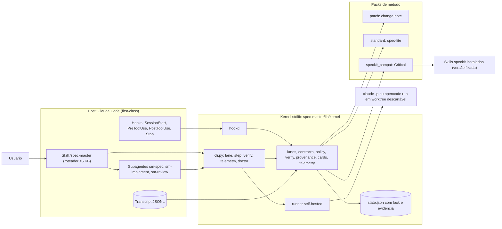

# Proposta — Spec Master: de extensão do Spec Kit a harness

> Origem: avaliação multiagente solicitada pelo mantenedor (sessão Claude Code, 2026-09-27)
> Status: **proposta para decisão** — nada aqui altera o comportamento atual do `/spec-master`
> Escopo: performance, overengineering do fluxo Spec Kit completo e reformulação do Spec Master como harness
> Evidência detalhada: [`evidence.md`](evidence.md) (6 relatórios de diagnóstico) · [`alternatives.md`](alternatives.md) (as duas propostas concorrentes)

**Classificação das afirmações.** Este documento segue a disciplina anti-alucinação do próprio projeto:

- **MEDIDO**: executado ou conferido neste repositório, sempre em cópias descartáveis quando o comando grava estado.
- **SIMULADO**: execução determinística das chamadas que o protocolo manda fazer, sem LLM.
- **MODELO**: estimativa com premissas explícitas. Turnos e tokens de saída são hipotéticos.
- **HIPÓTESE**: só se confirma com o baseline da Onda 0.

---

## 1. Resumo executivo

1. **O gargalo de performance é o laço agentic, não o Python.** Cada chamada ao `cli.py` leva ~0,1 s (MEDIDO). O custo real vem de quatro fatores multiplicados: contexto, turnos, artefatos gerados e esperas humanas.
   - O agente lê inteiro um protocolo de 49,8 KB, do qual só 21–27% serve à fase em execução.
   - Cada feature exige de 36 a 58 chamadas de contabilidade ao CLI, e cada uma é um turno que reenvia o contexto.
   - Os artefatos gerados têm de 4,3× a 5,4× o tamanho de código+testes (MEDIDO).
2. **Para mudanças XS, S e M, o ciclo completo do Spec Kit é overengineering, e o dogfood mostrou isso.**
   - O tier XS só dispensa o `clarify`; 6 das 7 fases continuam obrigatórias (MEDIDO).
   - A regex de sensibilidade sobe o tier de S para M em 3/3 features, por causa do vocabulário do próprio Spec Kit (`data-model`, `contracts/`).
   - O `clarify` não teve efeito em 3/3 features.
   - 13 dos 16 itens do roadmap foram entregues fora do fluxo.
3. **O harness atual é declarado, não imposto.**
   - O host não tem nenhum hook, settings, subagente ou plugin configurado.
   - `policy preflight` aprova `git push -f origin main` (MEDIDO).
   - O state machine impõe a *ordem* das fases, mas não a *evidência*: aceita `PASSED` sem artefato, o que viola o Princípio IV da constitution.
   - As métricas registram tokens = 0 em 9 de 9 rodadas.
   - A nota honesta como harness fica em ~31/100. As autoauditorias davam 73/100 e "100% readiness" porque pontuavam a *existência* de comandos.
4. **Recomendação: opção H, um strangler orientado a kernel.**
   - Um kernel determinístico em stdlib passa a decidir o **próximo passo, a permissão, o contexto, o "pronto" e a medição**. O host impõe essas decisões por hooks.
   - **Três lanes (Patch, Standard e Critical)** substituem as 7 fases fixas.
   - O Spec Kit deixa de ser o motor obrigatório e vira o **pack do lane Critical e formato de troca**.
5. **A sequência é medir, cortar, impor, encurtar e isolar**, em ondas com KPIs e go/no-go. Paralelismo, multi-host, Team Mode executável e calibração ficam para uma Onda 4, condicionada a demanda medida.
6. **Critério falsificável de overengineering.** Cada lane é comparado com um *braço agentic direto*, isto é, a mesma tarefa feita sem o Spec Master. Se o fluxo atual custar menos de 2× esse braço no caso Standard, o problema não é a cerimônia. Nesse caso, o plano para nas correções da Onda 0.
7. **Ganhos esperados (MODELO, a confirmar com o baseline):**
   - Patch com pelo menos 70% menos input que o fluxo atual.
   - Standard com −78% a −84% de input cumulativo.
   - Artefatos por feature de ~48 KB para no máximo 8 KB.
   - Interrupções humanas de até 9 para no máximo 1 por feature.
   - Bootstrap de instruções de 55 KB para no máximo 8 KB.

---

## 2. Como a avaliação foi feita

Foi um workflow em três estágios, com 9 agentes independentes. Os agentes trabalharam em modo somente leitura no repositório; tudo o que grava estado rodou em cópias descartáveis.

| Estágio | Agente | Lente |
|---|---|---|
| Diagnóstico | Custo do fluxo agentic | Contexto, tokens, turnos, gates humanos, razão artefato/código |
| Diagnóstico | Overengineering e cerimônia | Tiers, fases obrigatórias, redundância de verificação, dogfood |
| Diagnóstico | Maturidade de harness | Classificação IMPOSTO × DECLARADO × AUSENTE; primitivas do host |
| Diagnóstico | Performance do core Python | Latência, imports, crescimento de estado, testes, classificação de módulos |
| Diagnóstico | Acoplamento com o Spec Kit | Pontos de acoplamento, versão, fonte da verdade, desacoplamento |
| Diagnóstico | Benchmark de mercado | Claude Code, Codex, Spec Kit 1.x, Kiro, OpenSpec, BMAD, GSD, Agent OS, Tessl e outros |
| Propostas | Arquiteto A | Evolução incremental (*strangler fig*) |
| Propostas | Arquiteto B | Kernel de harness enxuto (*clean-slate* controlado) |
| Avaliação | Avaliador independente | Verificação no código, matriz de decisão ponderada, recomendação |

O avaliador reconferiu no código 12 afirmações das quais a decisão depende: 10 foram confirmadas, 1 parcialmente e 1 ficou não verificada ([Apêndice A](#apêndice-a--afirmações-verificadas-no-código)). A síntese reconferiu à parte 5 números centrais:

- `SKIPPABLE_PHASES = ("clarify",)`;
- `budget file` devolvendo o conteúdo que ele mesmo marca como omitido;
- `policy preflight` aprovando `git push -f`;
- 47.739 B de artefatos contra 11.203 B de código+testes na feature 003;
- 14 referências a um `CLAUDE.md` que nunca foi versionado.

**Limitação.** Nenhum agente rodou o fluxo real com um LLM medindo tokens. Por isso, todos os ganhos de custo são MODELO ou HIPÓTESE até a Onda 0.

---

## 3. Diagnóstico

### 3.1 Performance: onde o custo realmente está

| Indicador | Valor | Tipo |
|---|---|---|
| Latência por chamada do `cli.py` | 101–120 ms. Só o Python vazio (`python3 -c pass`) leva 11 ms; as funções do core levam de 0,04 a 5 ms; o resto é import e montagem do argparse | MEDIDO |
| Chamadas de CLI mandatadas por feature | 36 (XS mínimo) a 58 (M com 1 ciclo de repair) | SIMULADO |
| stdout do CLI por feature | ~101 KB, 74% dele vindo de `budget file`, que ecoa até o conteúdo que diz ter omitido | MEDIDO |
| Carga fixa de instruções por sessão | 55,1 KB (~13,8k tok): entrypoint + `PROTOCOL.md` ("leia integralmente") + adapter | MEDIDO |
| Fração do `PROTOCOL.md` útil à fase corrente | 21–27%; 26% nunca é usado em runtime no Claude Code | MEDIDO |
| Instruções do Spec Kit por feature | ~98–106 KB (~25k tok): 6 `SKILL.md` (81 KB) + templates. Cada skill traz ~3,8 KB de boilerplate de *extension hooks* que não faz nada, porque não existe `extensions.yml` | MEDIDO |
| Docs normalizados carregados no `specify` | 28,1 KB, dos quais só 1–3,7 KB tratam da feature | MEDIDO |
| Servidor MCP | 76 tools e 34,8 KB de schema (~8,7k tok). Cada chamada abre um subprocesso: 112 ms | MEDIDO |
| Artefatos por feature (003–005) | 8–9 arquivos e 47,7–54,8 KB: 4,3–5,4× código+testes (8,7–12,5× contando só o código). São 21–26 tasks para módulos de 92–131 LOC | MEDIDO |
| Gates humanos por feature | Até 9, mais 1–3 por workflow | MEDIDO (leitura das skills e do protocolo) |
| Input cumulativo por feature | 8,8–19,3M tok (central 13M) na 1ª feature da sessão, crescendo nas seguintes | MODELO |
| Custo por feature (preço de referência: US$ 4 / US$ 20 por MTok de input/output) | ~US$ 6,3–8,7 | MODELO |
| Paralelismo | 9 de 10 features estavam na onda 0 do DAG, mas a execução foi serial, numa única sessão | MEDIDO |

**Consequência.** Otimizar o Python (lazy imports, daemon, MCP in-process) afeta menos de 4% do wall-clock e por isso fica para o fim. As alavancas que importam são seis:

1. parar de ecoar conteúdo;
2. fatiar o protocolo;
3. agregar a contabilidade num comando `step`;
4. gerar menos artefatos;
5. isolar o contexto por fase;
6. agrupar as perguntas ao usuário.

### 3.2 Onde o fluxo completo do Spec Kit é overengineering

- **A adaptação é só de nome.** `risk_profile` marca `specify`, `plan`, `tasks`, `analyze`, `implement` e `validate` como obrigatórias em todos os tiers, e `state.SKIPPABLE_PHASES = ("clarify",)`. Os rótulos `analyze light/deep` e `review self/peer` não são lidos por nenhum código.
- **A classificação é cega na entrada e inflada depois.**
  - As 10 features têm exatamente 3 ACs, e 8 delas saem S, seja o módulo de 92 LOC, seja o de 994.
  - No `pre_implement`, 3/3 sobem de S para M porque o `tasks.md` cita `data-model` e `contracts/`. Cada uma ganha um `analyze` a mais (~12,6k tok).
  - No sentido oposto, a feature que faz `git push` e `gh pr create` continua S.
- **O rigor ficou invertido no dogfood.** O fluxo completo foi aplicado aos 3 menores módulos (92–131 LOC). Os 13 itens maiores e mais arriscados (165–994 LOC, incluindo o passo de PR/push) foram entregues fora dele. Hoje há 7 de 10 features `COMPLETED` com as 7 fases `PENDING`.
- **O valor capturado é pequeno perto do custo.**
  - O `clarify` não teve efeito em 3/3: nenhum `spec.md` tem seção *Clarifications*.
  - Metade dos achados do `analyze` eram inconsistências da própria papelada.
  - Os defeitos reais só apareceram na implementação, contra o código.
- **Throughput indicativo** (experimento natural, não controlado): ~13 linhas por minuto no fluxo completo contra ~130 fora dele.
- **Há cerca de 20 mecanismos de verificação sobrepostos**, quase todos em prosa: analyze, checklist, converge, validate, quality gates, evals, EARS, traceability, constitution check, peer review e outros. O único que executa código (quality gates) devolve `[]` no próprio repositório.
- **A cerimônia estrutural foi construída antes do uso**, contrariando a Gall's law e o YAGNI que o próprio knowledge base documenta.
  - O grafo tem 4 nós; há 0 decisões registradas, 0 disparos de hooks e 0 workstreams.
  - A calibração tem 0 rodadas utilizáveis e um laço latente (`TIGHTEN_FACTOR = 0.8`) que apertaria os limiares e empurraria tudo para tiers mais caros.
- **O mercado chegou ao mesmo diagnóstico.** Kiro (Quick Spec/Bugfix), BMAD (Quick Flow), OpenSpec (delta specs), GSD (`/gsd-quick`) e Factory (Normal vs. Spec mode) decidem *quanto processo* aplicar **antes** de gerar artefatos. Num benchmark externo (Scott Logic), o Spec Kit levou ~7× o tempo de agente e ~14× o tempo humano do prompting iterativo em features comparáveis.

**Onde o fluxo completo compensa.** Em incerteza de design, contrato público com breaking change, dados ou migrações, superfícies sensíveis (auth, pagamento, secrets) e ambientes regulados. É exatamente isso que o lane Critical cobre (§5.6).

### 3.3 Harness: declarado, não imposto

| Capacidade | Hoje | Evidência |
|---|---|---|
| Controle do loop | **DECLARADO** no modo hosted. Só é **IMPOSTO** no *guarded mode* (OpenCode), que não está ligado ao `/spec-master` | O entrypoint diz "leia e siga integralmente"; o controller só tem a integração `opencode` |
| Ordem das fases | **IMPOSTO** | `state transition` recusa `implement` antes de `analyze` |
| Evidência para promover uma fase | **AUSENTE** | `transition` aceita `PASSED` sem artefato; `upsert-feature` aceita uma feature `COMPLETED` com 7 fases `PASSED` apontando para um diretório inexistente |
| Política de ferramentas | **DECLARADO** e fraco | Só roda se o agente chamar; aprova `git push -f origin main`, `git clean -xdf` e `git push origin +main` como `low` |
| Hooks de ciclo de vida | **DECLARADO** | `hooks.py` é um barramento interno consultivo; o controller descarta as diretivas; o host não tem nenhum hook |
| Orçamento de contexto | **DECLARADO** | `budget` só estima; `budget file` injeta o que diz ter omitido |
| Isolamento e subagentes | **AUSENTE** no modo hosted | Team Mode são 12 personas no mesmo contexto; não existe `.claude/agents/` |
| Observabilidade | **DECLARADO** e inválido | Tokens 0 em 9/9 rodadas; 5/9 com horários redondos, sobrepostos ou anteriores ao início; nenhuma com feature ou tier |
| Evals comportamentais | **AUSENTE** | `evals.py` tem 5 checagens fixas que sempre passam |
| Distribuição | Parcial | `init.sh` + entrypoints em prosa; sem plugin; o MCP não está registrado |

O que o host já oferece e o projeto não usa:

- transcript JSONL com `usage` por resposta;
- `claude -p --output-format json` (com `total_cost_usd` e `num_turns`), `--max-budget-usd` e `--json-schema`;
- `claude plugin eval`, com um braço sem plugin;
- hooks `PreToolUse`, `PostToolUse`, `Stop`, `SubagentStop`, `SessionStart`, `UserPromptSubmit` e `PreCompact`.

Um protótipo descartável de ~100 linhas, reaproveitando `phase_contracts`, `tool_policy` e `state`, impôs gates em ~27–33 ms por decisão (MEDIDO).

### 3.4 Integridade e deriva: o que precisa ser corrigido antes de qualquer enforcement

- **O estado perde escritas concorrentes.** Não há lock, e o arquivo temporário tem nome fixo. Entre 6% e 50% dos updates concorrentes se perdem, conforme a máquina, e alguns processos quebram com `FileNotFoundError`.
- **Os contratos de fase usam globs globais.** Isso dá falso `PASSED` no `plan`, falso `BLOCKED` por placeholders de `specs/001` e `002`, e dependência de `.specify/feature.json`, que está no `.gitignore`. **Por isso, ligar hooks em modo de bloqueio antes de escopar os contratos por feature produziria bloqueios falsos.**
- **`graph enrich-discovery`**, obrigatório no Step 8, apaga arestas de decisão e faz o `graph validate` seguinte falhar.
- **Há deriva entre protocolo, CLI e Spec Kit.**
  - `knowledge get --id` e `knowledge for-context` não existem no parser.
  - O adapter aponta para `.claude/commands/speckit.<phase>.md`, mas o Spec Kit instalou skills `/speckit-<phase>`.
  - O discovery enxerga 0 das 10 skills instaladas.
  - Há 14 referências a um `CLAUDE.md` que está no `.gitignore` e nunca foi versionado.
- **A verificação executável é cega no próprio repositório.**
  - `gates detect` devolve `[]`.
  - `unittest discover` roda 502 testes com 21 erros de import de pytest.
  - A suíte passa com 631 testes só quando rodada de dentro de `spec-master/tests`; o comando documentado, rodado da raiz, falha na coleta.

### 3.5 Acoplamento com o Spec Kit e posição no mercado

- **O acoplamento está no ritual, não no código.** Só ~100 das 13.691 linhas do core (0,7%) citam artefatos do Spec Kit. Mesmo assim, o agente lê ~24,7k tokens de skills e templates do Spec Kit por feature, 14× mais que os prompts próprios.
- **Versão.**
  - O repositório está na 0.16.4 e o upstream na 1.0.12: 14 releases em 42 dias, incluindo a major 1.0.0.
  - O bootstrap instala o HEAD, sem pin.
  - Os templates de metodologia (MIT) não mudaram entre 0.16.4 e 1.0.12; integrações e workflows mudaram muito.
- **Há 4 conflitos de fonte da verdade:**
  - numeração e diretório da feature;
  - estado de fase;
  - constitution, com dois processos de governança;
  - branch, com dois barramentos de hooks.
- **O papel de "orquestrador acima do Spec Kit" está sendo absorvido.** O Spec Kit 1.x já tem engine de workflows e um catálogo de mais de 150 extensões comunitárias e dezenas de presets, inclusive extensões para "pular o SDD pesado".
- **O que diferencia o Spec Master, e deve ser preservado:**
  - proveniência `EXPLICIT/INFERRED/DISCOVERED_FROM_CODEBASE/UNRESOLVED` como contrato de primeira classe (nenhum concorrente pesquisado tem);
  - core determinístico testado sem LLM;
  - rastreabilidade por AC;
  - risco por sensibilidade.

  O mercado migrou para *lanes + hooks + subagentes + evals + telemetria + plugin*, e é nesse eixo que esses diferenciais rendem.

---

## 4. Opções avaliadas e decisão

| Opção | Resumo | Total ponderado (1–5) |
|---|---|---:|
| **0**: status quo + ajustes mínimos | Mantém o fluxo completo e o protocolo em prosa; aplica só correções baratas (telemetria, dieta de saída, fim da inflação de tier) | 2,78 |
| **A**: strangler incremental | 4 ondas sobre o código atual; o legado fica atrás de `--legacy` até a onda 3 | 3,97 |
| **B**: kernel enxuto (SMK) | Novo pacote `kernel` (≤4,5k LOC), nova CLI `smk` e plugin; aposenta o legado nas semanas 16–18 | 3,95 |
| **H**: híbrido, strangler orientado a kernel | Quick wins e promoção por evidência para todos já na onda 0; kernel com orçamento de LOC no CI; amplitude só por demanda | **4,32** |

**Critérios e pesos** (somam 100):

| Critério | Peso | 0 | A | B | H |
|---|---:|---:|---:|---:|---:|
| Ganho de performance e custo por feature | 22 | 2 | 4 | 4,5 | 4,5 |
| Proporcionalidade da cerimônia | 13 | 2 | 5 | 5 | 5 |
| Maturidade real de harness (enforcement) | 18 | 1,5 | 4 | 4,5 | 4,5 |
| Risco de migração e regressão (5 = menor risco) | 13 | 5 | 4 | 2,5 | 4 |
| Esforço e tempo até o valor (5 = melhor) | 10 | 5 | 2,5 | 2,5 | 3,5 |
| Compatibilidade e governança (Princípio VI) | 8 | 5 | 4,5 | 2,5 | 4,5 |
| Manutenibilidade | 10 | 2 | 3,5 | 4,5 | 4 |
| Diferenciação de mercado | 6 | 1 | 4 | 4,5 | 4 |

**Por que não A.** Chega tarde onde mais importa: o Standard só por volta da semana 18. Mantém dois caminhos de controle (prosa e hooks) por meses e só exige evidência na transição na onda 3, adiando a conformidade com o Princípio IV. Além disso, a onda 1 fica superlotada e promete bindings multi-host antes de haver demanda.

**Por que não B.** Renomeia o produto (`smk`, `/sm`) e quebra a CLI, contra o Princípio VI, sem nenhum ganho de performance. Adota event sourcing como fonte da verdade quando lock + `mkstemp` resolve o problema. Subestima o esforço: 18 semanas declaradas, provavelmente 24–30 na prática. Não dá quick wins a quem continua no fluxo atual. E aposentar o legado nas semanas 16–18 com um único mantenedor é agressivo.

**O que H toma de cada uma:**

- **De A:** compatibilidade (`/spec-master`, `specs/NNN`, `state.json` e a CLI como fachada), hooks em *audit* antes de bloquear e quick wins para todos.
- **De B:** kernel físico com orçamento de LOC verificado no CI por um `doctor`, go/no-go falsificável (≥2× em relação ao braço direto), Patch sem subagente e triagem com limite de turnos.
- **Novo em H:** promoção por evidência já na onda 0 (conformidade com o Princípio IV, que não depende de emenda), contratos escopados antes de qualquer bloqueio e amplitude adiada para uma onda 4 condicional.

**Ressalva.** H foi montada depois de A e B, então é natural que as domine; o valor da matriz está em mostrar quais enxertos compensam. Com os pesos mais favoráveis a B (manutenibilidade 20, mercado 12, risco 5, compatibilidade 0), as duas praticamente empatam (4,27–4,28).

---

## 5. A proposta: Spec Master como harness (opção H)

### 5.1 Princípio organizador

> **O modelo faz o trabalho semântico** (entender o pedido e escrever spec, código e testes).
> **O kernel determinístico decide** o próximo passo, o que é permitido, que contexto carregar, quando algo está "pronto" e como medir.
> **O host impõe** essas decisões com hooks, permissões, subagentes e worktrees.

Hoje essas três responsabilidades estão todas na prosa que o modelo lê. A reformulação as separa.

### 5.2 Arquitetura em camadas

| Camada | Dono | Conteúdo |
|---|---|---|
| **L0 Host** | Claude Code (first-class); OpenCode e `claude -p` via runner | Loop de ferramentas, compactação, permissões, subagentes, hooks, transcript/OTel, plugin, `claude plugin eval` |
| **L1 Bindings** | Spec Master | Plugin do Claude Code com skill roteadora `/spec-master` (≤5 KB), `hooks/hooks.json` → `hookd`, `agents/sm-{spec,implement,review}.md` e `.mcp.json` enxuto. `init.sh link --hooks` gera um `.claude/settings.json` equivalente. Os demais agentes ficam num tier *prompt-only*, rotulado *advisory* |
| **L2 API** | Spec Master | `cli.py` como fachada compatível, com grupos novos: `lane`, `step`, `verify`, `telemetry`, `doctor`. MCP com no máximo 8 tools in-process (onda 3) |
| **L3 Kernel** | Spec Master (`spec-master/lib/kernel/`, stdlib) | Estado com evidência, contratos por feature, lanes, cards, política, verificação e proveniência, telemetria, `hookd`, runner |
| **L4 Packs de método** | Spec Master | `patch` (change note), `standard` (spec-lite), `speckit_compat` (Critical: delega às skills instaladas) |
| **L5 Periferia** | Opt-in ou congelada | Sob demanda: dashboard, web bundle, PR step (Princípio X), export OTLP, EARS (alimenta o `verify:pre`), tracker, playbooks como skills. Congelados: grafo, calibração e Team Mode |

### 5.3 Kernel

O **orçamento de tamanho é verificado pelo `doctor` no CI**: no máximo 2,5k LOC novas até a onda 2, e no máximo 4,5k LOC importadas no caminho quente na onda 3 (hoje são ~12,9k). Os módulos atuais são corrigidos no lugar na onda 0 e agrupados em `kernel/` na onda 1, com shims de import para manter a compatibilidade.

| Módulo | Origem | Responsabilidade | Onda |
|---|---|---|---|
| `state` | `state.py` corrigido | Lock + `mkstemp`; upsert só de metadados; invariantes entre status e fases; **promoção só com evidência** (hash + checks); tentativas por feature+fase | 0 |
| `contracts` | `phase_contracts` escopado | Artefatos, placeholders e allowlist dentro do diretório da feature; `git diff --name-only` no lugar do snapshot SHA-256 do repositório inteiro; sem depender de `.specify/feature.json` | 0 |
| `telemetry` | novo (substitui o `record-round` manual) | Ingere `usage` e timestamps do transcript e do JSON do `claude -p`; schema v2 (`cache_read`, `cache_creation`, `cost_usd`, `turns`, `human_wait_s`, `lane`, `source`); `validate` rejeita zeros e cronologia impossível | 0 |
| `lanes` | `risk_profile` + regex de caminho do `hooks.py` | Triagem por caminhos, diff, manifesto, testes e ações irreversíveis (ignorando `specs/**` e `.spec-master/**`); envelope; escalonamento. Os tiers XS–XL passam a ser só sinais de entrada | 1 |
| `step` + `cards` | novo + fatias do `PROTOCOL.md` | `step next/begin/end`; core card, cards de lane e de fase e feature card, com orçamento e **sem eco de conteúdo**. É a mesma função de próximo passo que o controller usa | 1 |
| `policy` + `hookd` | `tool_policy` reescrito + protótipo de hook | allow/ask/deny por argv; entrypoint dos hooks com imports mínimos (p95 ≤ 50 ms) | 1 |
| `verify` + `provenance` | `quality_gates` + `sast_gates` + `gates.json` + `ears` | `pre` (Standard/Critical) e `post` (todas as lanes); gates detectados ou declarados, com evidência e timeout; AC→teste; escopo do diff; tags de proveniência com `file:line` | 1–2 |
| `runner` | `controller` + `phase_runner` | Integrações `opencode` (atual) e `claude -p`; worktree por tentativa; `--max-budget-usd`; `PhaseResult` validado por schema | 3 |

### 5.4 Três linhas de defesa (iguais em todos os modos)

1. **Antes da ação.** O `PreToolUse` do host nega três coisas: escrita fora da allowlist do passo, edição direta do estado e comandos destrutivos.
2. **Depois da ação.** `step end` e `verify` só promovem com evidência: artefato escopado à feature, gates verdes, AC mapeado a teste e diff dentro do escopo. É *fail-closed*, como pede o Princípio IV.
3. **No self-hosted.** Cada tentativa roda num worktree descartável. O que viola o contrato não é integrado e fica preservado (Princípio V).

### 5.5 Modos de execução

| | Hosted (padrão, interativo) | Self-hosted (CI, evals, modelos locais) |
|---|---|---|
| Entrada | `/spec-master <contexto ou intenção>` | `cli.py run --runner claude\|opencode --feature F --max-budget-usd N` |
| Dono do loop | O host, guiado por `step next` e pelos hooks | `kernel/runner`, com um processo por passo |
| Isolamento | Patch na sessão principal; Standard e Critical em subagentes que devolvem `PhaseResult` de até 2k tokens | Worktree descartável por tentativa |
| Enforcement | `hookd` + permissões do host | `--allowedTools`/`--disallowedTools`, `--permission-mode` e contratos sobre o diff. Hooks via `--plugin-dir` só se um spike confirmar (o `--bare` pula hooks) |
| Perguntas | Só na fronteira de passo e em lote; subagentes devolvem `questions[]` | Estado `PAUSED` + `questions.json`, depois `answer` e `run --resume` |
| Telemetria | Transcript lido no `Stop`/`SubagentStop` | JSON do `claude -p` (`total_cost_usd`, `num_turns`, `usage`); `opencode run --format json` |

### 5.6 Lanes adaptativas (no lugar das 7 fases fixas)

A lane é decidida **antes de gerar qualquer artefato**, por sinais de **caminho, diff e repositório**. Nunca por contagem de ACs nem por regex sobre prosa.

| | **Patch** | **Standard** | **Critical** |
|---|---|---|---|
| **Entrada** | Todas estas condições valem: intenção cabe numa frase; ≤3 arquivos de produção num módulo e diff ≤~50 LOC; nenhum caminho sensível; manifesto de dependências intacto; nenhuma ação irreversível; há teste (ou ele é criado na mudança); zero `UNRESOLVED` | O que não cabe no Patch e não tem sinal de Critical: ≤12 arquivos e ≤3 camadas; contrato público só com adições; dependência nova só de dev/test. As features 003–005 do dogfood cairiam aqui | Basta um destes: caminho sensível; breaking de contrato público; ação irreversível; migração ou schema; novo provedor ou dependência de runtime; >3 camadas, >12 arquivos ou >~800 LOC; área sem testes; exigência regulatória; `min_lane: critical`; override do usuário |
| **Fases** | triage → implement (sessão principal, sem skill do Spec Kit) → verify:post → done | triage → spec (subagente) → clarify *só se houver UNRESOLVED* → verify:pre → implement (subagente, test-first) → verify:post → review (subagente de contexto limpo) → done | triage → **pack speckit_compat**: specify → clarify (1 lote) → plan → tasks → analyze (≤3 repairs) → aprovação humana → implement → verify:post → review + segurança → ADR |
| **Artefatos** | Change note ≤1 KB em `.spec-master/changes/<id>.md` (intenção EXPLICIT, 1–3 checagens de aceite com proveniência, arquivos tocados, id da evidência) | Um único `specs/NNN-slug/spec.md` ≤8 KB (problema, ACs com proveniência, plano curto, ≤12 tasks). `research`, `data-model`, `contracts` e `quickstart` só com gatilho explícito | Conjunto do Spec Kit em `specs/NNN-slug/` (número e diretório alocados pelo kernel), ADR, relatório de validação, evidência por fase |
| **Gates humanos** | 0, exceto a confirmação antes de ação irreversível (Princípio X) | ≤1: o lote de clarify, só quando há `UNRESOLVED`; fora disso, `SAFE_DEFAULT` registrado | ≤3, em lote e nas fronteiras: clarify, aprovação antes do implement, confirmação antes de ação irreversível |
| **Gates automáticos** | PreToolUse (política, estado, envelope); verify:post fail-closed; Stop bloqueia "pronto" sem evidência | verify:pre bloqueia implement com `UNRESOLVED` ou AC sem task/teste; verify:post; review sem achado de correção aberto | Allowlist por fase; zero `UNRESOLVED`; verify pre/post; teto de 3 repairs; revisores independentes; SAST/secrets quando detectados |
| **Escalonamento** | O PostToolUse recalcula os sinais pelo diff real. Sobe para Standard se o envelope estourar, se o mesmo gate falhar 2×, se surgir decisão do usuário ou se não houver teste viável. Reaproveita o que foi feito | Sobe para Critical por sinal de caminho ou de diff. O spec-lite é importado pelo pack compat e só o que falta é gerado. Sinal apenas textual vira pergunta de confirmação | Topo; nunca rebaixa no meio do fluxo. Estourar o teto de repair leva a `BLOCKED`, com a tentativa preservada |

Regras transversais:

- Caminho não reconhecido cai em Standard.
- O override só pode **subir** de lane.
- `min_lane` pode ser fixado por projeto ou por caminho em `.spec-master/policy.json`.
- Nunca se rebaixa de lane no meio do fluxo.
- Na variante *bugfix* do Patch, o verify exige um teste que falhava antes e passa depois, com as duas execuções registradas.

### 5.7 Exemplo: uma correção de 3 linhas, hoje e com o Patch

| | Hoje (tier XS) | Lane Patch |
|---|---|---|
| Fases | specify → plan → tasks → analyze (+repair) → implement → validate (só o clarify pode ser pulado) | triage → implement → verify:post |
| Instruções carregadas | ~34,5k tok | ≤3k tok (cards) |
| Chamadas estruturais de CLI | ≥36 | ≤4 |
| Artefatos | Conjunto Spec Kit em `specs/NNN/` (as features 003–005 geraram 8–9 arquivos cada) | 1 change note ≤1 KB (que pode ir no corpo do commit) |
| Interrupções humanas | até 9 | 0 (exceto antes de ação irreversível) |
| O que garante a qualidade | Prosa lida pelo modelo | Hooks + verify fail-closed + teste obrigatório |

### 5.8 Relação com o Spec Kit

O Spec Kit **deixa de ser o motor obrigatório** e passa a ter três papéis:

1. **Motor do lane Critical.** O pack `speckit_compat` delega cada fase à skill ou ao comando instalado. Não há fork, e as `SKILL.md` nunca são editadas (o manifest guarda o hash de cada uma). `clarify` e `analyze` não são reimplementados.
2. **Formato de troca.** `speckit export` materializa qualquer feature como `specs/NNN-slug/{spec,plan,tasks}.md`. `speckit import` traz specs existentes como histórico *sem evidência*, que só vira `PASSED` depois de passar pelo verify.
3. **Opção por projeto.** Com `min_lane: critical`, o formato completo vale para toda mudança, como em ambientes regulados.

**Fonte única da verdade.** O kernel passa a ser dono de:

- numeração e diretório da feature, repassados ao Spec Kit por `SPECIFY_FEATURE_DIRECTORY` e `--number`;
- branch, via `GIT_BRANCH_NAME`;
- estado de fase: só `step end` promove;
- constitution: `constitution_diff`, com bump semver;
- barramento de eventos: `hooks.py`. O `extensions.yml` só entra quando o usuário usar extensões do Spec Kit.

**Versão.**

- Faixa suportada `>=0.16.4,<1.1` desde a onda 0.
- Bootstrap com tag, não interativo e só quando o Critical precisar.
- Discovery lendo `.specify/integration.json`.
- `doctor` avisa quando a versão sai da faixa.
- Smoke noturno em 0.16.4 e no último 1.0.x.

Patch e Standard **não exigem `.specify/`**. Usam change note e spec-lite derivados dos templates MIT do Spec Kit, com atribuição.

**O que não reimplementar:**

- o instalador de 40+ agentes;
- o workflow engine do Spec Kit 1.x (seria uma segunda máquina de estados);
- o catálogo de extensões e presets;
- clientes de tracker;
- os prompts de `clarify` e `analyze`.

**Governança.** Trocar o default exige uma **emenda do Princípio VII** e da seção *Development Workflow* ("never simulated or hand-authored as a substitute for a real phase run"), com aprovação explícita. Proposta de redação:

> O Spec Master é dono do harness e das lanes. O Spec Kit é o pack do lane Critical e o formato de troca. As integrações do ecossistema continuam sendo reaproveitadas.

- A emenda é proposta na onda 1, via `constitution_diff`, e decidida antes de o Standard virar default (onda 2).
- Sem aprovação, Patch e Standard ficam opt-in (`--lane`) e o Spec Kit continua sendo o default para features.
- A promoção por evidência **não depende da emenda**, porque é conformidade com o Princípio IV, que já está em vigor.

### 5.9 Cortes, congelamentos e plugins

| Ação | Item | Justificativa |
|---|---|---|
| Reescrever | `PROTOCOL.md` monolítico (49,8 KB, lido inteiro) | Vira um roteador de até 5 KB, um core card e cards por lane e fase gerados pelo kernel; o material de referência vai para `docs/`. A versão atual fica congelada como `--legacy` até a onda 3 |
| Cortar | 14 referências a `CLAUDE.md §N` e os comandos quebrados (`knowledge get --id`, `knowledge for-context`) | O arquivo nunca foi versionado e os comandos são inválidos. No lugar: regras explícitas nos cards e um teste de conformidade protocolo↔parser no CI |
| Fundir | Tiers XS–XL e os rótulos `light/deep` e `self/peer` | Viram sinais de entrada de `lanes`. Os rótulos não têm consumidor |
| Cortar | Sensibilidade calculada por regex sobre a prosa de tasks e spec | Provoca a escalada S→M em 3/3 features e deixa push/PR em S. Passa a vir só de caminho e diff, ignorando `specs/**` e `.spec-master/**` |
| Fundir | Contabilidade manual feita pelo LLM (`record-round`, `traceability add`, `delta snapshot`, edição do `rounds.json`) | Passa para `step begin/end` e para a telemetria. Hoje produz dados inventados |
| Reescrever | Eco de conteúdo no `budget file` e JSON indentado por padrão | O padrão vira ids + tokens em JSON compacto; flags restauram o formato antigo |
| Reescrever | `state upsert-feature` aceitando status e fases; `transition` para `PASSED` sem artefato | Viola o Princípio IV. A promoção passa a exigir evidência; o histórico entra marcado como sem evidência |
| Reescrever | `phase_contracts` com globs globais | Escopar por feature e usar `git diff` é pré-requisito para os hooks |
| Reescrever | `tool_policy` / `policy preflight` consultivo | Vira política por argv aplicada no `PreToolUse`, primeiro em audit e depois bloqueando |
| Manter | `state`, `fingerprint`, `traceability`, `quality_gates`/`sast_gates`, `discovery`, `git_strategy`, `constitution_diff`, `controller`/`phase_runner` | Núcleo rápido e testado, com correções pontuais: lock, discovery via `integration.json`, gates em projetos stdlib, timeout nos gates |
| Manter | Camada normalizada de 3 documentos | Consumida por *feature cards* em vez de carregada inteira; não trocar por intake de LLM sem evidência |
| Cortar | `evals.py` e `runtime_contract.py` como gates obrigatórios | Sempre passam. No lugar: replay determinístico em todo PR e evals com braço sem plugin a cada release |
| Cortar | Autoauditoria no Step 8 (graph enrich/validate/snapshot/health, evals, runtime contract) | Valida o harness, não a feature, e o enrich apaga arestas. Vai para o `doctor` no CI |
| Cortar | `opencode_runner.py` | Nada o importa em produção; foi substituído pelo `phase_runner` |
| Cortar | Artefatos completos do Spec Kit em mudanças pequenas | Somam 4,3–5,4× código+testes. Saem do Patch e do Standard; no Critical, só com gatilho |
| Congelar | `calibration.py` | Tem 0 rodadas utilizáveis e um laço latente que aumenta a cerimônia. Só volta com 10 ou mais features medidas |
| Congelar | Team Mode (12 papéis e template fixo de 6 etapas) | Depois de 10 features: 0 workstreams e 0 decisões. O revisor independente vira subagente; papéis extras só com eval que prove valor |
| Congelar | Knowledge graph (`lib/graph`, ~2k LOC) | Tem 4 nós. As decisões passam para um registro simples + ADR |
| Virar plugin | dashboard, web bundle, `pr_step`, `metrics_export`, `ears`, `tracker_orchestration` | Nenhum foi usado no dogfood. O PR continua como passo confirmado (Princípio X); o EARS pode alimentar o `verify:pre` |
| Reescrever | Servidor MCP com 76 tools e um subprocesso por chamada | Vira no máximo 8 tools in-process na onda 3, com o catálogo completo atrás de `--expert` |
| Congelar | `adapters_gen.py` e os 30+ entrypoints gerados | Estão defasados. Ficam num tier *prompt-only* rotulado; só o Claude Code é first-class até haver demanda |
| Congelar | Paralelismo por ondas, bindings multi-host, DAG de pacotes | Sem demanda medida; dependem do lock e dos evals. Onda 4, condicional |
| Reescrever | `cli.py` monolítico | Registro lazy por grupo, na onda 3. Baixo retorno: a latência do CLI é menos de 4% do tempo |

---

## 6. Plano de performance

| Onda | Ação | Ganho esperado | Como medir |
|---|---|---|---|
| 0 | Telemetria do host e baseline com braço agentic direto (3 casos × 3 execuções × 2 braços, modelo fixo, `--max-budget-usd`) | Não acelera nada sozinha. Leva as rodadas utilizáveis de 0/9 para 100% e cria a métrica que decide se há overengineering: **sobretaxa = custo(lane) / custo(agentic direto)** | Desvio de até 2% contra o transcript bruto e de até 5% contra o `total_cost_usd`; mediana e CV versionados em `.spec-master/metrics/baseline/` |
| 0 | Dieta de saída do CLI (`budget file` só com ids e tokens, JSON compacto, ack mínimo em `transition`, `state show --summary` no Step 0) | stdout por feature de 100,8 KB para até 15 KB (−85%); −8% a −15% de input cumulativo (MODELO) | Bytes por comando antes e depois, na simulação do protocolo |
| 0 | Fim da inflação de tier (sensibilidade por caminho/diff; push/PR/publish/deploy tratados como irreversíveis) | 1 `analyze` a menos por feature: ~12,6k tok, ~8 turnos, ~−12% de input (MODELO) | Replay de `risk classify` em 003–005 (esperado: S) e em `optional-pr-open-step` (esperado: subir); 0 falso negativo nas fixtures sensíveis |
| 0 | Gates humanos só na fronteira de fase e em lote | Interrupções de até 9 para ≤1 por feature; evita reescrever o cache depois de esperas acima de 5 min (até ~US$ 2,4 por feature, MODELO) | Contagem de `AskUserQuestion` e `human_wait_s`; `cache_creation` no turno seguinte |
| 0 | Poda do protocolo sem mudar o fluxo + teste de conformidade protocolo↔parser | −12,9 KB (~3,2k tok) fixos por turno; zera os turnos de erro por deriva | `wc -c` do que o entrypoint manda carregar; 0 invocações inválidas no CI |
| 0 | Contratos por feature via `git diff --name-only` | Checagem de escopo de ~0,87 s para até 0,1 s num repositório de 57k arquivos (HIPÓTESE), o que permite checar a cada PostToolUse; elimina falsos PASSED/BLOCKED | Benchmark num repositório sintético; testes de contrato com 5+ features |
| 1 | `step next/begin/end` + cards (roteador de até 5 KB); `SessionStart(compact)` reinjeta o card | Chamadas estruturais de 36–58 para ≤12 por feature; bootstrap de 55,1 KB para ≤8 KB; −25% a −43% de input (MODELO) | Chamadas e `num_turns` por feature, em 3 execuções da feature de referência |
| 1 | `hookd` no Claude Code (PreToolUse, PostToolUse, Stop/SubagentStop, SessionStart), 2 semanas em audit | Tira a contabilidade do laço de LLM e impede "pronto" sem artefato; ≤50 ms p95 por tool call (protótipo: 27–31 ms) | p50/p95 do self-timing; replay de payloads; taxa de falso bloqueio em audit |
| 1 | Lane Patch | Instruções de ~34,5k para ≤3k tok, ≤4 chamadas, 0 gates; **≥70% menos input** que o fluxo atual e sobretaxa ≤1,3× em relação ao braço direto (metas) | A/B headless, 3 execuções por braço; `claude plugin eval` com braço sem plugin |
| 2 | Feature cards | Insumo do `specify` de 28,1 KB para ~4,6 KB (−84%) | Bytes de `inputs[]` registrados pelo `step next` |
| 2 | Lane Standard (spec-lite, verify:pre determinístico no lugar do analyze por LLM, implement e review em subagentes) | Numa feature S/M: input de ~13M para ~2–3M tok (−78% a −84%), artefatos de 47,7 KB para ≤8 KB, ~130 para ~45 turnos, ~US$ 6,3 para ~US$ 2 (MODELO) | Replay do escopo de 003–005 em clones, 3 execuções por braço; não-inferioridade de até 5 pp nos graders |
| 2 | Isolamento por fase (subagentes devolvendo `PhaseResult` de até 2k tok; Patch sem subagente) | O custo cresce linearmente com o número de features: a 3ª fica a ±15% da 1ª | Features #1 e #3 na mesma sessão; `cache_creation` por subagente |
| 3 | Runner self-hosted (`claude -p` + opencode, worktree por tentativa, `--max-budget-usd`) | Custo exato por fase; Critical com até 60% do input do fluxo atual | Custo real em 100% das execuções self-hosted |
| 3 | MCP com até 8 tools in-process, CLI lazy, leitura do `firings.jsonl` pelo fim | −7,7k tok de schema por sessão MCP; CLI de 101–113 ms para 30–45 ms; transição O(1) em relação ao histórico | Benchmarks de 7 repetições; bytes do `tools/list` |
| 4 | Paralelismo (`-j 2`) e modelo/effort por passo, **só com demanda** | Wall-clock perto da feature mais longa; −30% a −60% de custo nos passos migrados (HIPÓTESE) | Série × `-j 2` × `-j 4`; 0 corrupção de estado |

---

## 7. Roadmap em ondas

Esforço total estimado: **~18–22 pessoa-semanas** para as ondas 0 a 3. As datas são indicativas.

### Onda 0: medir e parar o desperdício (semanas 1–3)

**Objetivo.** Ter um baseline real e cortar o desperdício que não depende de mudar o fluxo. De quebra, o estado passa a respeitar o Princípio IV. **Esta onda não altera nenhum default e não depende de emenda.**

**Entregáveis:**

- **Telemetria do host.** Ingestão do transcript e do JSON do `claude -p`, schema v2 retrocompatível e `metrics validate` checando a cronologia. As rodadas r1–r9 são marcadas como `manual-unverified`.
- **Baseline.** 3 casos (bugfix XS, réplica da 003 e feature com auth sintética) × 3 execuções × 2 braços (fluxo atual e agentic direto), versionado.
- **Dieta de saída do CLI** e `state show --summary` no Step 0.
- **Integridade:**
  - lock + `mkstemp`;
  - upsert só de metadados;
  - contratos escopados por feature;
  - promoção por evidência, com `--import-unverified` para o histórico;
  - tentativas por feature+fase;
  - `gates.json` declarativo;
  - detecção de projetos stdlib/unittest;
  - correção dos 21 erros de import;
  - correção do bug de arestas do `graph enrich`.
- **Fim da inflação de tier**; gates humanos só na fronteira de fase e em lote.
- **Poda do protocolo e teste de conformidade** protocolo↔parser; discovery via `.specify/integration.json`; pin do Spec Kit e bootstrap com tag.

**KPIs:**

| Indicador | Hoje | Meta |
|---|---|---|
| Rodadas com usage vindo do host | 0/9 | 100% |
| stdout do CLI por feature | 100,8 KB | ≤15 KB |
| Escaladas espúrias de S para M (003–005) | 3/3 | 0/3; `optional-pr-open-step` deve subir |
| Invocações inválidas no protocolo | 2 | 0 |
| Skills do Spec Kit detectadas | 0/10 | 10/10 |
| Updates perdidos (16 escritas concorrentes × 5 rodadas) | 6–50% | 0 |
| Promoções aceitas sem artefato | aceitas | 0 |
| `gates detect` no próprio repo / erros no `unittest` | `[]` / 21 | ≠ `[]` / 0 |
| CV do baseline por caso | — | <25% |

**Go/No-go.** Avança para a onda 1 se três condições valerem: o baseline é reprodutível; confirma que o laço de LLM responde por ≥90% do custo e do tempo; e mostra que o fluxo atual custa **≥2×** o braço agentic direto no caso Standard. Se custar menos de 2×, para-se nas correções da onda 0 e o plano é revisto. Em qualquer caso, os testes do modo *native* continuam verdes sem edição.

### Onda 1: impor o harness e abrir o Patch (semanas 4–9)

**Entregáveis:**

- `spec-master/lib/kernel/` com `lanes`, `step`, `cards`, `policy`, `hookd`, `verify:post` e `provenance` v1. O `doctor` verifica no CI o orçamento de LOC e o tamanho dos cards.
- `step next/begin/end`, compartilhando com o controller a função de próximo passo. `PROTOCOL.md` fatiado em roteador de até 5 KB + cards. Rota `--legacy` congelada.
- Plugin do Claude Code (skill `/spec-master`, `hooks.json`, agents) e `init.sh link --hooks`. Hooks em **audit por 2 semanas**, depois bloqueando.
- Lane Patch de ponta a ponta, com a variante bugfix. Fica opt-in via `--lane patch` até a emenda.
- Evals adversariais: "implemente já", escrita em `state.json`, comando destrutivo, retomada após compactação.
- Proposta de emenda da constitution (Princípio VII e *Development Workflow*) via `constitution_diff`.

**KPIs:**

- Caso Patch: ≥70% menos input e custo que o fluxo atual; sobretaxa ≤1,3× em relação ao braço direto; taxa de sucesso ≥ à do braço sem plugin.
- Patch com ≤4 chamadas estruturais, 0 gates humanos e artefato ≤1 KB.
- Bootstrap de instrução ≤8 KB (hoje 55,1 KB).
- `hookd` com p95 ≤50 ms.
- Falsos bloqueios em audit ≤2%.
- Nos evals: 0 escritas em caminhos protegidos e 0 comandos destrutivos executados.

**Go/No-go.** Com as metas do Patch atingidas e falsos bloqueios ≤2%, os hooks passam a bloquear. Acima disso, continuam em audit até a correção. Se o enforcement por hooks se mostrar inviável, o kernel segue em modo *advisory*, mas com `step end` fail-closed.

### Onda 2: Standard e isolamento (semanas 10–15)

**Entregáveis:**

- Spec-lite, `verify:pre` determinístico e feature cards.
- Subagentes `sm-spec`, `sm-implement` e `sm-review`, cada um devolvendo `PhaseResult` de até 2k tok.
- Escalonamento automático pelo diff (Patch → Standard → Critical), gerando só o que falta.
- Evals v1 com 6 casos, rodados a cada release via `claude plugin eval` com braço sem plugin. Replay determinístico do `hookd` em todo PR.
- Proveniência como gate duro no Standard: `DISCOVERED_FROM_CODEBASE` exige `file:line` verificável, e `UNRESOLVED` bloqueia o implement.
- `speckit export` sob demanda e decisão sobre a emenda.

**KPIs:**

- Standard com ≤40% do input cumulativo do fluxo atual (o modelo prevê ~20%) e sobretaxa ≤2× em relação ao braço direto.
- Artefatos ≤8 KB e razão artefato/(código+testes) ≤1,5× (hoje 4,3–5,4×).
- ≤1 interrupção humana por feature.
- Taxa de sucesso a no máximo 5 pp do fluxo completo e ≥ à do braço sem plugin.
- O review acha pelo menos tantos defeitos semeados quanto o `analyze` atual.
- A 3ª feature na mesma sessão custa até ±15% da 1ª.

**Go/No-go.** O Standard vira default para S/M se for não-inferior, consumir ≥50% menos tokens (medido) e a emenda for aprovada. Sem a emenda, fica opt-in. Se a qualidade for pior, o Standard fica restrito a S e as features M vão para o Critical.

### Onda 3: Critical via compat, self-hosted e consolidação (semanas 16–22)

**Entregáveis:**

- `speckit_compat`: faixa de versões, bootstrap com tag, número e branch alocados pelo kernel, delegação às skills instaladas e `speckit import`.
- Runner generalizado (`claude -p` + opencode) com worktree por tentativa, timeout nos gates e `--max-budget-usd`.
- MCP com até 8 tools in-process, CLI lazy, dashboard sob demanda e periferia virando plugin ou congelada.
- Deprecação do `--legacy` anunciada com uma versão de aviso.

**KPIs:**

- Critical com ≤60% do input do fluxo atual e qualidade não-inferior.
- 0 falsos negativos de sensibilidade nas fixtures.
- Smoke do compat verde em 0.16.4 e no último 1.0.x.
- 100% das execuções self-hosted com custo real registrado.
- Caminho quente com ≤4,5k LOC importadas (hoje ~12,9k) e `tools/list` ≤5 KB (hoje 34,8 KB).
- ≥80% das mudanças do repositório passando pelas lanes por 4 semanas seguidas.

**Go/No-go.** O `--legacy` só sai do caminho padrão depois de 4 semanas seguidas com ≥80% das mudanças nas lanes, 0 P0 aberto e evals verdes em 2 releases. Se o compat não estabilizar, o Critical continua no fluxo legado congelado.

### Onda 4: amplitude sob demanda (a partir da semana 23, condicional)

**Candidatos:**

- paralelismo por ondas no self-hosted (`-j 2`);
- bindings com enforcement para Codex, Copilot CLI e OpenCode interativo;
- Team Mode como 3–4 subagentes executáveis no Critical;
- calibração reativada, com ≥10 features medidas;
- *provenance guard* publicado como skill avulsa.

**Regra.** Cada item só entra com demanda explícita (2 ou mais projetos ou usuários) ou com um gargalo medido nas ondas anteriores. Sem isso, não é construído.

---

## 8. Riscos e mitigação

| Risco | Mitigação |
|---|---|
| Uma mudança sensível entrar como Patch ou Standard (subclassificação) | Sinais reavaliados a cada edição (PostToolUse) e no verify; caminho desconhecido cai em Standard; override só sobe; `min_lane` por projeto ou caminho; 0 falso negativo nas fixtures sensíveis como go/no-go |
| Falsos bloqueios, ou mudança na semântica de hooks entre versões do host | Escopar os contratos antes de bloquear; 2 semanas em audit (≤2% de falso bloqueio); `hookd` só age com passo `RUNNING`, respeita `stop_hook_active` e permite no máximo 2 reentradas; override auditado; um único host first-class, com teste de conformidade por versão |
| Os ganhos estimados não se confirmarem (turnos e saída do modelo são hipotéticos; subagentes e o Stop podem acrescentar turnos) | Baseline na onda 0 com braço direto; go/no-go sobre deltas medidos; relatórios separam medido de estimado; se o isolamento encarecer, volta a sessão única com cards |
| O strangler nunca terminar | Legado congelado, só com correção P0; deprecação com critério objetivo e data; 20% de cada onda reservados para remover o que foi substituído; `doctor` aplicando o orçamento de LOC |
| A emenda da constitution não ser aprovada | As correções do Princípio IV não dependem dela; Patch e Standard ficam opt-in; o ganho vem dos quick wins, do enforcement e do Patch opt-in |
| Perda de qualidade com menos artefatos | Não-inferioridade de até 5 pp nos evals; revisão independente de contexto limpo; proveniência obrigatória; `speckit export` sob demanda; o Critical não muda |
| Capacidade de um único mantenedor com manutenção dupla | Cada onda entrega valor sozinha; legado só com P0; periferia congelada; onda 4 condicional |
| Telemetria incompleta (usage de subagentes, custo estimado no hosted) | Spike na onda 0; na falta de dado, usar a janela entre begin e end do passo; custo rotulado como "medido" ou "estimado" |
| O custo do isolamento (cache writes a 1,25×) anular o ganho | Patch sem subagente; isolar só Standard e Critical; prefixo estável; medir por lane |
| Deriva do upstream do Spec Kit | Faixa de versões, bootstrap com tag, `doctor` e smoke noturno; com o Spec Kit restrito ao Critical, uma quebra não para o Patch nem o Standard |
| Overengineering do próprio harness | Não-objetivos explícitos; orçamento de LOC no CI; toda peça nova precisa mover um KPI da onda; amplitude só na onda 4 |
| Privacidade dos transcripts | Ler só usage, timestamps e ids; nada de conteúdo nas métricas |

---

## 9. O que NÃO fazer

- Não reescrever do zero nem renomear o produto (`smk`, `/sm`). Nenhuma alavanca de performance depende disso, e a quebra viola o Princípio VI.
- Não adotar event sourcing como fonte da verdade agora. Lock + `mkstemp` resolve na escala atual.
- Não construir DSL nem engine de workflow, e não competir com o workflow engine do Spec Kit 1.x nem com os workflows do host.
- **Não colocar hooks em modo de bloqueio antes de escopar os contratos por feature.** Os bloqueios falsos já foram reproduzidos.
- Não publicar ganhos de custo nem reativar a calibração sem telemetria do host e sem baseline.
- Não usar notas de rubrica (31/100, "100% readiness") como KPI. Só valem métricas medidas e evals com baseline, para não cair em Goodhart.
- Não criar marketplace próprio nem manter 30+ bindings first-class. Só o Claude Code é first-class até haver demanda.
- Não isolar o Patch em subagentes, não usar *agent teams* e não paralelizar antes de haver lock e evals.
- Não editar as `SKILL.md` do Spec Kit nem reimplementar `clarify` e `analyze`. No Critical, delegar.
- Não instalar o Spec Kit do HEAD sem tag, e não exigir `.specify/` para Patch e Standard.
- Não trocar a camada normalizada por um intake de LLM sem evidência. Fatiar com feature cards.
- Não otimizar a latência do CLI ou do MCP antes das alavancas de contexto e de cerimônia, que respondem por mais de 96% do tempo.
- Não deixar o LLM escrever métricas, timestamps ou `state.json` à mão.
- Não mudar os defaults do fluxo sem aprovação explícita da emenda da constitution.
- Não rodar a suíte de evals com LLM em todo PR. Nos PRs, só o replay determinístico.

---

## 10. Próximas 10 ações (em ordem)

1. **Ligar a telemetria do host** (transcript e JSON do `claude -p`) com schema v2 e validação, e medir um baseline de 3 casos × 3 execuções, incluindo o braço agentic direto.
2. **Corrigir a integridade que impede o harness:** lock + `mkstemp`, upsert só de metadados, contratos por feature via `git diff`, **promoção por evidência (Princípio IV)**, tentativas por feature+fase, `gates.json` e os 21 erros do `unittest`.
3. **Aplicar a dieta de saída do CLI:** `budget file` sem conteúdo (inclusive nos itens omitidos), JSON compacto, ack mínimo e `state show --summary`.
4. **Desarmar a inflação de tier:** sensibilidade só por caminho e diff, ignorando `specs/**` e `.spec-master/**`; escopo por arquivos e camadas; push, PR, publish e deploy contados como irreversíveis.
5. **Podar o protocolo e corrigir a deriva** (`CLAUDE.md`, `knowledge get/for-context`, adapter, discovery via `integration.json`), fixar a versão do Spec Kit e pôr no CI um teste de conformidade protocolo↔parser.
6. **Levar os gates humanos para a fronteira de fase**, em lote, registrando o `SAFE_DEFAULT`.
7. **Criar `spec-master/lib/kernel/`** com `step next/begin/end` e cards (roteador de até 5 KB), e um `doctor` que aplique o orçamento de LOC.
8. **Empacotar o `hookd` como plugin do Claude Code** (PreToolUse, PostToolUse, Stop/SubagentStop, SessionStart): 2 semanas em audit, depois bloqueando.
9. **Abrir a lane Patch** com `verify:post` fail-closed, medi-la contra o baseline e propor a emenda da constitution.
10. **Abrir a lane Standard** com spec-lite, `verify:pre`, subagentes (spec, implement, review) e evals com braço sem plugin. Depois disso, restringir o Spec Kit ao Critical via `speckit_compat`.

### Decisões que cabem ao mantenedor

- **Aprovar a Onda 0.** Não muda defaults, cumpre a constitution atual e é pré-requisito de tudo o que vem depois.
- **Orçamento de LLM** para o baseline (~US$ 40–80) e para cada rodada de evals por release (~US$ 85–250).
- **Confirmar o Claude Code como único host first-class** até haver demanda medida por outros.
- **Iniciar o processo de emenda** do Princípio VII e da seção *Development Workflow* na onda 1, a decidir antes da onda 2.

---

## Apêndice A — Afirmações verificadas no código

| Status | Afirmação | Como foi conferida |
|---|---|---|
| Confirmada | O tier XS só dispensa o `clarify`; 6 de 7 fases continuam obrigatórias; `light/deep` e `self/peer` não têm consumidor | `risk_profile._profile` e `state.SKIPPABLE_PHASES=("clarify",)`; `transition --phase plan --status SKIPPED` falha |
| Confirmada | Hooks, política e contratos são só declarados; o host não impõe nada | Não existem `.claude/settings.json`, `.claude/agents`, `.claude-plugin`, `.mcp.json`; `tool_policy` só é importado por `cli.py` e `evals.py`; o controller descarta o retorno de `hooks.safe_emit`; `cli.py` não usa `phase_contracts` |
| Confirmada | O estado aceita promoção sem evidência (violação do Princípio IV) | Upsert de uma feature "ghost" `COMPLETED` com 7 fases `PASSED` e diretório inexistente → rc=0; `specify` de `RUNNING` para `PASSED` sem artefato → aceito |
| Confirmada | Os contratos de fase usam globs globais (falso PASSED/BLOCKED) | `validate_artifacts(plan)` devolve `[]` sem plano da feature ativa; placeholders de `specs/001` e `002` acusados em outras features |
| Confirmada | Artefatos com 4,3–5,4× o tamanho de código+testes | 003: 47.739 / 11.203 B; 004: 49.671 / 9.229 B; 005: 54.841 / 10.187 B |
| Confirmada | O CLI leva ~0,1 s por chamada; o core não é o gargalo | Medianas de 7 execuções: 101–113 ms; `python3 -c pass` = 11 ms |
| Confirmada | `budget file` devolve o conteúdo inclusive dos itens omitidos | Com `--token-budget 3000`, `app-features.md` vai para `omitted` com 17.100 caracteres de conteúdo |
| Confirmada | O vocabulário do Spec Kit infla o tier de S para M; push/PR não é detectado | `risk classify` em dry-run: 003–005 viram M por `schema`/`public_contract`; `optional-pr-open-step` fica S |
| Confirmada | Métricas inválidas, embora o host exponha usage real | `rounds.json`: tokens 0 em 9/9; transcript JSONL com `usage` por resposta; o `claude` instalado expõe `--output-format json`, `--max-budget-usd`, `--json-schema` e `plugin eval` |
| Confirmada | Deriva protocolo/CLI/Spec Kit e ausência de verificação executável | `knowledge get --id` → erro; `knowledge for-context` → erro; discovery encontra 0 de 10 skills; 14 referências a `CLAUDE.md` (no `.gitignore`, 0 commits); `gates detect` → `[]`; `unittest` → 21 erros |
| Parcial | Escritas concorrentes perdem de 19% a 50% dos updates | O defeito existe, mas a magnitude varia com a máquina (6–12% na reprodução do avaliador) |
| Não verificada | O self-hosted pode impor os mesmos hooks via `claude -p --bare --plugin-dir` | O `--help` diz que `--bare` pula hooks; precisa de spike. Até lá: sem `--bare`, com `--allowedTools`/`--disallowedTools` e contratos sobre o diff |
| Confirmada (síntese) | `policy preflight` aprova comandos destrutivos | `git push -f origin main`, `git clean -xdf` e `git push origin +main` → `allowed: true`, `risk: low` |

## Apêndice B — Contradições entre analistas e como foram resolvidas

1. **Razão artefato/código.** 4,3–5,4× (com testes) e 8,7–12,5× (só código) estão ambas corretas; o que muda é o denominador.
2. **Chamadas por feature.** 36 (XS mínimo), 47, 58 (M com repair) e ~71 turnos (com custos fixos) vêm de simulações com premissas diferentes. Até haver telemetria, use a faixa 36–58 + ~20 fixas.
3. **Testes.** 631 com pytest rodado de dentro de `spec-master/tests`, e 502 com `unittest` (21 erros). As duas contagens são verdadeiras.
4. **Perda de updates.** 19–50% contra 6–12%: o defeito é real, e a magnitude depende da máquina.
5. **`CLAUDE.md`.** Está no `.gitignore` *e* nunca foi commitado; as duas afirmações valem.
6. **39,6M tok na 3ª feature.** É um limite superior, porque ignora a compactação do host.
7. **Throughput 10× fora do fluxo.** É só indicativo; o experimento não foi controlado.

## Apêndice C — Referências externas principais

- Anthropic: [Effective harnesses for long-running agents](https://www.anthropic.com/engineering/effective-harnesses-for-long-running-agents), [Effective context engineering for AI agents](https://www.anthropic.com/engineering/effective-context-engineering-for-ai-agents), [Building effective agents](https://www.anthropic.com/engineering/building-effective-agents).
- Claude Code: [hooks](https://code.claude.com/docs/en/hooks), [sub-agents](https://code.claude.com/docs/en/sub-agents), [skills](https://code.claude.com/docs/en/skills), [plugins](https://code.claude.com/docs/en/plugins), [plugin evals](https://code.claude.com/docs/en/plugin-evals), [monitoring usage](https://code.claude.com/docs/en/monitoring-usage), [headless](https://code.claude.com/docs/en/headless).
- Harness engineering: [Martin Fowler / Böckeler](https://martinfowler.com/articles/harness-engineering.html), [12-factor agents](https://github.com/humanlayer/12-factor-agents), [marmelab — state of AI harness engineering 2026](https://marmelab.com/blog/2026/09/24/the-state-of-ai-harness-engineering-2026.html).
- Spec Kit: [releases](https://github.com/github/spec-kit/releases), [workflows](https://github.github.io/spec-kit/reference/workflows.html), [extensions](https://github.github.io/spec-kit/reference/extensions.html); crítica: [Scott Logic — putting Spec Kit through its paces](https://blog.scottlogic.com/2025/11/26/putting-spec-kit-through-its-paces-radical-idea-or-reinvented-waterfall.html).
- Lanes no mercado: [Kiro specs](https://kiro.dev/docs/specs/) e [hooks](https://kiro.dev/docs/hooks/), [OpenSpec OPSX](https://github.com/Fission-AI/OpenSpec/blob/main/docs/opsx.md), [BMAD scale-adaptive planning](https://mintlify.wiki/bmad-code-org/BMAD-METHOD/concepts/scale-adaptive-planning), [GSD user guide](https://github.com/gsd-build/get-shit-done/blob/main/docs/USER-GUIDE.md), [Factory specification mode](https://docs.factory.ai/autonomy-and-safety/specification-mode).
- A lista completa, com a indicação das fontes secundárias ou não verificadas, está em [`evidence.md`](evidence.md#benchmark-de-mercado).
